# 纪元急袭
# Epoch Rush: Pixel Command

**组织军团，指挥主将，在文明进化的瞬间反推敌方基地。**

**Build your army, command your hero, and turn an evolution into a counterattack.**

[下载 / Download](https://github.com/wikigsroom/Evolutionary-history-of-war/releases/tag/v0.8.0) · [中文说明](#zh-guide) · [English guide](#en-guide) · [实机图与 GIF / Screenshots & GIFs](#media) · [完整兵种表 / Full roster](#roster) · [验收证据 / QA evidence](docs/qa/v0.8.0/README.md)

| 项目 / Item | 当前状态 / Current state |
| --- | --- |
| 主线路 / Primary runtime | **Godot 0.8.0**, Godot **4.7.2**, GDScript, 2D Compatibility renderer |
| 类型 / Genre | 横向单战线战争进化、基地攻防、主将构筑 / Side-view single-lane warfare, base defense and commander builds |
| 内容 / Content | **10** 时代 / eras · **50** 兵种 / troops · **6** 主将 / commanders · **60** 主将时代形态 / commander-era forms |
| 战场 / Battlefields | **30** 地图 / maps · **20** 战役关卡 / missions · **20** 炮塔 / turrets · **10** 时代奇袭 / era strikes |
| 构筑 / Builds | **18** 专精 / specializations · **18** 技能定义 / skill definitions · **12** 遗物 / relics · **18** 天赋 / talents |
| 主动道具 / Active items | 战鼓令、烟幕罐、时序补给 / War drum, smoke and temporal supplies |
| 声音 / Audio | **43** 音效族 / SFX families · **129** 变体 / variants · **4** 随机 BGM / shuffled songs · **3** 结算短曲 / result stings |
| 界面 / Presentation | 方案 1「像素指挥卡组」/ Direction 1: pixel command cards; current in-game text is **Chinese** |
| 平台 / Platforms | Windows x64 原生实测 / native verification; Android arm64 包验证 / package verification |
| 历史线路 / Legacy runtime | 根目录 Phaser / TypeScript / Vite **0.3.1**, Electron / Capacitor wrappers |
| 仓库 / Repository | 源码、运行素材、文档与精简证据 / Source, runtime assets, documentation and compact evidence |

**直接游玩 / Play now — [v0.8.0 Release](https://github.com/wikigsroom/Evolutionary-history-of-war/releases/tag/v0.8.0)**

| 平台 / Platform | 下载 / Download | 使用 / Use |
| --- | --- | --- |
| Windows x64（推荐 / recommended） | [完整便携 ZIP / Portable bundle](https://github.com/wikigsroom/Evolutionary-history-of-war/releases/download/v0.8.0/Epoch-Rush-Godot-Windows.zip) | 解压后运行 EXE，附带第三方许可 / Extract and run the EXE; third-party notices included |
| Windows x64 | [独立 EXE / Standalone EXE](https://github.com/wikigsroom/Evolutionary-history-of-war/releases/download/v0.8.0/Epoch-Rush-Godot.exe) | 内嵌游戏资源 / Embedded game resources |
| Android arm64 | [正式 APK / Release APK](https://github.com/wikigsroom/Evolutionary-history-of-war/releases/download/v0.8.0/Epoch-Rush-Godot-release.apk) | Android 7.0+，仅 arm64 / Android 7.0+, arm64 only |
| Android 调试 / debugging | [Debug APK](https://github.com/wikigsroom/Evolutionary-history-of-war/releases/download/v0.8.0/Epoch-Rush-Godot-debug.apk) | 调试使用 / Diagnostic build |
| 原生服务端 / Native server | [Windows x64 Server ZIP](https://github.com/wikigsroom/Evolutionary-history-of-war/releases/download/v0.8.0/Epoch-Rush-Server-0.8.0-Windows-x64.zip) | 接入、裁判、数据库和启停脚本 / Gateway, referee, database and admin scripts |
| 校验 / Verification | [SHA256SUMS.txt](https://github.com/wikigsroom/Evolutionary-history-of-war/releases/download/v0.8.0/SHA256SUMS.txt) | 五个二进制包的 SHA-256 / SHA-256 for all five binary packages |

v0.8.0 新增真人联机、自由匹配、六位码房间、双方构筑和准备、原局自动重连及客户端重启恢复。Windows 导出资源双客户端 19 项检查通过；实际 HTTP/WSS、数据库与原生崩溃恢复有独立证据。保留十时代、三档 AI、独立进化与首都回满、长屏安全区、骑士品牌和 Yourset 随机 BGM。Android 实体设备验收仍待完成。

v0.8.0 adds real-player online battles, matchmaking, six-digit rooms, loadouts/readiness, automatic reconnect and client-restart resume. Nineteen real-client checks using the exported Windows resource pack passed, alongside network and native process-crash checks. Existing ten-era gameplay, AI difficulties, independent evolution, capital healing, safe areas, knight branding and shuffled BGM remain available. Physical Android validation is pending.

**联机开始 / Start online**：解压 Server ZIP，运行 `Start-Server.ps1`；两台客户端在联机菜单连接 `http://<服务器局域网 IPv4>:28187`，选择自由匹配或相同六位码，双方准备。服务器默认最多十局，原生运行，不使用 Docker/WSL/虚拟机。没有随包提供公共匹配服务器；公网部署需要自己的常驻服务器与 HTTPS/WSS。

Extract the Server ZIP and run `Start-Server.ps1`; connect both clients to `http://<server LAN IPv4>:28187`, use matchmaking or the same six-digit code and ready up. Ten-match admission is the default. All components run natively. No hosted public matchmaking endpoint is included; public deployment needs an operator-owned persistent host and HTTPS/WSS.

[联机交付报告 / Online report](docs/epoch-rush/godot-v0.8-online-report.md) · [服务端中英操作 / Server guide](services/online-gateway/README.md) · [v0.8.0 发布说明 / Release notes](docs/releases/v0.8.0.md) · [SIDcloud 隐私政策 / Privacy](https://jyqx.sidcloud.cn)

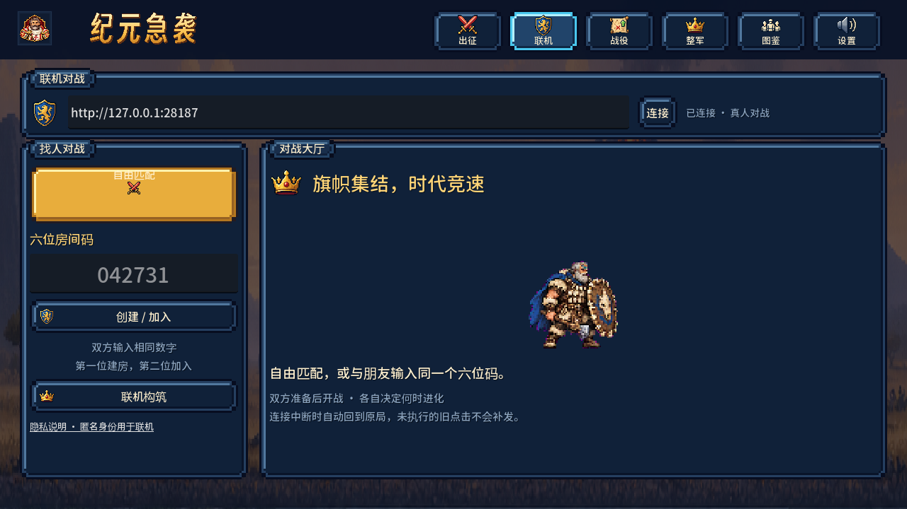

**v0.7.1 实机菜单 / Menu captured in v0.7.1**

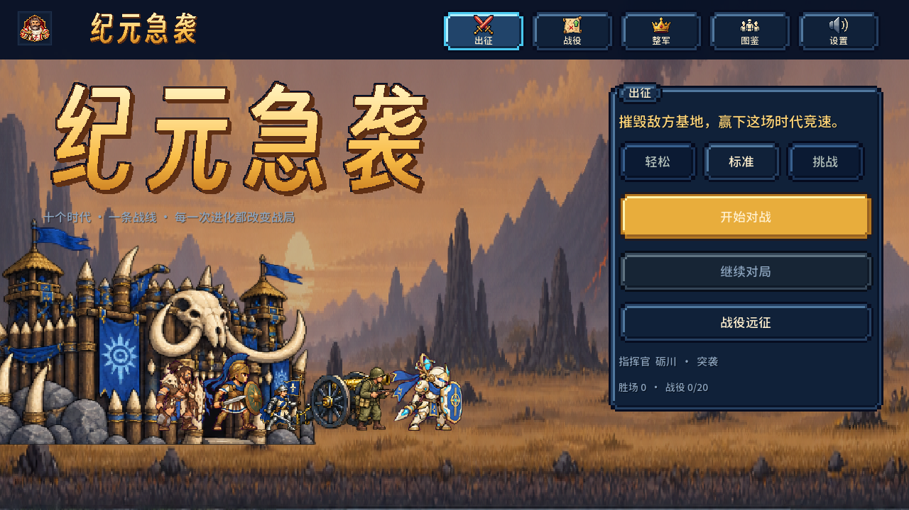

本次难度与首都规则更新见 [v0.7.2 说明 / Balance update](docs/releases/v0.7.2.md) 和 [验收记录 / QA evidence](docs/qa/v0.7.2/README.md)。品牌及随机配乐的原始交付见 [v0.7.1 报告](docs/epoch-rush/godot-v0.7.1-branding-bgm-report.md)。菜单图保留 0.7.1 采集版本，战斗图、标注图和 GIF 保留 0.7.0 采集版本。

本项目参考 **Age of War 1、2** 的横向接敌、兵线占位、基地攻防和时代竞速，再加入主将、主动道具、研究、遗物与环境演出。它是架空的独立游戏工程，军备组合及代差服务于玩法，并非历史武器性能模拟。

The project takes inspiration from **Age of War 1 and 2**: physical battle lines, base defense and an era race. Commanders, active items, research, relics and battlefield events extend that foundation. Equipment combinations and era scaling belong to a fictional game setting rather than a historical weapons simulation.

**最新修复 / Latest fix：** 双方营寨现已面向战场中央，覆盖十时代、四种损伤状态及连续换代；原生检查 **527 / 527** 通过，本机 Windows 与 Android 包已重新导出。Both camps now face inward across all ten eras, damage states and evolution transitions. See the [修复记录与实机对比 / repair report and native comparison](docs/epoch-rush/godot-base-facing-fix.md). Android validation covers package contents and signatures.

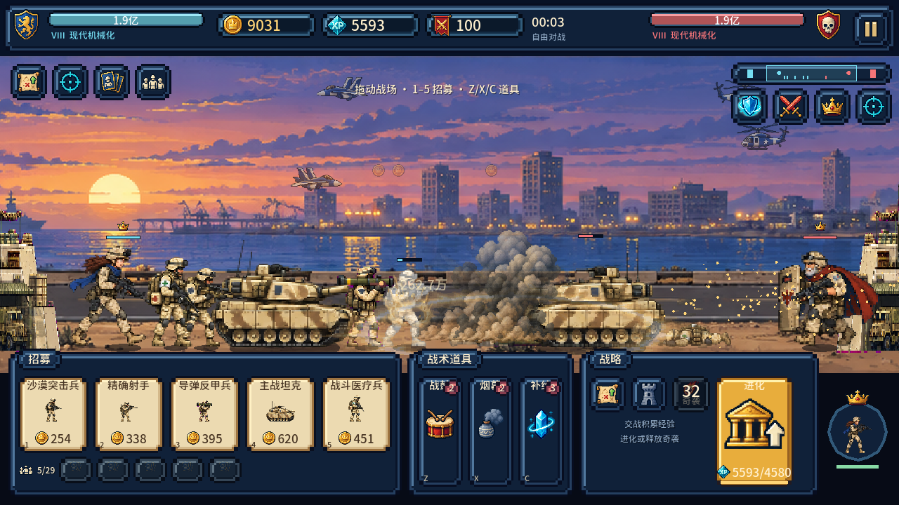

<a id="media"></a>
## 实机展示 / Native screenshots and GIFs

下面的画面来自 **Godot 4.7.2 加载首次发布的 0.7.0 Windows EXE 的内嵌游戏资源**；最新营寨朝向另见上方修复记录。菜单截图和战斗截图为实际渲染；只有菜单标注、HUD 标注与十时代拼图增加了说明文字。GIF 来自预设起始时代的原生模拟录像，按原速截取、降至 12 fps 和 768px 宽以便阅读，循环播放且无音轨。它们不是概念图，也不是一局对战在数十秒内自然进化十代的记录。

These images were rendered by **Godot 4.7.2 using the initially published v0.7.0 Windows executable's embedded game resources**; the repair report above shows the updated camp orientation. Only the annotated guides and era collage add explanatory labels. GIFs are normal-speed excerpts from native, scripted matches with predefined starting eras, reduced to 12 fps and 768px width. They loop without audio; they do not represent a single match naturally reaching all ten eras in seconds.

### 菜单示意 / Menu guide

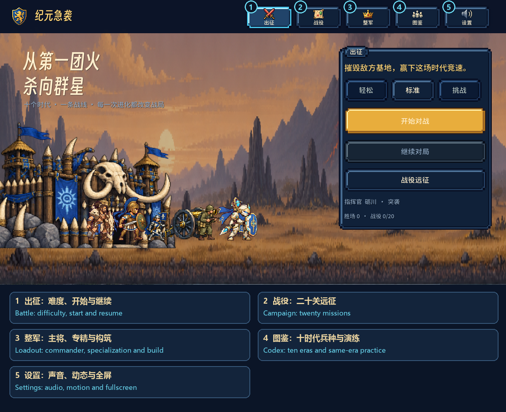

| 标号 / No. | 入口 / Destination | 功能 / Purpose |
| --- | --- | --- |
| 1 | 出征 / Camp | 难度、新对战、继续对局与当前主将 / Difficulty, new match, continue and current commander |
| 2 | 战役 / Campaign | 20 关远征路线、前置解锁、首领关 / 20 missions, sequential unlocks and boss encounters |
| 3 | 整军 / Loadout | 主将、专精、两个通用技能、遗物与天赋 / Commander, specialization, two common skills, relics and talents |
| 4 | 图鉴 / Codex | 十时代兵种信息、指定起始时代对战 / Ten-era troop information and an era-specific match start |
| 5 | 设置 / Settings | 四组音量、音效开关、镜头动态与全屏 / Four audio groups, audio toggles, camera motion and fullscreen |
| 6 | 联机 / Online | 真人匹配、六位码、构筑准备与原局恢复 / Matchmaking, six-digit rooms, builds/readiness and resume |

<details>
<summary>查看各页面原生截图 / Expand native menu screenshots</summary>

**出征营地 / Camp**

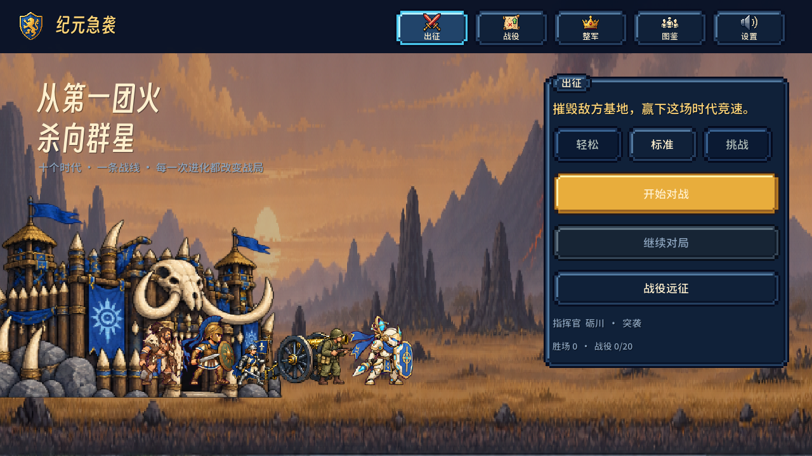

**战役路线 / Campaign route**

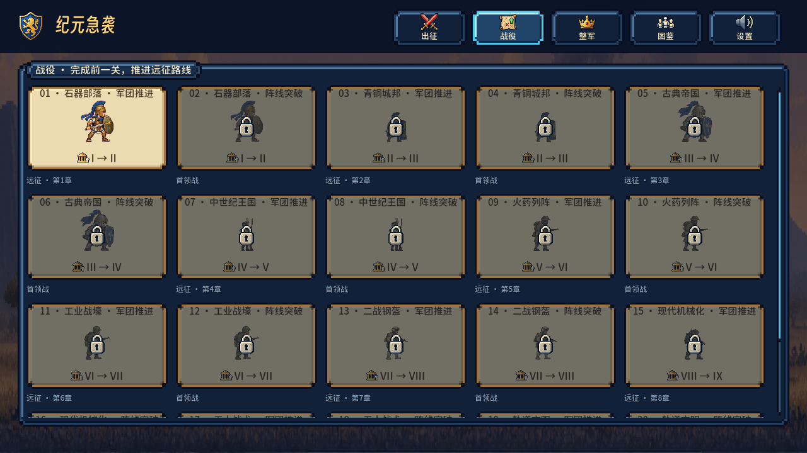

**整军构筑 / Commander loadout**

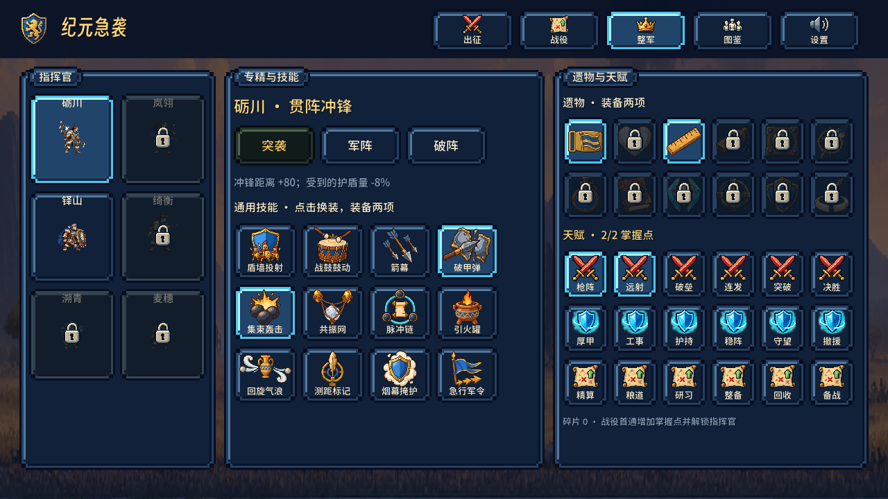

**时代图鉴 / Era codex**

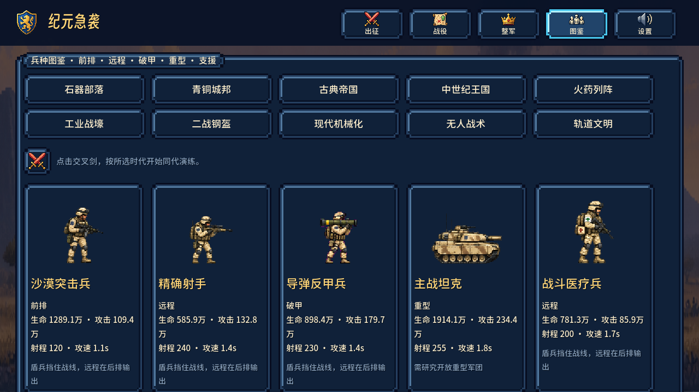

**声音与显示设置 / Audio and display settings**

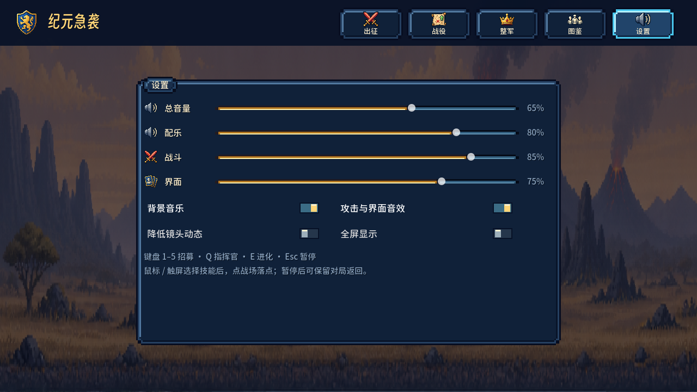

</details>

### 战斗界面示意 / Battle HUD guide

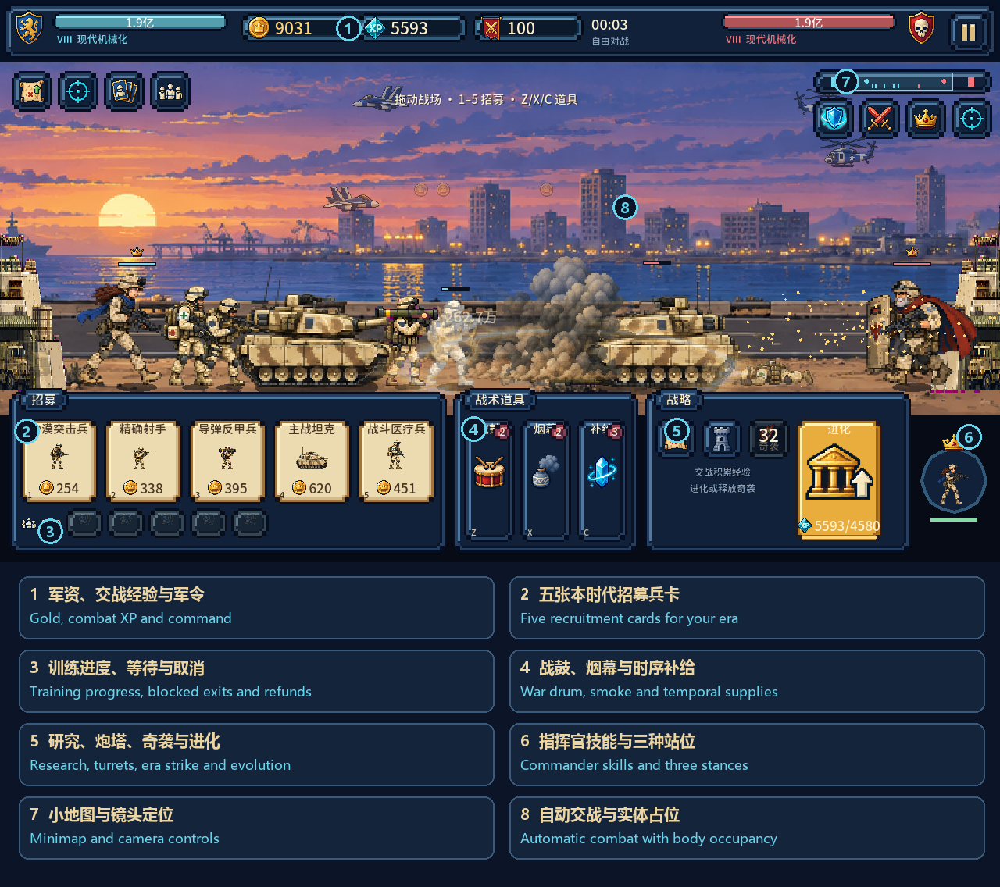

顶栏显示双方基地耐久、各自时代、本方金币、交战经验、军令和时间；底部集中放置本时代五张招募卡、训练队列、三个主动道具、研究、炮塔、奇袭与进化。指挥官入口位于右下，小地图与镜头定位在战场上方。战斗区保留给兵线、弹体、落点预警和打击反馈。

The top bar shows both bases and eras, your gold, combat XP, command and match time. The bottom deck groups five recruitment cards, the queue, three active items, research, turrets, era strike and evolution. Commander actions sit at the lower right; the minimap and camera controls sit above the field.

### 三段实机 GIF / Three native gameplay GIFs

**中世纪：盾兵接敌、骑士推进与范围打击 / Medieval: shield contact, knights and area impacts**

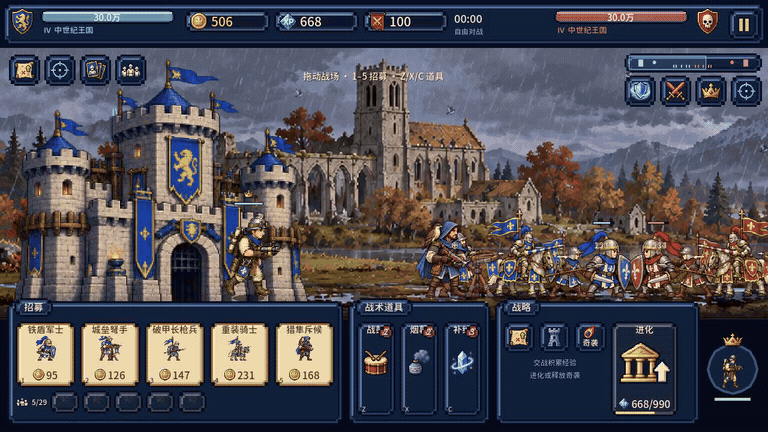

**现代：机械化战线、导弹发射与烟尘余波 / Modern: mechanized lines, missile launch and impact smoke**

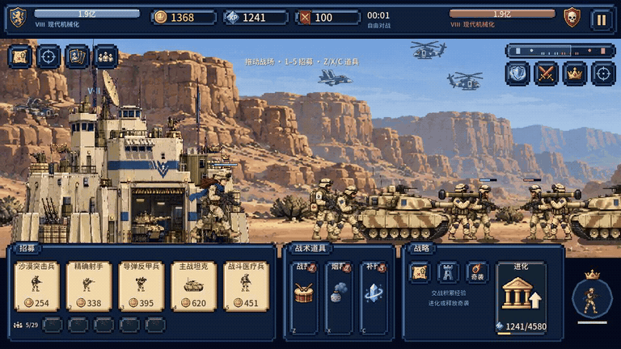

**轨道：能量兵线与轨道打击 / Orbital: energy weapons and orbital strike**

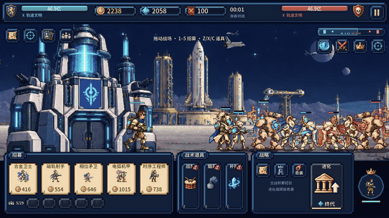

### 十时代风貌 / Ten-era visual progression

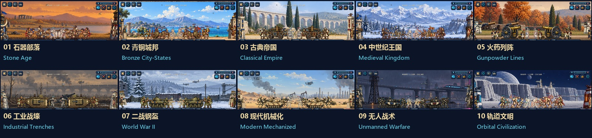

<details>
<summary>查看更多战斗截图 / Expand additional battle screenshots</summary>

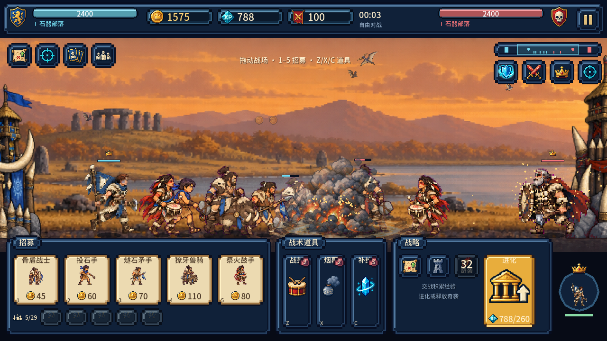

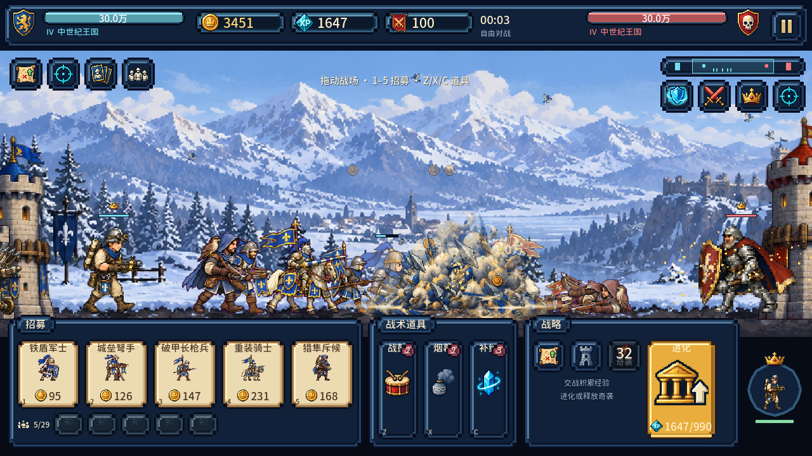

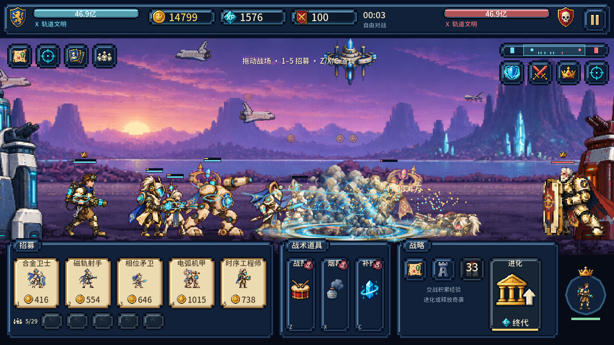

</details>

截图来源、尺寸、GIF 时长和 SHA-256 见 [媒体清单 / Media manifest](docs/media/v0.7.0/media-manifest.json)。实际游戏的音乐和命中音不会出现在 GIF 中，声音设计另见 [SOUND_DESIGN.md](godot/SOUND_DESIGN.md)。

<a id="zh-guide"></a>
## 中文说明

### 1. 游戏目标与基本节奏

玩家与 AI 分居战场两端。训练普通兵、部署炮塔、指挥主将并使用道具，摧毁敌方基地获得胜利。普通兵自动前进、接敌和攻击，玩家管理的是军团组合、资金、训练顺序、施法位置和时代时机。

一局的基础循环是：

1. 用前排稳定接敌位置，为远程与破甲兵创造输出时间。
2. 从交战中获得金币与经验，在新兵、同代研究和基地炮塔间分配金币。
3. 判断经验应该用于时代奇袭解围，还是保存到下一次进化。
4. 进化后用新时代新兵与主将组织反推，同时处理旧兵和旧订单占用的阵线空间。
5. 通过道具、技能、站位和镜头观察调整攻守，最终击破基地。

对战不要求每局都经过十时代。压制策略可以提前结束比赛，守城对局则可能进入加时。当前八个完整对局验证样本的模拟时长约为 **4.7–31.7 分钟**，它们是检查样本，不是承诺的固定局长或全关卡平衡结论。

### 2. 三种对战入口

| 入口 | 当前行为 |
| --- | --- |
| 出征 → 开始对战 | 从石器部落开始的标准 AI 对战，使用当前整军配置；双方独立进化，最高可到轨道文明 |
| 战役 → 关卡 → 出征 | 使用关卡指定的起始时代、时代上限、敌军构筑和增援规则；按路线解锁，首通提供成长奖励 |
| 图鉴 → 选择时代 → 交叉剑按钮 | 双方从所选时代开始，便于查看该时代的兵线与演出；**当前仍按标准对战保存和结算，会影响档案与奖励** |

原生 Godot 营地默认带主将，不沿用旧 Web 版“经典模式默认不带英雄”的规则。图鉴入口尚未实现独立的无奖励沙盒模式。

三种难度分别为轻松、标准、挑战。AI 开局金币／持续收入倍率分别为 **0.80／0.85、1.25／1.35、1.50／1.65**；玩家资源不受难度加成影响。AI 决策间隔和失误率分别为轻松 2 秒／20%、标准 1 秒／8%、挑战 0.5 秒／2%。战役在预设敌方金币上应用对应开局系数，增援仍按关卡规则。进化经验仍来自战斗，不因时间或玩家升级免费获得；竞技公平 AI 属于后续设计。

### 3. 金币、经验与军令

| 资源 | 获取与用途 |
| --- | --- |
| 金币 / 军资 | 玩家石器开局 240；基础收入 2.5/秒，随时代和构筑调整；用于招募、八类研究、炮塔和扩展炮塔槽 |
| 交战经验 / XP | 击杀敌方普通兵、己方普通兵阵亡产生；己方阵亡经验系数为 65%；用于进化与时代奇袭，**等待不产生被动 XP** |
| 军令 / Command | 基础开局 50、上限 100、每秒恢复 3；供主将与通用技能使用，部分构筑提高上限 |

进化与奇袭共用经验，施放奇袭可能推迟升级。时序补给可补充金币与军令，也能推进训练。实际价格、收入和技能参数以运行数据与当前构筑为准。

### 4. 独立进化与跨代压制

**本方升级不会让另一方自动升级。** 两侧有各自的时代、金币、经验、队列与冷却。任一侧进化可能更换共享战场背景；背景依据双方最高时代选择，所以画面换时代不代表落后方也完成了升级。顶栏两侧时代标识分别反映真实状态。

本版进化立即完成，需支付本方经验，并从三项军备增益中选一项：普通兵攻击 +5%、普通兵最大生命 +6%、基础金币收入 +5%。九次进化共 27 个选择条目；它们目前是数值选择，还不是完整的机动／阵地科技分支。

| 进化时的对象 | 实际处理 |
| --- | --- |
| 本方基地 | 换成新时代基地，最大生命按兵种生命比例增长，并立即恢复满血；不会治疗另一方 |
| 本方指挥官 | 更新时代形态、装备、数值及专属技能变体；保留生命比例与技能冷却 |
| 本方招募目录 | 更新为新时代五个兵种 |
| 已在场普通兵 | 保留出生时代和原有单位身份 |
| 已付费训练订单 | 保留购买时的兵种与时代，完成后出旧时代兵 |
| 已建炮塔 | 保留建造时代；可出售后重新建造当前时代炮塔 |
| 敌方军团 | 不因本方进化而自动换代 |

进化后 30 秒内，前三个符合条件的新时代新兵可获得换代冲锋，在首次实际接敌时触发 8 秒增益：移动速度 +25%、首次攻击 +20%。这不是全军旧兵免费换装。

相邻时代同定位单位的基础攻击与生命按 **5 倍**增长，基地生命采用相同尺度；金币价格与收入约按每代 **1.28 倍**、交战经验约按 **1.45 倍**增长。因此进化带来明确的战力跃迁，经验节奏与伤害倍率并非同一增长曲线。五倍数值不等于固定胜率，仍需考虑阵型、研究、预算与在场旧兵。

### 5. 完整十时代与五十兵种

招募卡从左到右固定为前排、远程、破甲、重型、支援定位；键盘 `1`–`5` 对应五个卡槽。支援槽可同时具有远程攻击与辅助能力，具体以单位的实际特殊参数为准。重型卡需先完成“重型军团”研究。

<a id="roster"></a>

| 时代 / Era | 1 前排 / Front | 2 远程 / Ranged | 3 破甲 / Anti-armor | 4 重型 / Heavy | 5 支援 / Support | 下次进化 XP |
| --- | --- | --- | --- | --- | --- | ---: |
| I 石器部落 / Stone Age | 骨盾战士 | 投石手 | 燧石矛手 | 獠牙兽骑 | 祭火鼓手 | 260 |
| II 青铜城邦 / Bronze City-States | 青铜盾卫 | 城邦弓手 | 青铜长矛卫 | 双轮战车 | 太阳旗卫 | 420 |
| III 古典帝国 / Classical Empire | 军团盾卫 | 帝国弩手 | 重标枪兵 | 攻城弩车 | 军团医师 | 650 |
| IV 中世纪王国 / Medieval Kingdom | 铁盾军士 | 城垒弩手 | 破甲长枪兵 | 重装骑士 | 猎隼斥候 | 990 |
| V 火药列阵 / Gunpowder Lines | 线列步兵 | 燧发枪手 | 刺刀掷弹兵 | 野战加农炮 | 军乐鼓手 | 1480 |
| VI 工业战壕 / Industrial Trenches | 堑壕步兵 | 栓动步枪兵 | 重机枪手 | 菱形坦克 | 战地军医 | 2180 |
| VII 二战钢盔 / World War II | 钢盔步兵 | 半自动步枪兵 | 反坦克射手 | 中型坦克 | 卫生兵 | 3180 |
| VIII 现代机械化 / Modern Mechanized | 沙漠突击兵 | 精确射手 | 导弹反甲兵 | 主战坦克 | 战斗医疗兵 | 4580 |
| IX 无人战术 / Unmanned Warfare | 外骨骼卫士 | 线圈射手 | 电磁反甲兵 | 无人突击车 | 电子工程师 | 6520 |
| X 轨道文明 / Orbital Civilization | 合金卫士 | 磁轨射手 | 相位矛卫 | 电弧机甲 | 时序工程师 | — |

表中的兵种名保留游戏内中文名称，便于对应按钮和图鉴；英文时代与定位是文档译名。单位 ID 为 `U{时代序号}{槽位}`，例如 `U11` 是石器前排、`U84` 是现代主战坦克、`U105` 是轨道支援。

以未叠加构筑的石器基础数据为例：

| 单位 | 金币 | 基础生命 | 基础攻击 | 攻击周期 | 射程 | 训练时间 |
| --- | ---: | ---: | ---: | ---: | ---: | ---: |
| 骨盾战士 | 45 | 165 | 14 | 1.15 秒 | 42 | 1.7 秒 |
| 投石手 | 60 | 75 | 17 | 1.40 秒 | 220 | 2.1 秒 |
| 燧石矛手 | 70 | 115 | 23 | 1.35 秒 | 90 | 2.4 秒 |
| 獠牙兽骑 | 110 | 245 | 30 | 1.80 秒 | 52 | 3.8 秒 |
| 祭火鼓手 | 80 | 100 | 11 | 1.70 秒 | 190 | 2.7 秒 |

完整数据见 [units.json](godot/assets/data/units.json)、[eras.json](godot/assets/data/eras.json) 与 [weapons.json](godot/assets/data/weapons.json)。

### 6. 真实占位、攻击排队与训练阻塞

地面单位按身体范围占位，人物和车辆使用不同体积。短兵必须取得合法接触位置，不能让整支军队重叠在同一个点攻击；前排后面的单位等待前方空间。远程在射程内输出，具备相应规则的长兵可隔一名前排攻击，不能据此假定所有现代反甲单位都能隔排近战。

攻击包含起手、释放与恢复时序，飞行弹体有实际行程和命中结算。受击、护盾吸收、破盾、击退和死亡以战斗事件驱动表现。镜头、粒子和声音不额外制造伤害。

每侧训练队列最多 **5** 单。当前人口限制统计在场、存活的非主将实体，最多 **29**；主将另保留一个名额。队列中的订单目前不预先占用人口。训练完成但人口已满或基地出口无空间时，完工订单保留并等待，后续订单也会被阻塞。

点击常驻队列可查看与取消订单：未开始训练全额退款；已经开始返还 75%。训练不会因画面切换或本方进化而换成其他兵种。

医疗以 1.5 秒脉冲执行，一次最多处理三个目标。治疗和被动护盾共用滚动恢复预算：战斗中三秒合计不超过最大生命的 6%，且不超过近期承伤压力的 35%；脱战三秒最多恢复 15%。被动护盾上限为最大生命的 12%，全部护盾上限为 20%，血条与盾条分开显示。多名医疗兵不能无限叠成永动前排。

### 7. 主将、技能与成长构筑

| 主将 | 核心行为 | 解锁 |
| --- | --- | --- |
| H01 砺川 / Li Chuan | 冲锋、接触爆发、前线突击 | 初始可用 |
| H02 岚翎 / Lan Ling | 连射、远程火力 | 首通 M03 |
| H03 铎山 / Duo Shan | 掩护、护盾与守阵 | 初始可用 |
| H04 绮衡 / Qi Heng | 工程部署、召唤炮台 | 首通 M07 |
| H05 溯青 / Su Qing | 裂隙、能量与控制 | 首通 M15 |
| H06 麦穗 / Mai Sui | 补给与生产支援 | 首通 M11 |

每位主将有十套时代形态，共 **60** 套；进化改变造型、武器和专属技能名称／参数。它们沿用冲锋、连射、掩护、炮台、裂隙、补给六个技能行为家族，不是 60 套互不相关的技能系统。

整军页可配置一位主将、该主将三种专精之一、两个通用技能、两个遗物与天赋。运行数据含 12 个通用技能、6 个主将专属技能、18 个专精、12 个遗物和 18 个天赋。天赋分为先锋、守城、远征三路，初始两个掌握点，成长上限六点；高阶天赋有前层约束。新增通用技能替换最早装备的槽位，遗物可卸下。

战斗中的指挥官面板提供 **撤退、护阵、突击**。撤退后回到基地驻营，不占前线、不攻击、不施法；驻营基础恢复为每秒最大生命的 2.5%，仍受恢复预算限制。切回护阵或突击需要空闲出口，站位指令间隔为 0.5 秒。主将阵亡后约 25 秒重建，不能借阵亡刷新技能冷却。

战役首通解锁主将、掌握点、遗物和碎片。重复遗物转换为碎片，未拥有遗物可用四个碎片打造。战利品包含稀有保底与独立随机状态；奖励按对局序列去重，读取同一已结算结果不会重复领取。当前熟练度会记录在档案中，不等于已有完整的熟练度解锁树。

### 8. 主动道具、同代研究与炮塔

| 道具 | 初始次数 | 冷却 | 实际效果 |
| --- | ---: | ---: | --- |
| 战鼓令 | 2 | 22 秒 | 全军 8 秒攻击 +18%、移速 +12%；推进队首原始训练时长的 35% |
| 烟幕罐 | 2 | 28 秒 | 选择落点，半径 135 内敌军减速 35%，持续 5 秒；当前不是隐身或阻断射击效果 |
| 时序补给 | 3 | 30 秒 | 获得 65 × 当前时代金币倍率的军资、15 军令；推进队首原始训练时长的 45% |

训练推进有共同累计上限：最多缩短一笔订单原始时长的 50%，叠加道具不会让生产瞬间完成。

八类金币研究如下。表内为基础价格，实际价格随时代和研究层级调整；研究在本局跨时代保留。

| 研究 | 基础金币 | 层数 | 每层效果 |
| --- | ---: | ---: | --- |
| 重型军团 | 105 | 1 | 开放重型卡 |
| 步兵锋刃 | 75 | 2 | 前排攻击 +15% |
| 步兵甲胄 | 60 | 3 | 前排护甲 +10 |
| 支援火力 | 85 | 2 | 远程攻击 +15% |
| 破甲技术 | 85 | 2 | 破甲兵攻击 +15% |
| 重型冲击 | 115 | 2 | 重型攻击 +15% |
| 远程校准 | 70 | 3 | 远程射程 +25 |
| 炮塔强化 | 95 | 2 | 基地炮塔攻击 +15% |

每时代提供两种基地炮塔：单体速射与范围溅射，共 20 种。初始开放一个槽，后续槽基础解锁费用为 90、180 金币；出售返还 60%。旧炮塔不会自动进化，售出后才能换建新时代炮塔。具体价格与攻击数据见 [turrets.json](godot/assets/data/turrets.json)，研究和道具定义见 [game_data.gd](godot/scripts/game_data.gd)。

### 9. 十套时代奇袭与弱随机事件

| 时代 | 时代奇袭 / Era strike | XP 费用 | 脉冲次数 |
| --- | --- | ---: | ---: |
| I | 流星陨火 / Meteor Fire | 55 | 2 |
| II | 火矢齐射 / Fire Arrow Volley | 80 | 3 |
| III | 重弩破阵 / Heavy Ballista Strike | 116 | 2 |
| IV | 王国箭雨 / Royal Arrow Rain | 168 | 4 |
| V | 炮列齐鸣 / Artillery Salvo | 243 | 3 |
| VI | 重炮覆盖 / Heavy Barrage | 353 | 3 |
| VII | 轰炸机群 / Bomber Formation | 511 | 3 |
| VIII | 制导空袭 / Guided Strike | 741 | 2 |
| IX | 无人蜂群 / Drone Swarm | 1075 | 4 |
| X | 轨道审判 / Orbital Judgment | 1558 | 3 |

奇袭冷却 34 秒、预警 1.15 秒、脉冲间隔 0.24 秒；单次基础伤害为 65 × 施放时代攻击倍率，最多处理六个不同目标，不直接伤害基地。施放时代、伤害与落点在发起时冻结，途中进化不会抬高已发射攻击。弹体数量用于演出层次，不是每个粒子额外结算伤害。

载具根据时代贴地发射、飞行投弹或垂直打击：现代导弹车为地面发射平台，二战轰炸机为空中平台，轨道时代采用轨道打击。演出有载具、发射、飞行、冲击、烟尘、碎片和余波阶段。

中性弱事件包含陨石、恐龙坠落、落石、雷暴、坠机、无人机坠落与轨道残骸。首次出现在 38–58 秒，其后间隔 48–82 秒，每局最多 14 次；预警 2.1 秒，单次事件伤害不超过目标最大生命的 10%，不伤基地、不产金币和经验。环境有独立随机流，存档后继续不会重抽已预告事件。

每时代三张全景，共 30 张。任一侧进化后依据双方最高时代换图，并避免重复上一张。蝙蝠、鸟、翼龙、气球、飞机、直升机、无人机、穿梭机等天空剪影具有运行时位移、浮动与旋转；它们是表现元素，没有碰撞、奖励或额外战力。

### 10. 战役与结算

战役共 20 关，每时代两关，奇数关为军团推进，偶数关为首领阵线突破。M01–M18 每对关卡从相应时代开始，最高进入下一代；M19、M20 从轨道时代开始并维持该上限。任务简报展示敌军、起止时代、增援波数与教学目标。

关卡按前置通关解锁，通关状态和首次奖励保存在本机档案。胜负以基地状态判定；为避免无尽龟缩，20 分钟提高基地战斗伤害压力至 1.5 倍，24 分钟至 2 倍，30 分钟开始每秒损耗最大基地生命的 1%。

### 11. 键鼠与触屏操作

| 操作 | Godot 0.8.0 输入 |
| --- | --- |
| 招募五个卡槽 | `1`–`5`，或点击兵卡 |
| 战鼓、烟幕、补给 | `Z`、`X`、`C`，或点击道具 |
| 指挥官技能与站位 | `Q` 打开面板，再点击图标 |
| 进化选择 | `E`，或点击琥珀色进化卡 |
| 移动镜头 | 拖动战场、鼠标滚轮、`A` / `D`、`←` / `→` |
| 定位两侧基地 | `Home` / `End`，或战场定位按钮 |
| 小地图 | 点击位置定位；可选择跟随前线／主将 |
| 目标技能或烟幕 | 先选技能／道具，再点合法战场落点；拖动只移动镜头 |
| 取消瞄准 | 右键，或 `Esc` |
| 返回、关闭面板、暂停 | `Esc` 按当前界面逐级处理 |
| 研究、炮塔、时代奇袭、队列管理 | 对应 HUD 图标，不沿用旧 Web 快捷键 |

触屏使用相同的屏幕入口和选中后点落点流程，游戏以横屏为设计基准。当前已验证真实输入事件与 1280×720、960×540、800×450 三种视口布局；Android 真机上的触感与性能尚未验收。

### 12. UI、美术、动作和声音

UI 使用选定的方案 1「像素指挥卡组」：深海军蓝面板、纸色招募卡、像素切角与阶梯边框；青蓝标示本方／选择，红色标示敌方／危险，琥珀标示进化／奖励。图标优先，必要的单位名、价格与状态文字保持可读。菜单、HUD、队列、弹窗和指挥官面板使用同一套样式。

字体使用圆体中文正文与得意黑标题的子集资源，附带各自 SIL Open Font License。当前运行文本需要的 662 个汉字通过字形检查；如果扩写文本，需要重新制作子集。像素纹理采用最近邻采样，参考视口为 1280×720。

已使用的 AI 光栅美术通过指定 **Sub2API `gpt-image-2.5`** 制作，运行时无需访问生成服务。角色图集覆盖待机、移动、攻击、受击、死亡五种动作，共 30 帧；按原有身体、武器、方向和脚底锚点归一化，敌我使用不同配色。活动角色有 50 个兵种与 60 套主将形态，另有十个静态召唤炮台，共 120 个实际角色定义；敌我有效活动资源合计 6620 帧。包内另保留六个旧主将定义，因此完整动画清单是 126 定义、252 图集、6980 个非空帧。

打击表现以实际事件驱动：武器释放、弹道、命中闪光、材质碎屑、尘烟、护盾吸收／破裂、伤害文字、受击姿态、死亡与基地反馈。表现层有数量预算，避免将密集粒子或音效重复计入伤害。召唤炮台用静态图配合后坐力与闪光；天空剪影尚未使用逐帧拍翼或螺旋桨图集。

音频含 43 类、129 个音效变体、四首 Yourset 完整 BGM 和三段胜负平局短曲。菜单与十时代共用随机轮播，每轮四首各一次，跨轮避免连续重复；曲间 2 秒等功率淡化，切菜单和时代进化均不断曲。四首 BGM 由项目所有者指定提供并独立标记，实测约 -19 LUFS；旧 CC0 循环曲保留用于历史兼容，但当前原生 BGM 不再使用它们。公开音效采用 CC0，结合合成瞬态和分层混音；攻击、发射、命中、木盾、肉体、金属、破盾与奇袭有不同声音身份。Music / Battle / UI 分组、镜头声像、画外衰减、重要事件压低配乐、暂停与后台恢复均由独立音频模块处理。GIF 没有声音，完整方案见 [声音设计](godot/SOUND_DESIGN.md) 和 [音频来源](godot/assets/audio/Audio-CREDITS.txt)。

### 13. 存档、继续与数据迁移

Godot 使用本机 `user://` 数据目录保存：`profile.json` 记录构筑、战役、解锁与奖励；`settings.json` 记录音量和显示；`match.json` 记录可继续的战斗。写入先落到 `.tmp`，再保留 `.bak` 备份并替换正式文件，读取时可回退到备份。

暂停菜单可以保留对局返回营地，然后使用“继续对局”。快照 v2 包含双方时代、金币、经验、队列、实体、生命／护盾、技能冷却、随机环境、随机流及镜头。旧 Godot 五时代快照映射为新 I / II / IV / VI / X，保留旧订单、生命比例与冷却；它不意味着可以直接导入任意 Web 存档。

Windows 与 Android 档案分别存于各自应用数据目录，单机进度没有云同步或跨平台自动迁移。单人对战可离线运行；联机仅保存所选服务端的随机匿名身份与会话状态。

### 14. 从源码启动原生 Godot 版

安装 **Godot 4.7.2 Standard（非 .NET）**；导出时再安装同版本 Export Templates。下列命令在 **仓库根目录**的 PowerShell 执行，`$godotExe` 请指向自己的引擎可执行文件。项目运行不需要 Node.js，也不需要重新调用图片生成。

```powershell
git clone git@github.com:wikigsroom/Evolutionary-history-of-war.git
cd Evolutionary-history-of-war

$godotExe = 'C:\Tools\Godot\Godot_v4.7.2-stable_win64_console.exe'
& $godotExe --headless --path godot --editor --import
& $godotExe --path godot --editor
```

在编辑器按 `F6` 运行当前场景或 `F5` 运行工程。也可以直接启动游戏：

```powershell
& $godotExe --path godot
```

首次导入会在 `godot/.godot/` 生成缓存；该目录不入库。PNG 的 `.import` 配置和 GDScript 的 `.uid` 文件属于源码资源引用，随仓库保留。全部工具在本机原生执行，不要求 Docker、WSL 或虚拟机。

### 15. Windows 与 Android 构建

仓库包含源码与运行素材，**未把本机 EXE、APK、安装工具链和大体积原始录像提交到 Git**。可直接游玩的安装包通过 [v0.8.0 Release](https://github.com/wikigsroom/Evolutionary-history-of-war/releases/tag/v0.8.0) 下载；以下 `godot/build/` 路径表示自行构建时的本机输出。

先创建仅用于本机的导出配置：

```powershell
Copy-Item godot/export_presets.example.cfg godot/export_presets.cfg
New-Item -ItemType Directory -Force godot/build/windows, godot/build/android | Out-Null
```

`export_presets.example.cfg` 不含签名凭据，使用安装的标准模板。私有的 `export_presets.cfg`、密钥库、密码、工具链和导出包均被 Git 忽略；应在 Godot 的导出设置中配置自己的发布密钥。

**Windows x64：**

```powershell
& $godotExe --headless --path godot --export-release 'Windows Desktop' build/windows/Epoch-Rush-Godot.exe
python -X utf8 tools/package_godot_windows.py
```

第二步用 Python 标准库生成八文件便携 ZIP 和 `SHA256SUMS.txt`，随包附带引擎、字体、音频许可。EXE 内嵌资源，解压运行无需安装 Godot 或启动网页服务。包文件名为 `godot/build/windows/Epoch-Rush-Godot-Windows.zip`。

**Android arm64：**需要本机 JDK 21、Android SDK / platform 36、Godot 的 Android 导出模板和本机签名配置。当前 Gradle 预设应用 ID 为 `studio.epochrush.pixelcommand`，版本 0.8.0、versionCode 13，最低 API 24、target SDK 36，仅 arm64。Godot 编辑器中的 SDK、Java 与 debug keystore 路径也需正确设置。

```powershell
# 下面两项填入你自己的安装路径。
$env:JAVA_HOME = 'C:\Tools\jdk-21'
$env:ANDROID_SDK_ROOT = "$env:LOCALAPPDATA\Android\Sdk"

& $godotExe --headless --path godot --export-release 'Android' build/android/Epoch-Rush-Godot-release.apk
& $godotExe --headless --path godot --export-debug 'Android' build/android/Epoch-Rush-Godot-debug.apk
python -X utf8 tools/finalize_android_packages.py
```

当前预构建 Android 模板曾缺失 adaptive-icon 资源别名；后处理脚本补齐资源、按 16 KB 原生页对齐并使用本机密钥重新签名。运行前须准备两个 APK、release 密钥配置和编辑器 debug keystore 配置。脚本优先读取 `JAVA_HOME`、`ANDROID_SDK_ROOT` / `ANDROID_HOME`；特殊安装可指定 `EPOCH_RUSH_JAVA`（Java 可执行文件）、`EPOCH_RUSH_ANDROID_BUILD_TOOLS`（build-tools 目录）与 `EPOCH_RUSH_GODOT_EDITOR_SETTINGS`（编辑器设置文件）。Android 包已验证，但尚无连接真机的安装和试玩证明。

### 16. 回归检查与已记录的验收

先完成 Godot 资源导入，再运行基础规则、技能和存档检查：

```powershell
New-Item -ItemType Directory -Force output/qa/ten-eras | Out-Null
& $godotExe --headless --path godot --script res://qa/ten_era_rules.gd
& $godotExe --headless --path godot --script res://qa/ten_era_skills.gd
& $godotExe --headless --path godot --script res://qa/ten_era_restore.gd
```

旧存档真实测试样本已经包含在 [godot/qa/fixtures](godot/qa/fixtures)，不依赖被忽略的本机生产目录。原生交互和声音检查需要图形／音频设备；音频不可用 headless 的 Dummy 驱动代替：

```powershell
& $godotExe --path godot --script res://qa/interaction_regression.gd
& $godotExe --path godot --script res://qa/audio_regression.gd
```

以下为 2026-10-07 的 0.7.0 成品证据，精简 JSON 已随仓库提交；原始高分辨率审查板、运行日志、长录像和安装包保留在本机输出。历史报告中的构建哈希对应当时的成品，不表示每次文档或工具修改后都重新导出了游戏。

| 范围 | 已记录结果 | 证据 |
| --- | --- | --- |
| 时代、数值、恢复、环境 | 420 / 420 规则检查 | [rules-regression.json](docs/qa/v0.7.0/rules-regression.json) |
| 主将技能与实际作用 | 203 / 203 技能检查 | [skills-regression.json](docs/qa/v0.7.0/skills-regression.json) |
| 旧档迁移与继续 | 45 / 45 恢复检查 | [restore-regression.json](docs/qa/v0.7.0/restore-regression.json) |
| 主将形态 | 120 个敌我时代形态渲染 | [native-transition-report.json](docs/qa/v0.7.0/transitions/native-transition-report.json) |
| 地图与演出 | 十时代、30 背景、双方载具、90 张原生截图的检查记录 | [native-visual-report.json](docs/qa/v0.7.0/windows-embedded/native/native-visual-report.json) |
| 鼠标与触屏输入 | 159 项，三种视口 | [interaction-checks.json](docs/qa/v0.7.0/windows-embedded/interactions/interaction-checks.json) |
| Windows 原生声音 | 265 / 265；38.613 秒实际混音，削波 0、捕获丢帧 0 | [audio-regression.json](docs/qa/v0.7.0/audio/native/audio-regression.json)、[signal-checks.json](docs/qa/v0.7.0/audio/audio-signal-checks.json) |
| 完整合法对局 | 八场全部结束，每 tick 地面重叠与正常路径跳跃均为 0 | [full-battles.json](docs/qa/v0.7.0/full-matches/full-battles.json) |
| Windows 内嵌内容 | 19 个 JSON、252 图集；当时数据与源码逐字节相同 | [embedded-content.json](docs/qa/v0.7.0/windows-embedded/embedded-content.json) |
| Android 内容与签名 | 两个 APK、19 个数据文件、570 项纹理；签名／16 KB 对齐通过 | [package-asset-checks.json](docs/qa/v0.7.0/packages/package-asset-checks.json)、[android-finalization.json](docs/qa/v0.7.0/android-finalization.json) |

桌面性能样本来自 RTX 3060、1280×720、Compatibility / OpenGL 3.3。24 单位代表场景帧间隔 p95 为 **8.837 ms**；60 单位合成压力场景 p95 为 **14.538 ms**，最大 **46.896 ms** 包含场景切换。末尾存活／镜头内实体分别为 13/10、36/26，静态内存约 67.4/68.7 MiB；合成场景有故意重叠与重复奇袭，不能解释为手机性能或 60 人一直同时在屏。详见 [performance.json](docs/qa/v0.7.0/performance/performance.json)。

### 17. 工程结构与可修改入口

```text
Evolutionary-history-of-war/
├─ README.md                         中英双语总览与实机展示
├─ godot/
│  ├─ project.godot                  原生 0.8.0 工程入口
│  ├─ scenes/Main.tscn               主场景
│  ├─ scripts/                      模拟、战斗、菜单、HUD、音频与存档
│  ├─ assets/data/                  19 个 JSON 数据表
│  ├─ assets/                       角色、基地、地图、UI、字体、音频
│  ├─ qa/                           回归、原生交互、截图与录像驱动
│  ├─ docs/                         架构与分发许可
│  └─ export_presets.example.cfg    不含凭据的导出配置模板
├─ docs/
│  ├─ epoch-rush/                    设计、版本报告、玩法提案
│  ├─ media/v0.7.0/                  实机截图、双语示意图、GIF
│  └─ qa/v0.7.0/                     精简交付证据与哈希清单
├─ tools/                           资源、媒体、校验与本机打包工具
├─ src/                             历史 Phaser 0.3.1 源码
├─ public/                          历史 Web 运行素材与许可
├─ tests/                           历史 Web 单元／回归测试
├─ desktop/                         历史 Electron 桌面壳
├─ android/                         历史 Capacitor Android 工程
└─ ios/                             历史 Capacitor iOS 工程
```

原生模拟以 30 Hz 固定步长运行，渲染做插值。模拟状态、输入、表现、存档和声音分层，声音和视觉事件不驱动战斗随机数。主要修改入口：

| 文件 / 模块 | 职责 |
| --- | --- |
| [game_model.gd](godot/scripts/game_model.gd) | 双方状态、招募、研究、进化、队列与快照 |
| [epoch_combat.gd](godot/scripts/epoch_combat.gd) | 占位、移动、目标、伤害、投射物、恢复与护盾 |
| [epoch_skills.gd](godot/scripts/epoch_skills.gd) | 主将／通用技能、道具与时代奇袭 |
| [epoch_environment.gd](godot/scripts/epoch_environment.gd) | 环境事件、地图选择与独立随机状态 |
| [menu_screen.gd](godot/scripts/menu_screen.gd)、[battle_screen.gd](godot/scripts/battle_screen.gd) | 菜单结构、HUD、弹窗与交互 |
| [battle_world.gd](godot/scripts/battle_world.gd)、[unit_view.gd](godot/scripts/unit_view.gd) | 战场、镜头、角色图集与动作播放 |
| [battle_audio.gd](godot/scripts/battle_audio.gd) | 声音映射、混音、声部、优先级与暂停 |
| [game_store.gd](godot/scripts/game_store.gd) | 档案、设置、战役奖励和继续对局 |
| [assets/data](godot/assets/data) | 时代、兵种、主将形态、技能、地图规则、任务与动画元数据 |

修改数值先改 Godot 数据与规则，再检查回归。`docs/epoch-rush/data/` 和根目录 `public/` 含历史内容，不能直接当作十时代原生版的唯一数据源。修改中文文本后需检查字体子集；修改图集后需同步动画元数据、敌我资源、身体锚点和哈希。资源制作工具只在开发阶段使用，游戏运行不依赖 Python 或生成网关。

### 18. 历史 Web / Electron / Capacitor 0.3.1

根目录 `package.json` 的 **0.3.1** 对应历史 Web 线路；`godot/project.godot` 的 **0.8.0** 对应原生重构，两个版本号属于不同运行时。历史线路有五时代、25 兵种、6 英雄、10 炮塔、18 技能、三个主动道具与 15 战役关卡；旧快捷键、默认无英雄经典模式和存档格式与 Godot 不完全一致。

需要本机支持该锁文件的 Node.js（Vite 8 工具链要求的 Node 版本，建议至少 22.12）和 npm：

```powershell
npm ci
npm run dev

# 单独执行检查或构建：
npm test
npm run build
npm run preview
```

开发服务绑定 `127.0.0.1`，生产输出在被忽略的 `dist/`。历史桌面启动用 `npm run desktop`；打包入口为 `npm run desktop:pack`。历史移动壳通过 `npm run native:sync` / `npm run android:build` 构建，Android 需要 JDK／SDK，iOS 需要 Mac、Xcode 与签名。根目录 `ios/` 是旧 Capacitor 工程，并不表示当前已有 Godot 原生 iOS 包。

### 19. 媒体再生成与素材许可

游戏运行素材已经入库，无需重做生产任务。需要更新 README 媒体时，菜单截图可从实际工程获取：

```powershell
$env:EPOCH_RUSH_README_MEDIA = Join-Path (Get-Location) 'docs/media/v0.7.0'
& $godotExe --path godot --script res://qa/readme_capture.gd
```

该脚本使用隔离 QA 档案，不修改玩家存档。若要注明来自成品包，使用同版本编辑器加载实际 EXE 内嵌 PCK：

```powershell
& $godotExe --main-pack godot/build/windows/Epoch-Rush-Godot.exe --script godot/qa/readme_capture.gd
```

发行模板本身不支持外置 `--script`。战斗截图来自 `ten_era_visual.gd`，GIF 源录像由 `ten_era_showcase.gd` 驱动；完整原始素材保留在本机 `output/qa/ten-eras/`，不随精简证据上传。`tools/build_readme_media.py` 需要 Pillow、FFmpeg、本机对应截图和录像，Windows 标注使用系统微软雅黑，仅把文字渲染进图中，不分发该字体：

```powershell
python -m pip install pillow
python -X utf8 tools/build_readme_media.py --help
```

| 资源 | 许可与来源 |
| --- | --- |
| Godot 引擎 | MIT；随分发附带 [引擎许可](godot/docs/distribution/Godot-LICENSE.txt) 与 [第三方声明](godot/docs/distribution/Godot-third-party-notices.txt) |
| 圆体中文字体 | SIL OFL 1.1，保留源字体版权与声明；[resource-rounded-LICENSE.txt](godot/assets/fonts/resource-rounded-LICENSE.txt) |
| 得意黑标题字体 | SIL OFL 1.1；[smiley-LICENSE.txt](godot/assets/fonts/smiley-LICENSE.txt) |
| 公开音效与音乐 | CC0-1.0；Kenney、joaquinton、Kistol、Eldritch Grim、MintoDog、Theodore Kerr、cynicmusic 等；[作者与来源](godot/assets/audio/Audio-CREDITS.txt)、[CC0 文本](godot/assets/audio/Audio-CC0-1.0.txt) |
| Yourset 四首 BGM | 项目所有者指定提供，独立来源标记；不适用 CC0，不提供单独素材的再分发许可，详见 [音频声明](godot/assets/audio/Audio-CREDITS.txt) |
| AI 美术与处理后的运行素材 | 指定 Sub2API / `gpt-image-2.5` 制作，运行文件随源码提供；原始生产提示词与审查过程见设计文档，私有接口凭据不入库 |
| 本项目代码与自制内容 | 尚未选择覆盖整个仓库的统一开源许可证；第三方引擎、字体与音频分别适用自身许可 |

### 20. 当前边界与下一步

本版已实现独立时代、真实占位、同代研究、主将构筑、主动道具、十时代演出、本机存档和真人联机。以下边界可在源码与验收中确认：

- 单人模式对手为本机 AI；联机模式提供真实 PvP、自由匹配与六位码，需运行自己的服务端。没有已部署公共匹配服、回放服务或单机云档案。
- 进化是即时的三选一数值增益；公开研发读条、机动／阵地分支和有限集结属于下一轮提案。
- AI 难度明确包含开局金币和持续收入系数，属于单机挑战模式；尚未实现完全隔离的公开观察快照，不宣称竞技公平。
- 图鉴指定时代入口仍用普通对战结算；无奖励沙盒尚未接入。
- “战术补给”数据描述还含未接入的学识收入加成；当前实际作用为金币收入提升，等待仍不生 XP。
- Android 仅完成 arm64 包、资源、签名和对齐验证，未完成真机操作、性能与听感；原生 Godot iOS、Linux、macOS 和浏览器导出未做本次交付验收。
- 八场完整对局和自动规则检查不等于二十关全部人工难度测试，也不等于已证明五五开胜率。
- Windows 强制 `--quit-after` 的启动样本曾出现退出对象／资源诊断；详见交付报告，不能据此声明整个运行周期无资源泄漏。

下一轮将考虑生产与集结成本、公开研发、信息与反制、竞技 AI 的观察约束和更有取舍的时代路线。完整设计见 [0.7 后续玩法深化与对等博弈](docs/epoch-rush/godot-v0.7-gameplay-depth-and-fair-duels.md)，这些内容未计入当前已实现功能。

### 21. 文档导航

- [Godot 工程、启动与导出](godot/README.md)
- [Godot 声音设计与事件映射](godot/SOUND_DESIGN.md)
- [十时代 0.7.0 交付报告](docs/epoch-rush/godot-v0.7-ten-eras-report.md)
- [公开精简验收证据](docs/qa/v0.7.0/README.md)
- [下一轮玩法与对等博弈设计](docs/epoch-rush/godot-v0.7-gameplay-depth-and-fair-duels.md)
- [Age of War 前两部复核与核心逻辑](docs/epoch-rush/20-Age-of-War前两部复核与重做方案.md)
- [项目设计资料索引](docs/epoch-rush/README.md)
- [原生架构说明](godot/docs/rebuild-architecture.md)

历史设计与交付记录可能引用本机 `output/`、本机技能路径或旧版本数字；GitHub 阅读时以本 README、Godot 当前源码及 `docs/qa/v0.7.0/` 为当前公开入口。

<a id="en-guide"></a>
## English guide

### 1. Objective and match flow

Epoch Rush is a side-view army and base battle with offline AI modes and real-player online 1v1. Online play uses an operator-run authoritative server. Regular troops move and fight automatically. You manage recruitment order, unit composition, research, turrets, commander skills, item timing and evolution. Destroy the opposing base to win.

Build a front line to protect ranged and anti-armor troops, earn combat XP, then decide whether to spend it on an era strike or save it for evolution. A successful evolution creates a large power jump, but old troops and paid orders still occupy your army's space. Commander placement, targeted skills and limited items help convert that advantage into a push.

Matches may end before reaching the final era. Eight completed verification samples lasted approximately **4.7–31.7 simulated minutes**. This is a test range rather than a fixed match-length promise or a complete balance study.

### 2. Modes, menus and difficulty

The five menu destinations are **Camp, Campaign, Loadout, Codex and Settings**. The [annotated menu guide](#media) shows their actual screen positions. Current in-game text is Chinese; the English names here are documentation translations, not an implemented English localization.

| Entry | Implemented behavior |
| --- | --- |
| Camp → Start | Standard AI match starting in the Stone Age, using the equipped commander build; independent evolution up to era X |
| Campaign → Mission | Mission-specific starting era, maximum era, opposing build and reinforcement rules; sequential progression and first-clear rewards |
| Codex → Era → Crossed swords | Both armies start in the selected era to inspect its troops and effects; **currently saves and rewards as a standard match**, not a reward-free sandbox |

The native camp enables commanders by default. The legacy Web runtime's default hero-free classic mode does not describe the Godot version.

AI starting gold / passive income multipliers are **0.80 / 0.85** on Easy, **1.25 / 1.35** on Standard and **1.50 / 1.65** on Challenge. Player resources are unaffected. Decision intervals remain 2.0, 1.0 and 0.5 seconds, with mistake rates of 20%, 8% and 2%. Campaign enemy starting gold receives the selected multiplier; reinforcement schedules stay mission-specific. XP remains earned through combat, with no free catch-up evolution. A strictly public-information competitive AI has not yet been implemented.

### 3. Resources and independent evolution

Player Stone Age defaults are 240 gold, 2.5 gold per second, 0 combat XP and 50 command. Command regenerates at 3 per second, with a base cap of 100. Gold funds troops, research and turrets; command pays for commander and common skills. Era and build modifiers change these values.

Combat XP comes from enemy troop kills and ordinary allied troop deaths, with a 65% factor for allied deaths. **There is no passive XP for waiting.** Evolution and era strikes spend the same XP pool, creating a choice between immediate relief and a future power jump.

**Evolving one side does not evolve the other.** Each side has its own era, resources, queue and cooldowns. Either side's evolution can replace the shared background using the highest era reached by either army; a new background does not mean the other side has caught up. Check the two era labels in the HUD.

Evolution is instantaneous in v0.7.0. Pay XP and choose one of three stat benefits: +5% ordinary troop attack, +6% ordinary troop maximum HP, or +5% base gold income. Nine transitions provide 27 choice entries. These are existing stat choices; they are not the proposed mobile/entrenched technology branches or a public research timer.

The capital updates to the new era, scales maximum HP with troop HP and fully heals on a successful evolution. The commander keeps its HP fraction and skill cooldowns. The opposing capital is unaffected. Recruitment cards change immediately. Existing ordinary troops, paid orders and built turrets keep their original era. Sell a turret to replace it with a current-era model.

The first three eligible new-era troops produced within 30 seconds can trigger an eight-second evolution rush at first actual contact: +25% movement and +20% first attack. Existing troops do not receive a free era conversion.

Adjacent-era same-role base attack and HP scale by **5×**, with base HP on the same scale. Gold costs and income scale approximately **1.28×** per era, and combat XP approximately **1.45×**. This separates progression pace from the damage curve; 5× statistics do not imply a fixed win probability.

### 4. Eras and troop roles

The [complete roster](#roster) lists all **50 troops across ten eras**, with the XP gate for each transition. Names remain in Chinese to match the actual buttons and codex. Recruitment slots always follow this order:

| Slot | Role | Typical use |
| --- | --- | --- |
| 1 | Front line | Hold physical contact and absorb pressure |
| 2 | Ranged | Deal damage from behind the front |
| 3 | Anti-armor | Counter harder targets through the unit's weapon and damage rules |
| 4 | Heavy | Expensive breakthrough unit; requires Heavy Corps research |
| 5 | Support | Era-specific aura, healing or other support, sometimes combined with ranged attacks |

The eras are Stone Age, Bronze City-States, Classical Empire, Medieval Kingdom, Gunpowder Lines, Industrial Trenches, World War II, Modern Mechanized, Unmanned Warfare and Orbital Civilization. The nine XP gates are **260 / 420 / 650 / 990 / 1480 / 2180 / 3180 / 4580 / 6520**.

IDs follow `U{era number}{slot}`: `U11` is Stone Age front line, `U84` the modern main battle tank, and `U105` orbital support. Full statistics and weapon identities are in [units.json](godot/assets/data/units.json), [eras.json](godot/assets/data/eras.json) and [weapons.json](godot/assets/data/weapons.json).

### 5. Occupancy, attacks and production

Ground actors occupy body-sized space; vehicles and people have different footprints. Short melee troops need a legal contact position. Troops behind them wait for space instead of stacking at one attack point. Eligible long weapons can attack past one allied front-line actor; that rule does not apply universally to later anti-armor units. Ranged troops use their actual range and projectile behavior.

Attacks have windup, release and recovery timing. Projectiles travel and resolve hits through simulation rules. Damage, shields, stagger, knockback and death generate presentation events; particles and sound do not create extra damage.

Each side has at most **five queued orders** and **29 living non-commander field actors**, with a separate commander reservation. Queued orders do not currently reserve population. A completed order waits when the field limit or base exit blocks deployment, holding up the rest of the queue. Cancel an unstarted order for a full refund or a started one for 75%; evolution preserves the paid unit and era.

Healing pulses every 1.5 seconds and handles at most three targets. Healing and passive shielding share a rolling three-second recovery budget: in combat, at most 6% of maximum HP and 35% of recent incoming pressure, whichever is lower; out of combat, at most 15% of maximum HP. Passive shields cap at 12% and all shields at 20%. HP and shields have separate bars. Multiple medics cannot stack unlimited sustain.

### 6. Commanders and builds

| Commander | Identity | Unlock |
| --- | --- | --- |
| H01 砺川 / Li Chuan | Charge and frontline burst | Available initially |
| H02 岚翎 / Lan Ling | Volley and ranged pressure | First clear of M03 |
| H03 铎山 / Duo Shan | Cover, shields and defense | Available initially |
| H04 绮衡 / Qi Heng | Engineering and summoned turret | First clear of M07 |
| H05 溯青 / Su Qing | Rift, energy and control | First clear of M15 |
| H06 麦穗 / Mai Sui | Supply and production support | First clear of M11 |

Each commander has ten era forms, producing **60 forms**. Equipment, appearance and signature names/parameters evolve across eras, while the six underlying behavior families remain charge, volley, cover, turret, rift and supply.

A build equips one commander, one of that commander's three specializations, two common skills, two relics and talents. Runtime content contains **18 specializations, 12 common skills, six signature skills, 12 relics and 18 talents**. The three talent branches are Vanguard, Defense and Expedition. Start with two mastery points and progress to six, respecting tier prerequisites.

The commander tray offers **Retreat, Guard and Assault**. Retreat returns the commander to camp, removing it from frontline occupancy, attacks and casting. Garrison recovery has a 2.5%-maximum-HP-per-second baseline and still uses the recovery budget. Returning to the line needs an open exit. Stance commands have a 0.5-second interval; death triggers about 25 seconds of rebuilding and does not reset skill cooldowns.

Campaign first clears grant unlocks, mastery, relics and fragments. Duplicate relics turn into fragments, and an unowned relic can be crafted for four fragments. Loot has rarity pity counters and separate RNG state. Results are deduplicated by match sequence. Proficiency is recorded in the profile; a complete proficiency unlock tree is not currently implemented.

### 7. Items, research and base turrets

| Item | Charges / cooldown | Effect |
| --- | --- | --- |
| War Drum | 2 / 22 s | Eight seconds of +18% army attack and +12% movement; advances the first order by 35% of original training duration |
| Smoke Canister | 2 / 28 s | Targeted radius 135; slows enemies by 35% for five seconds; does not currently hide units or block shooting |
| Temporal Supplies | 3 / 30 s | 65 × era-cost-multiplier gold, 15 command and 45% original-duration training advancement |

Combined training advancement is capped at 50% of an order's original duration, preventing instant production through stacking.

Eight research categories cover heavy recruitment, frontline attack/armor, ranged attack/range, anti-armor attack, heavy attack and turret attack. Research persists during the match across eras. Prices scale with era and level. Their exact base costs, rank caps and per-rank effects appear in the Chinese research table and [game_data.gd](godot/scripts/game_data.gd).

Each era has rapid single-target and area turrets, for **20 turret types**. The base begins with one unlocked slot; the next two have base unlock costs of 90 and 180 gold. Selling returns 60%. Built turrets preserve their construction era; buy a new one after selling to change its era.

### 8. Era strikes, maps and neutral events

Every era has a distinct strike: meteor fire, fire arrows, ballista, royal arrows, cannon salvo, heavy barrage, bombers, guided strike, drone swarm and orbital judgment. The [strike table above](#zh-guide) lists all costs and pulse counts; canonical parameters are in [era-specials.json](godot/assets/data/era-specials.json).

Strikes share a 34-second cooldown, 1.15-second warning and 0.24-second pulse spacing. Depending on era they use two to four pulses, with base pulse damage of 65 × casting-era attack multiplier and at most six distinct targets. They do not directly damage bases. Era, damage and target position are frozen on cast, so evolving while a strike is airborne does not upgrade it. Visual projectile counts are not additional damage pulses.

Ground launchers, flying bombers and orbital platforms have different presentation paths. The modern missile vehicle launches from the ground. Launch, travel, impact, smoke, debris and aftermath form separate effect phases.

Seven neutral events include meteors, falling dinosaurs, rocks, thunderstorms, crashing aircraft, falling drones and orbital debris. The first occurs at 38–58 seconds, later events at 48–82-second intervals, with at most 14 per match. Warnings last 2.1 seconds; event damage caps at 10% of the target's maximum HP. Events cannot damage bases or grant gold/XP. Their independent RNG and pending state are included in saves.

There are three panoramic maps per era, **30 total**. Evolution by either side selects a background for the highest era reached, avoiding the previous map. Sky silhouettes move, float and rotate without becoming combat actors; they currently use runtime movement rather than full wingbeat/propeller animation strips.

### 9. Campaign and overtime

Twenty missions provide two encounters per era: odd-numbered army advances and even-numbered boss-line breakthroughs. Each pair from M01 through M18 starts in its corresponding era and can reach the next; M19 and M20 start and remain in the final era. Briefings show enemy builds, reinforcement waves, teaching goals and allowed eras.

Progress unlocks the next encounter and records first-clear rewards locally. Base destruction determines the result. Overtime raises base combat-damage pressure to 1.5× at 20 minutes and 2× at 24 minutes; at 30 minutes, bases begin losing 1% of their maximum HP per second.

### 10. Keyboard, mouse and touch

| Action | Native Godot input |
| --- | --- |
| Recruit slots 1–5 | `1`–`5` or click a troop card |
| War drum / smoke / supplies | `Z` / `X` / `C` or click an item |
| Commander tray | `Q`, then click a skill or stance |
| Evolution choice | `E` or the amber evolution card |
| Pan camera | Battlefield drag, mouse wheel, `A` / `D`, `←` / `→` |
| Focus allied / enemy base | `Home` / `End` or on-screen controls |
| Minimap / follow | Click the minimap; select frontline or commander follow |
| Targeted skill | Select it, then click a legal battlefield position |
| Cancel targeting | Right-click or `Esc` |
| Close, back or pause | `Esc`, according to the active UI layer |
| Research, turrets, era strike, queue | Their HUD icons; legacy Web shortcuts do not apply |

Dragging pans rather than casts. Touch uses the same icon-first selection and target-tap flow. Landscape is the design baseline. Real input events and three viewport sizes—1280×720, 960×540 and 800×450—have been verified, but Android device feel and performance remain untested.

### 11. Art, animation, UI and audio

The chosen visual direction is **pixel command cards**: navy panels, parchment troop cards, stepped pixel borders, cyan selection/allies, red enemies/danger and amber progression. Menus, HUD, queues, modals and commander controls share the same visual system. Nearest-neighbor textures and a 1280×720 reference viewport preserve the pixel presentation.

Body text uses a rounded Chinese subset and titles use Smiley Sans, with SIL OFL notices included. The delivered runtime's 662 required Chinese glyphs have coverage checks. Adding new text may require rebuilding font subsets.

Raster art was produced with the specified **Sub2API `gpt-image-2.5`** workflow. Included runtime assets require no image service or credentials to play. Active troops and commander forms have idle, move, attack, hit and death rows totaling 30 frames, normalized for identity, equipment, facing and ground anchors. There are 120 active actor definitions: 50 troops, 60 commander forms and ten static summoned turrets. Both palettes contain 6620 active frames; six retained legacy commanders bring the full metadata inventory to 126 definitions, 252 atlases and 6980 nonempty frames.

Actual simulation events trigger weapon release, trajectories, impact flashes, material fragments, dust, shield absorption/breaks, damage text, hit poses and death. Effect budgets limit visual density. Static summoned turrets add procedural recoil and flashes.

Audio includes **43 SFX families / 129 variants, four full-length Yourset BGM songs and three result stings**. Menus and all ten eras share shuffled playback: every song plays once per cycle, consecutive repeats are avoided across cycles, and songs crossfade for two seconds. Menu changes and evolution preserve the current song. The owner-supplied songs are credited separately and mastered to approximately -19 LUFS; legacy CC0 loops remain for compatibility but are no longer selected by native BGM. CC0 SFX recordings combine with synthesized layers. Swings, shots, impacts, flesh, wood, metal, shields and era strikes have separate identities. Music/Battle/UI buses, camera panning, off-screen attenuation, priority voices, music ducking and pause/background handling are independent of simulation. See [sound design](godot/SOUND_DESIGN.md) and [credits](godot/assets/audio/Audio-CREDITS.txt). GIFs contain no audio.

### 12. Saves and continuation

Godot stores `profile.json`, `settings.json` and `match.json` in the platform's local `user://` directory. Writes use a temporary file and retain a backup; reads can fall back to the backup. Keep a match from the pause menu and resume it from Camp.

Version-two snapshots retain eras, resources, queues, actors, HP/shields, cooldowns, environment events, RNG and camera state. Legacy five-era **Godot** snapshots map to new eras I / II / IV / VI / X while retaining orders, HP fractions and cooldowns. This is not a claim of arbitrary Web-save import compatibility.

Windows and Android keep separate application data. Offline saves have no cloud synchronization. Optional online play uses a random anonymous identity on the selected authoritative server; offline play remains supported.

### 13. Run the native project from source

Install **Godot 4.7.2 Standard, not .NET**. Exporting also requires matching Export Templates. Run these PowerShell commands from the repository root, replacing the engine path with your installation:

```powershell
git clone git@github.com:wikigsroom/Evolutionary-history-of-war.git
cd Evolutionary-history-of-war

$godotExe = 'C:\Tools\Godot\Godot_v4.7.2-stable_win64_console.exe'
& $godotExe --headless --path godot --editor --import
& $godotExe --path godot --editor
```

Press `F5` to run the project, or run directly:

```powershell
& $godotExe --path godot
```

Node.js, Python and image-generation access are not required for native gameplay. Import caches under `godot/.godot/` are ignored; `.import` resource settings and `.uid` identifiers are tracked. The workflow runs natively and requires no Docker, WSL or virtual machines.

### 14. Export Windows and Android

This repository contains source and runtime assets. Local executables, APKs, toolchains and long raw recordings are excluded from Git. Ready-to-play packages are available in the [v0.8.0 Release](https://github.com/wikigsroom/Evolutionary-history-of-war/releases/tag/v0.8.0). The `godot/build/` paths below refer to local output when building your own packages.

Create an ignored local export configuration from the credential-free template:

```powershell
Copy-Item godot/export_presets.example.cfg godot/export_presets.cfg
New-Item -ItemType Directory -Force godot/build/windows, godot/build/android | Out-Null

& $godotExe --headless --path godot --export-release 'Windows Desktop' build/windows/Epoch-Rush-Godot.exe
python -X utf8 tools/package_godot_windows.py
```

The Python packager uses only the standard library. It creates `Epoch-Rush-Godot-Windows.zip` with the exported executable and seven documentation/license files, checks its archive content and writes SHA-256 sums. Resources are embedded in the EXE, so the portable game needs neither an installed engine nor a web server.

For Android, configure your own release keystore in Godot's local export settings and set the editor's Java, SDK and debug-keystore paths. Use JDK 21 and Android SDK/platform 36 with the matching engine templates:

```powershell
$env:JAVA_HOME = 'C:\Tools\jdk-21'
$env:ANDROID_SDK_ROOT = "$env:LOCALAPPDATA\Android\Sdk"

& $godotExe --headless --path godot --export-release 'Android' build/android/Epoch-Rush-Godot-release.apk
& $godotExe --headless --path godot --export-debug 'Android' build/android/Epoch-Rush-Godot-debug.apk
python -X utf8 tools/finalize_android_packages.py
```

The preset uses `studio.epochrush.pixelcommand`, version 0.8.0/code 13, minimum API 24, target SDK 36 and arm64 only. The tested prebuilt template needed an adaptive-icon alias repair; the postprocessor fixes it, applies 16 KB native-page alignment and re-signs with your local keys. Both APKs and signing configurations must exist before running it. It resolves `JAVA_HOME` and `ANDROID_SDK_ROOT` / `ANDROID_HOME`; overrides are `EPOCH_RUSH_JAVA`, `EPOCH_RUSH_ANDROID_BUILD_TOOLS` and `EPOCH_RUSH_GODOT_EDITOR_SETTINGS`.

Private export settings and signing keys are ignored. Android package verification is complete, but device installation, touch feel, frame pacing and hardware audio are not yet verified.

### 15. Verification and reproducibility

After importing resources, run simulation checks from the root:

```powershell
New-Item -ItemType Directory -Force output/qa/ten-eras | Out-Null
& $godotExe --headless --path godot --script res://qa/ten_era_rules.gd
& $godotExe --headless --path godot --script res://qa/ten_era_skills.gd
& $godotExe --headless --path godot --script res://qa/ten_era_restore.gd
```

Authentic legacy fixtures are tracked in [godot/qa/fixtures](godot/qa/fixtures). Native interaction and audio require actual drivers:

```powershell
& $godotExe --path godot --script res://qa/interaction_regression.gd
& $godotExe --path godot --script res://qa/audio_regression.gd
```

The committed [QA evidence index](docs/qa/v0.7.0/README.md) covers the tested October 7, 2026 delivery: **420 rules, 203 skill checks, 45 restore checks, 159 input checks and 265 native audio checks**, plus 120 commander-palette forms, ten-era rendering, embedded Windows content and two Android packages. A 38.613-second native mix had no clipped samples or capture drops. Eight completed legal-action matches checked ground occupancy and normal-route jumps every tick, with zero violations.

Performance samples used an RTX 3060 at 1280×720 with Compatibility/OpenGL 3.3. The representative 24-actor setup had **8.837 ms p95** frame intervals. A synthetic 60-actor render stress setup had **14.538 ms p95** and a **46.896 ms maximum** including scene setup. Ending live/visible counts were 13/10 and 36/26; static memory was about 67.4/68.7 MiB. Synthetic overlaps and repeated strikes are not normal recruitment, sustained 60-on-screen proof or Android benchmarks. See [performance.json](docs/qa/v0.7.0/performance/performance.json).

Reports describe the recorded delivery build. Historical source hashes do not certify every later documentation/tooling commit. Full raw logs, review boards, binaries and long videos remain local; the public collection retains JSON evidence and original/published hashes.

### 16. Source organization and development

The native project lives in `godot/`; the repository root's `src/`, `public/`, `desktop/`, `android/` and `ios/` retain the historical Web runtime. The directory tree and module map above show the full layout.

Native simulation uses a fixed **30 Hz** step with render interpolation. `GameModel` owns side state, training, research, evolution and snapshots. `EpochCombat` handles occupancy, targeting, damage, projectiles and recovery. `EpochSkills` resolves skills, items and era strikes; `EpochEnvironment` keeps environment RNG and state separate. Menu/HUD scripts manage input, `BattleWorld`/`UnitView` render the battle, `BattleAudio` mixes event-driven sound, and `EpochStore` handles profiles and rewards.

Runtime content is in **19 JSON tables under `godot/assets/data/`**, including eras, troops, commanders, era forms, skills, strikes, turrets, missions, loot and animation metadata. Historical design tables are not the authoritative native data source. When editing assets, update both palettes, frame metadata, body anchors and hashes; when extending Chinese text, check font-subset coverage.

To refresh menu captures, use the isolated QA profile:

```powershell
$env:EPOCH_RUSH_README_MEDIA = Join-Path (Get-Location) 'docs/media/v0.7.0'
& $godotExe --path godot --script res://qa/readme_capture.gd
```

For delivery-package captures, the same-version editor can use `--main-pack` with the exported EXE and the external QA script. The release template itself cannot run an external `--script`. Battle capture drivers are `ten_era_visual.gd` and `ten_era_showcase.gd`; `tools/build_readme_media.py` requires Pillow, FFmpeg and the local source captures. Published images and GIFs are already in the repository; regenerating them is optional.

### 17. Legacy Web runtime

Root `package.json` version **0.3.1** and native project version **0.8.0** identify separate runtimes. The legacy Phaser/TypeScript/Vite game has five eras, 25 troops, six heroes, ten turrets, 18 skills, three items and 15 missions. Its controls, default classic mode and save format differ.

Use a local Node.js version supported by the locked Vite 8 toolchain, preferably at least 22.12:

```powershell
npm ci
npm run dev

npm test
npm run build
npm run preview
```

Development binds to `127.0.0.1`; production files go to ignored `dist/`. `npm run desktop` starts Electron, and `npm run desktop:pack` packages it. `npm run native:sync` and `npm run android:build` operate the older Capacitor wrappers. The `ios/` directory requires Mac/Xcode/signing and is not a native Godot iOS delivery.

### 18. Credits and licensing

Godot uses MIT; its [license](godot/docs/distribution/Godot-LICENSE.txt) and [third-party notices](godot/docs/distribution/Godot-third-party-notices.txt) accompany Windows packages. The rounded Chinese and Smiley Sans subsets retain their [rounded-font](godot/assets/fonts/resource-rounded-LICENSE.txt) and [Smiley Sans](godot/assets/fonts/smiley-LICENSE.txt) SIL OFL notices.

The four owner-supplied Yourset BGM songs are credited separately and are not covered by CC0 or a standalone asset redistribution grant. Legacy public audio uses CC0-1.0, including sources by Kenney, joaquinton, Kistol, Eldritch Grim, MintoDog, Theodore Kerr and cynicmusic. See [audio credits](godot/assets/audio/Audio-CREDITS.txt) and the [CC0 text](godot/assets/audio/Audio-CC0-1.0.txt). AI raster production used the designated Sub2API image model; runtime assets are included, service credentials are excluded. System fonts used to annotate screenshots are rendered into images and not redistributed as font files.

**No repository-wide open-source license has yet been selected for project code and original content.** Third-party engine, font and audio components retain their individual licenses.

### 19. Current limits and roadmap

- Offline AI and real-player PvP with matchmaking and six-digit rooms are implemented. The server must be operator-run; hosted public matchmaking, server replays and offline cloud profiles are not included.
- Evolution currently offers instantaneous stat choices. Public research windups, finite assembly and mobile/entrenched paths are proposals.
- Difficulty explicitly includes AI starting-gold and passive-income advantages for local challenge play. A fully isolated public-observation snapshot and competitive fairness are not implemented.
- The codex's era-start match still affects standard results and rewards; a reward-free sandbox is pending.
- Tactical Supply's data description contains an unused knowledge-income modifier. Its current implemented benefit is gold income, and idle time still yields no XP.
- Android arm64 package, content, signature and alignment checks are recorded; device operation, performance and sound are pending. Native Godot iOS, Linux, macOS and browser exports were not validated in this delivery.
- Automated checks and eight full matches do not establish manual balance for all 20 missions or a 50/50 win rate.
- A forced `--quit-after` Windows launch sample produced object/resource exit diagnostics. See the delivery report; runtime leak freedom is not claimed.

The [next gameplay and fair-duel proposal](docs/epoch-rush/godot-v0.7-gameplay-depth-and-fair-duels.md) considers production commitments, visible research, information/counterplay, AI observation limits and more meaningful era paths. These are planned additions rather than current features.

### 20. Further documentation

Start with the [native project guide](godot/README.md), [sound design](godot/SOUND_DESIGN.md), [v0.7.0 delivery report](docs/epoch-rush/godot-v0.7-ten-eras-report.md), [public QA index](docs/qa/v0.7.0/README.md), [architecture](godot/docs/rebuild-architecture.md) and [design archive index](docs/epoch-rush/README.md).

Some historical documents reference ignored local `output/` evidence, workstation skill paths or older versions. For the current public project, use this README, native source and `docs/qa/v0.8.0/`. When reporting an issue, include runtime/version, platform, mode/mission, both eras, your build, reproduction steps and a screenshot or save when available; exclude signing credentials and private files.
