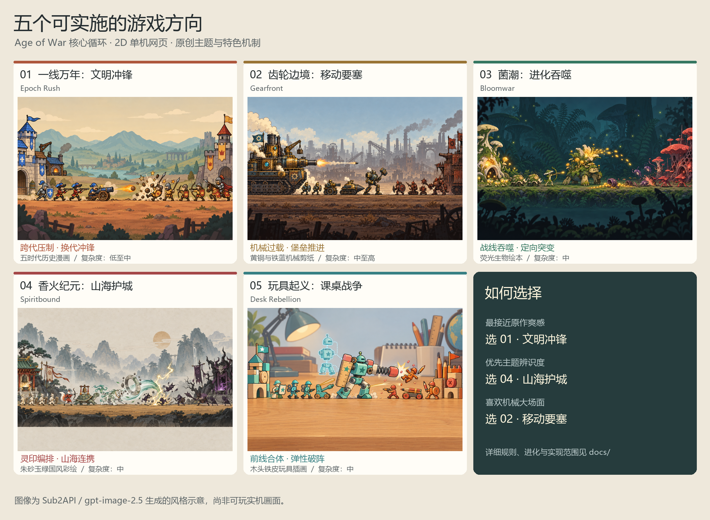
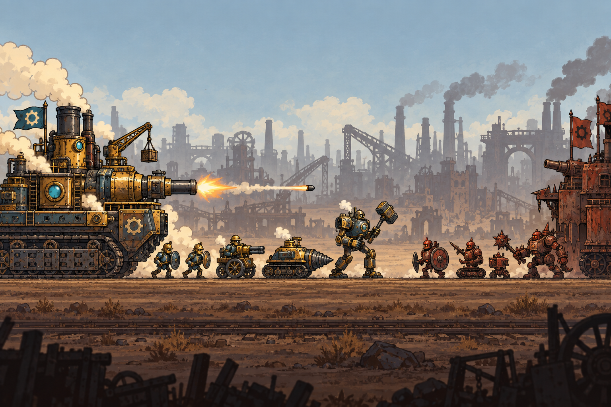
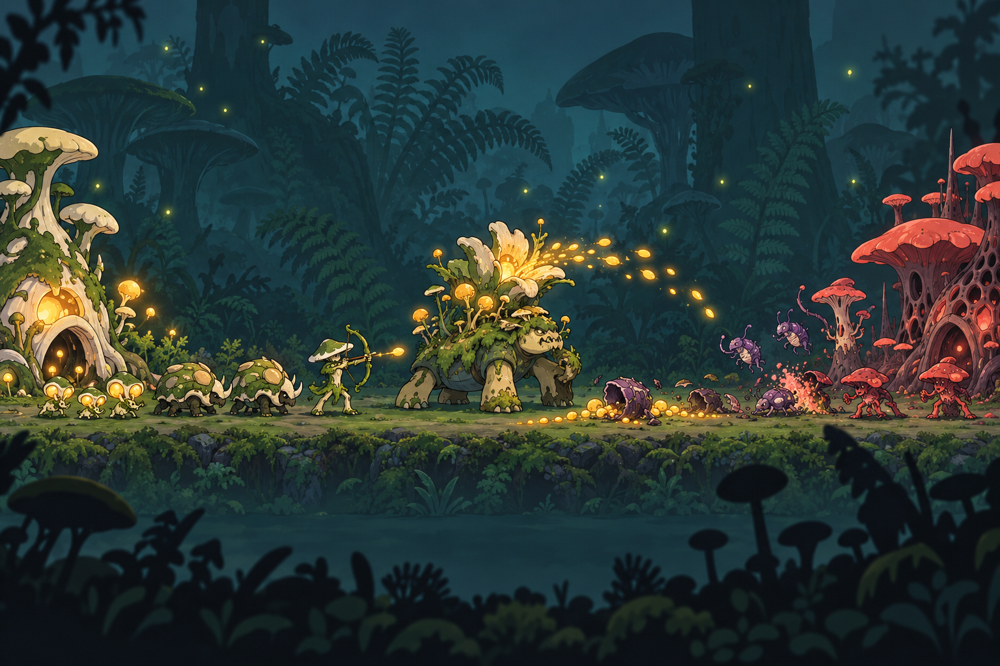
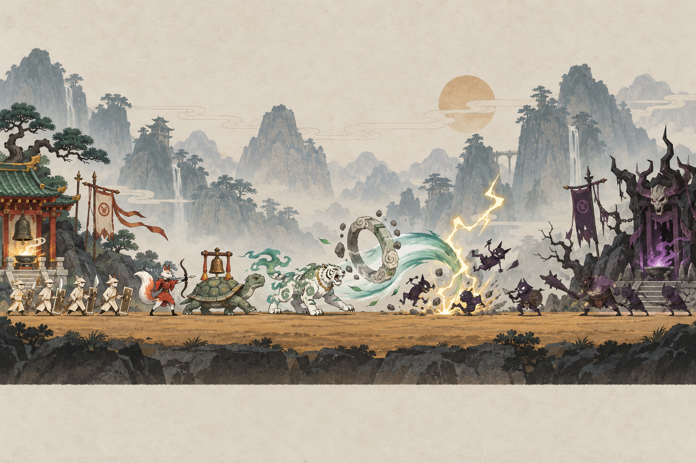
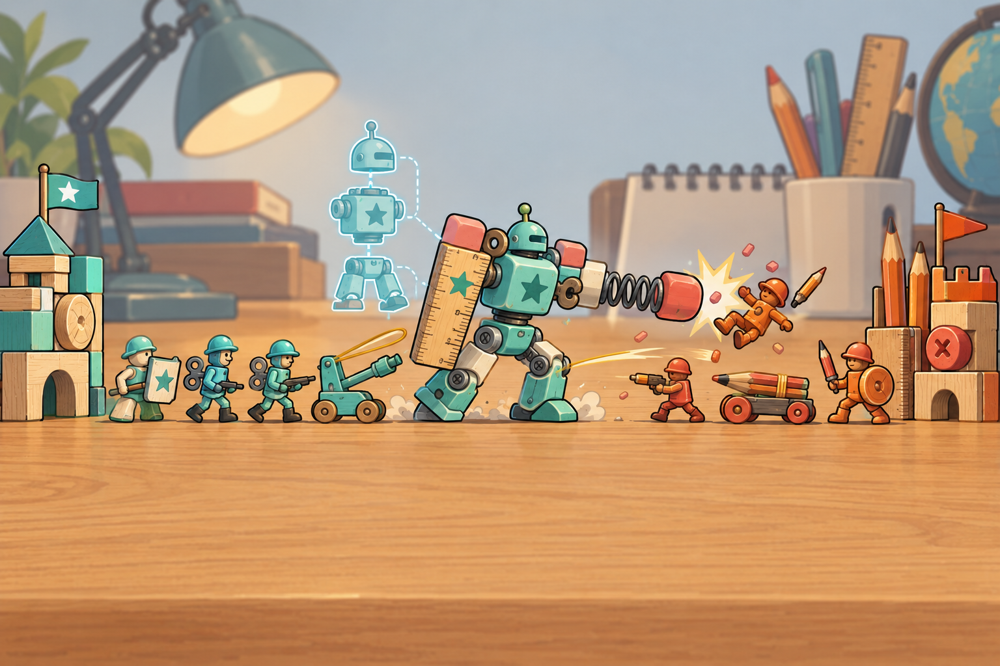

# Age of War 类游戏：五个可实施方向

日期：2026-10-03。状态：供方向选择的设计提案，尚未开始游戏实现。名称均为创作工作名。

## 设计依据与本次交付

保留“守住自己的基地，生产部队向敌方基地推进，在战斗中积累经验并进化”的主循环。Age of War 官方介绍强调跨越五个时代；第二代官方指南明确了兵种、炮塔、特殊能力、升级，以及资源投入与进化时机的取舍。[一代官方介绍](https://www.maxgames.com/mobile/age-of-war.html)；[二代官方指南](https://www.maxgames.com/guides/age-of-war-2.php)。以下特色机制、主题、名称和美术均为本项目原创提案。

这类游戏的爽感需要形成可操作的因果链：看懂敌军 → 配兵扛住 → 攒出关键资源 → 在恰当时机进化或释放招牌机制 → 打开缺口 → 形成推进 → 摧毁基地。不能只靠堆兵、加血量或一键全屏特效。

本次提供五套名称、世界构思、核心体验、进化路径、代表兵种、美术规范和实现边界，并通过用户指定的 `sub2-image-gen` / `gpt-image-2.5` 路线制作战场风格示意图。示意图用于选择构图与风格，不能证明游戏已实现或素材可直接拆成成品动画。

## 快速比较

| 编号 | 游戏名称 | 一句话体验 | 独有决策 | 美术辨识度 | 相对实现复杂度 |
| --- | --- | --- | --- | --- | --- |
| 1 | 一线万年：文明冲锋 / Epoch Rush | 用跨代军团把僵持战线打穿 | 现在多出兵，还是承受压力抢先换代 | 温暖、夸张的历史漫画 | 低至中；主要成本是五时代内容量 |
| 2 | 齿轮边境：移动要塞 / Gearfront | 开着会吐蒸汽的钢铁堡垒推进 | 过载爆发多久，何时冷却并移动基地 | 黄铜、铁蓝、烟尘的机械剪纸 | 中至高；移动基地与热量规则需重点验证 |
| 3 | 菌潮：进化吞噬 / Bloomwar | 吞下战场残骸，长出下一代怪兽 | 把生物质转成数量，还是带方向的突变 | 翡翠、琥珀与暗色森林的生物绘本 | 中；风险集中在分支平衡与同屏可读性 |
| 4 | 香火纪元：山海护城 / Spiritbound | 编排灵兵顺序，打出山海连携 | 下一批兵补当前缺口，还是完成灵印组合 | 朱砂、玉绿、纸白的国风彩绘 | 中；以三条固定连携控制组合规模 |
| 5 | 玩具起义：课桌战争 / Desk Rebellion | 用小兵拼出大玩具，弹飞敌阵 | 保留三个前排，还是合成一个破阵单位 | 木头、发条、塑料的温暖玩具插画 | 中；合体条件与碰撞体积需验证 |

判断来自系统和资产范围拆解，并非已完成代码或性能测试。追求最接近 Age of War 的进化体验，选 1；优先原创国风识别，选 4；优先机械重量感与大场面，选 2。

## 1. 一线万年：文明冲锋 · Epoch Rush

**定位与构思。** 一条战线上压缩万年战争史。玩家从石器部落发展到轨道文明，每次换代都会同步改变基地、兵器、炮塔、出兵菜单和技能表现。对手也会进化，必须争夺领先窗口。这是五个方向中最直接延续 Age of War 乐趣的方案。

**体验关键词。** 跨代压制、混编推进、旧时代翻盘。

**进化路径。** 石器部落 → 青铜城邦 → 王国骑士 → 钢铁工业 → 轨道文明，共五阶段。不同阶段改变攻击方式，而不只是数值：石块抛射、盾阵、骑兵冲锋、穿甲炮击、短距离电弧连锁。

**特色机制：换代冲锋。** 玩家花经验进化后，获得一面短时间有效的冲锋战旗；接下来第一批新兵获得移动和首击奖励。战旗不直接伤害敌人，因此必须提前守住基地、留出出兵资金和生产队列位置，才能把科技领先转成胜势。旧兵继续在场战斗，不全屏自动升级，画面可以出现盾兵护送火炮的混编军团。

**代表兵种。** 骨盾战士、投石手、青铜矛卫、战车、重装骑士、火枪兵、履带炮车、电弧卫士。每时代三种基础兵与一种招牌兵；基础定位围绕抗线、远程、反重甲，招牌兵承担跨代视觉变化。

**一段典型爽点。** 对手骑士压到城门 → 骨干盾兵最后扛住一轮 → 工业时代解锁 → 战旗扬起 → 首批炮车在保护下轰开骑士阵列 → 火枪兵把战线推回敌方。这一过程靠读阵和储蓄达成，进化不会自动清场。

**美术与界面。** 夸张头身比、粗棕色轮廓、两到三层色块阴影的历史漫画。主色为赭石、羊皮纸白、褪色青；己方蓝旗、敌方红旗，并使用不同盾形和旗形。背景由荒野变成城墙、工厂、远处轨道设施，但地面、轮廓和攻击轨迹保持清楚。UI 像战旗与铆接军令牌，进化按钮是一条五节点时代轴。重大进化用约一秒的横向翻页和基地变形，重炮强调后坐、尘浪和低频音效。

**第一完整版本目标。** 五时代、20 种兵、每时代两种炮塔外观与功能模板、五个时代技能、一张持续变化的战场、三档 AI。双方复用同一兵种库，通过阵营轮廓、旗帜与颜色区分。

**验证切片。** 先做王国 → 工业两时代、八种兵、两种炮塔、一次换代冲锋，验证“落后一代仍能防守，领先一代能有效推进”。完整版本再接入其余时代。

**可行性。** 单战线、固定基地、规则清楚；时代变化主要由数据表和素材切换完成。主要工作是控制 20 种兵的美术一致性和新时代强度，避免谁先进化谁立即获胜。

## 2. 齿轮边境：移动要塞 · Gearfront

**定位与构思。** 两座锅炉要塞在工业荒原上对峙。玩家的基地既是兵工厂，也是沿固定轨道缓慢推进的钢铁堡垒；士兵、钻车、炮械围绕它作战。体验从“守住后方”变成“把后方一步一步推上去”。

**体验关键词。** 机械重量、过载连发、堡垒压进。

**进化路径。** 废铁营地 → 蒸汽工坊 → 柴油军工 → 电磁要塞，共四阶段。动力技术变化带来更快生产、不同射击节奏与更重型的机械兵。

**特色机制：过载推进。** 打开过载后，生产速度与炮塔射速提高，同时积累热量。接近红线会有明确的汽笛和警示；超过红线触发短暂强制冷却。玩家可以主动停机泄压，牺牲即时火力保存下一波节奏。堡垒采用三个预设停靠点，只有前方安全、完成冷却且支付迁移费用时，才可推进一站；移动期间停止生产和炮塔开火。抢到前站可以缩短增援路程，却让基地更容易遭受攻击。

**代表兵种。** 铆钉盾兵、钉枪射手、钻头履带车、铁锤机兵、电磁炮架、蒸汽重装步行机。防御采用近距压制、长距轰击两种炮塔模板。

**一段典型爽点。** 开过载攒出钻车和重型机兵 → 连发炮火打散敌阵 → 在热量达到危险区前主动泄压 → 部队掩护要塞轰隆前进 → 新停靠点出兵更快抵达前线 → 再开一轮爆发压住城门。

**美术与界面。** 机械剪纸与漫画铁皮结合：大黄铜圆筒、铁蓝阴影、煤灰和橙色热光；粗轮廓、夸张铆钉、少量可转动的齿轮。基地产生的蒸汽与履带运动是视觉重心。UI 采用压力表、拨杆和铆钉面板；热量表始终清楚可见。避免将细小机械零件堆满单位，保证机兵在游戏实际尺寸下可辨识。

**第一完整版本目标。** 四动力阶段、16 种兵、四套基地、三停靠点、两类炮塔、一个热量系统、四个阶段技能、一张工业战场、三档 AI。敌方遵循相同热量与移动约束。

**验证切片。** 先做两阶段、八种兵、两个停靠点和完整过载冷却循环。先证明过载有收益也有风险，再增加第三个停靠点。

**可行性。** 机器适合由生成的静态部件配合代码动画完成：轮子转动、履带循环、炮管后坐、蒸汽粒子。基地移动限定在预设停靠点，不需要地图寻路；推进不能穿过敌兵或越过战线安全界限。五案中系统耦合最高，需要优先测试移动状态、出兵位置和基地受击。

## 3. 菌潮：进化吞噬 · Bloomwar

**定位与构思。** 战争发生在巨型森林的地面。玩家是一片会学习和变异的菌巢，派出孢子兵、甲壳兽和花炮兽，把残骸化为养分。成长不是制造更高级武器，而是让整支种群改变身体结构。

**体验关键词。** 越打越长、吞噬回收、突变流派。

**进化路径。** 孢子聚落 → 甲壳群落 → 共生花园 → 巨兽菌巢，共四阶段。形态由小圆孢子发展到装甲、远距喷射和巨型攻城生物。

**特色机制：战线回收与定向突变。** 阵亡单位留下短暂存在的生物质；进入己方前线控制范围后，自动回收到菌巢。推进能收回更多养分，后撤可能失去回收机会。基地有保底产量，不能因为第一次失利就停止出兵。进化时从两个明确基因选项中选一个，例如甲壳路线降低受伤、酸液路线强化反重甲。每次只影响一个定位或一项规则，不生成无限随机技能。

**代表兵种。** 孢子爬虫、甲壳护卫、菌帽喷射者、酸囊投手、花背攻城兽、根须巨兽。三种基础定位负责抗线、远程、破甲；每阶段增加一个生物形态鲜明的招牌兵。

**一段典型爽点。** 花炮打出密集孢子弹 → 甲壳兽夺回中线 → 敌我残骸化为琥珀养分飞向菌巢 → 资源刚好够完成突变 → 新一批酸囊兵击穿敌方硬壳 → 花背巨兽展开花冠轰击基地。

**美术与界面。** 生物绘本，圆润粗线条、哑光菌帽、简化甲壳、局部琥珀发光。己方翡翠绿与象牙白，敌方珊瑚红与紫色；同时区分轮廓与眼部形状。背景暗青森林衬托亮色生物。死亡表现为花粉、种壳与光点，降低遮挡。UI 像叶片、种荚、树根组成的自然工具，进化菜单用两颗不同轮廓的种子展示分支。声音采用轻微弹性、开花与木质敲击。

**第一完整版本目标。** 四阶段、16 种基础单位外观、三个进化节点各两个基因选项、两种巢穴防御模板、四个阶段技能、一张森林战场、三档 AI。基因用共享兵种外观加受控的角刺、光色与攻击特效表达，初版不为每条完整路线再画一整套军队。

**验证切片。** 两阶段、八种兵、一次二选一突变、完整生物质回收循环。验证控制中线能形成奖励，但保底产量与防御仍允许败势方反击。

**可行性。** 回收由地面资源实体和一维控制边界完成，不增加采集工人寻路。突变采用有限选项与数据修正，组合数可控。难点是养分奖励可能造成滚雪球，以及大批发光生物混在一起的可读性；需限制残骸持续时间、粒子数量和同屏兵数。

## 4. 香火纪元：山海护城 · Spiritbound

**定位与构思。** 山海之间的一座小村祠，借人间香火逐渐唤醒守护灵，发展为天工神阙。纸兵、灵狐、石龟和雷虎向敌方妖巢推进。玩家既在守城，也在安排一场有战术目的的出征仪式。

**体验关键词。** 神兽登场、编排连携、护城反击。

**进化路径。** 村祠纸兵 → 山灵古庙 → 百兽神庭 → 天工神阙，共四阶段。香火对应出兵资源，战斗经验对应祠堂进阶，规则延续熟悉的经济与进化循环。

**特色机制：灵印连携。** 兵种带有“山、风、雷”之一的灵印，按照实际出营顺序点亮三个位置。初版只实现三条固定配方：山→山→山触发前排护盾；风→风→雷触发一次窄范围连锁；山→风→雷触发击退。配方间共享冷却，同一刻只能触发一种效果。三位置滑动显示，玩家能看见差哪一印，同时仍要考虑队伍是否缺坦克或远程。兵种购买顺序必须先成为战术行为，不能变成不停点便宜兵刷全屏技能。

**代表兵种。** 纸甲兵、铜铃卫、灵狐弓手、石龟驮炮、雷虎、天工巨灵。神兽可拥有明显体型优势，但都在同一地面战线上行动；悬浮角色也使用地面投影，不引入第二套空战规则。

**一段典型爽点。** 纸兵在庙前撑住妖潮 → 玩家补出石龟、风印灵狐和雷印虎 → 三印依次亮起 → 山风雷连携将前排推离城门 → 祠堂进阶后天工巨灵踏出，利用刚打开的缺口反推。

**美术与界面。** 国风彩绘与纸片动画：朱砂红、玉石绿、宣纸白、炭黑，少量古金；大色块和克制的墨线，而不是满屏淡墨。角色采取简化头身与服装剪影，神兽轮廓一眼可认。背景山水降低饱和度，特效保留纸屑、风绸、钟纹与短促雷线。UI 像香案上的木牌和铜铃，连携区只保留三个大图标；真实文本使用可读的中文字体。声音重视木鱼、铜铃、鼓点和短促雷鸣。

**第一完整版本目标。** 四阶段、16 种兵、三条连携配方、两种庙宇防御模板、四套祠堂、四个阶段技能、一张山海战场、三档 AI。连携和主动技能采用不同表现，避免两者都只是清屏。

**验证切片。** 村祠 → 山灵两阶段、八种兵、三种灵印、三条连携。重点证明玩家能主动追求某条连携，也可能因为当前配兵需求放弃它。

**可行性。** 连携是小型顺序状态机，加护盾、有限范围伤害与击退，规则实现相对直接。美术可用静态部件动画与少量帧动画呈现纸兵、铃铛、神兽步伐。难点在于墨线细节缩小后糊成一团，以及低价兵刷连携；用清楚剪影、共享冷却和出兵间隔约束。

## 5. 玩具起义：课桌战争 · Desk Rebellion

**定位与构思。** 夜晚课桌上的玩具建立各自阵营。积木城堡、铅笔火炮、发条骑兵和橡皮装甲在木桌面上开战。玩家从简陋木制玩具发展到电子机甲，用“拼起来会更厉害”的直觉组织军队。

**体验关键词。** 合体惊喜、弹性碰撞、以小拼大。

**进化路径。** 木制积木 → 铁皮发条 → 塑料动力 → 电子机甲，共四阶段。每次换代都改变材质、运动节奏和攻击表现：木兵敲打、发条冲撞、皮筋抛射、电子脉冲。

**特色机制：前线合体。** 同时代、同类型的三个合体材料兵在前线存活并靠近到规定范围时，合体按钮亮起。按下后消耗额外费用，三个单位短暂组装为一个攻城型大玩具。只有指定材料兵可以合体，每阶段一条配方，共四条。三个前排减少成一个大单位，意味着覆盖与拦截能力下降；大玩具擅长破阵和攻城，但容易被便宜快兵分散火力。全地图任意三兵不能隔空合体。

**代表兵种。** 积木盾兵、木珠投手、发条步兵、皮筋弩车、橡皮装甲兵、电子脉冲兵；招牌合体为积木巨人、发条铁骑、塑料冲撞车与课桌机甲。

**一段典型爽点。** 三名发条兵被盾兵掩护到中线 → 合体按钮亮起 → 弹簧“咔嗒”卡合 → 发条铁骑一脚把敌方轻兵弹开 → 皮筋弩车补射 → 敌方铅笔堡垒掉出橡皮屑。高潮同时有体型、声音和战线变化。

**美术与界面。** 2D 手绘的玩具材质，不依赖真实 3D：蜂蜜色木桌、奶油白、薄荷蓝、少量番茄红；粗彩色轮廓、清楚的木纹、铁皮接缝和塑料高光。远处文具只作低对比背景。UI 使用圆角贴纸、纸胶带、积木卡片；合体按钮显示三个小剪影汇聚为一个大剪影。动画强调弹簧抖动、发条转动、橡皮回弹；攻击音效以木碰、弹簧、卡扣为主。

**第一完整版本目标。** 四材质阶段、每阶段三种常规兵加一种合体兵，共16 种单位、四条合体配方、两种文具炮塔模板、四套基地、四个阶段技能、一张桌面战场、三档 AI。

**验证切片。** 木制 → 发条两阶段、六种常规兵、两种合体兵、两条配方。先验证三个材料兵能自然聚集，合体有明显战术收益，同时不是只要亮按钮就必须按。

**可行性。** 合体是近邻筛选、单位移除、新单位生成和一次装配动画，不做自由零件拼装。木纹和塑料质感用生成图呈现，运动通过代码完成。难点是大单位碰撞宽度、材料兵存活概率以及合体前后仇恨切换；需要防止队伍卡死和组装期间无敌拖延。

## 五案共用的实施范围

### 技术与交互

- 2D 横向单战线、单机对抗 AI，优先桌面浏览器，兼容手机横屏。建议 Phaser 3 + TypeScript + Vite；开发开始时再确认当时可用版本和依赖。[Phaser 官方下载与脚手架说明](https://www.phaser.io/download/release/v3.90.0)。
- 部队自动行进和攻击，玩家操作出兵、生产队列、炮塔、进化、招牌机制、技能与暂停。1–4 键选择兵种，鼠标或触摸操作同一套按钮。
- 固定全战场视图优先；角色占据足够屏幕面积，双方基地与战线始终可见。设计基准横向 1280×720，手机横屏缩放并重排按钮。
- 目标一局约 8–12 分钟，每局有数次明确的阶段跃迁。此为设计目标，实际长度需要试玩数据校准。
- 钱或主题化资源负责出兵、炮塔和特色消费；战斗经验负责进化。稳定基础收入提供恢复机会。主动技能限制冷却，不与所有特色机制争抢同一个晦涩资源条。
- 规则层与渲染层分开；单位、射程、弹道、队列、经济和 AI 由数据与模拟驱动。DOM 用于中文文字、菜单和 HUD，Phaser 用于战场、动画与特效。
- AI 使用与玩家相同的经济、队列、进化和特色规则。难度通过决策间隔、配兵判断和策略倾向调整；任何额外经济倍率需要明示。
- 本地存档记录设置、教程、解锁、战绩；首版挑战内容复用同一张战场，通过起始条件与 AI 策略变化实现。先控制阵营共用单位总数在约 60 个以内，再根据实机表现调整。

### 美术、动画与声音由我完成

1. 方向选定后先固定侧视比例、角色高度、描边宽度、阵营识别方式、背景明暗和色板，生成一套风格母版。
2. 所有 AI 栅格素材通过指定 `sub2-image-gen` 的本地脚本调用网关生成，保留默认 `gpt-image-2.5`、high、PNG；本次风格图选用横向尺寸。调用失败时报告原因，不自行切换模型或服务。
3. 生产素材按角色、基地、背景、头像、图标分批生成。我负责透明度检查、去背景、裁切、统一尺寸和脚底锚点、图集整理与游戏接入。风格示意图与生产资产分开保存，示意画面不会直接当作整张游戏背景替代可交互内容。
4. 先用生成的单张角色拆成可复用部件，完成走路、呼吸、攻击、受击、倒下；车辆和炮械优先用轮子、炮管与履带的程序动画。只有必要角色增加少量帧动画，不把稳定性建立在大量独立生成的逐帧图片上。当前技能公开契约是生成接口，不预设它具备参考图编辑能力。
5. 粒子、弹道、伤害反馈、进化动画由代码实现；限制震屏、闪光与粒子密度。大招时保留战线和单位轮廓，提供降低动态效果的设置。
6. 基础音效与简短原创循环音乐由我用本地合成与编排制作，结合各方向的材料声学特征；不复用 Age of War 的音乐。图像生成技能负责图片，声音采用本地音频制作。
7. 首个可玩切片使用正式方向的代表资产；验证通过后逐步补齐完整版本的阶段、兵种、AI、教程、设置、存档和战斗结算。切片是验证步骤，不替代最终选定方向的完整内容。

### 必须验证的游戏感

- 出兵按钮立即反馈，队列与资源变化可读，玩家知道部队何时出营。
- 抗线、远程、反重甲各有用途，不能用一类便宜兵通吃。
- 新时代带来可见优势，旧时代合理防守仍有短暂应对窗口。
- 招牌机制需要玩家做取舍；放弃使用也能形成合理策略。
- 命中前有预备动作，命中时有弹道或接触、后坐与短促音效，受击方有对应动作；攻击反馈与真实伤害同步。
- 玩家可以凭战线位置、单位剪影、攻击轨迹看懂输赢原因，而不必阅读一屏伤害数字。
- 败势方拥有依靠基地防御和基础收入重新组织的一次机会，强势方也能及时结束对局，避免无穷僵持。
- 通过规则测试验证经济、队列、进化、胜负与各案特色机制；通过实机试玩验证节奏、帧率、尺寸、声音与输入。此阶段不宣称已经通过这些检查。

### 范围控制

首版集中做完整的单机推线、时代进化、特色机制和战斗表现。联网 PvP、开放地图、自由建筑摆放、真实物理破坏、复杂空战、自由零件拼装、大规模随机技能树均不属于本轮提案的首版范围。后续扩展需以核心玩法验证结果为依据。

开发与素材处理使用 Windows 本地进程，不启动 Docker、WSL 或其他本地虚拟化环境。后续如果使用浏览器试玩，完成后关闭不再使用的测试标签页。

## 建议与下一步

交付核验：五套方向均包含中英文名称、构思、进化路线、特色机制、代表兵种、具体爽点、美术与界面、完整版本范围、验证切片和可行性说明。五张风格图已通过指定脚本成功生成，均为可解码的 1536×1024 PNG，并已逐张检查；对比图已生成并检查文字与布局。图像提示词保存在 `output/imagegen/prompts/`。本次检查针对方案与视觉提案，游戏规则和性能验证在方向确定后的实现阶段进行。

默认建议 **1《一线万年：文明冲锋》**：最容易验证 Age of War 的原始体验，也能为以后扩展更多时代留下空间。

如果更看重原创美术和主题记忆点，建议 **4《香火纪元：山海护城》**：在保留核心循环的同时，以有限连携配方建立清楚的操作特色。

如果最期待机械重量感与堡垒推进，选择 **2《齿轮边境：移动要塞》**，并把过载、停靠点和移动状态作为最先验证的内容。

选择编号后，先把该方向转成确定版规则、资产清单与首个可玩切片。代码、素材生成与加工、动画、UI、声音和测试由我完成；用户负责方向选择与观感验收。
