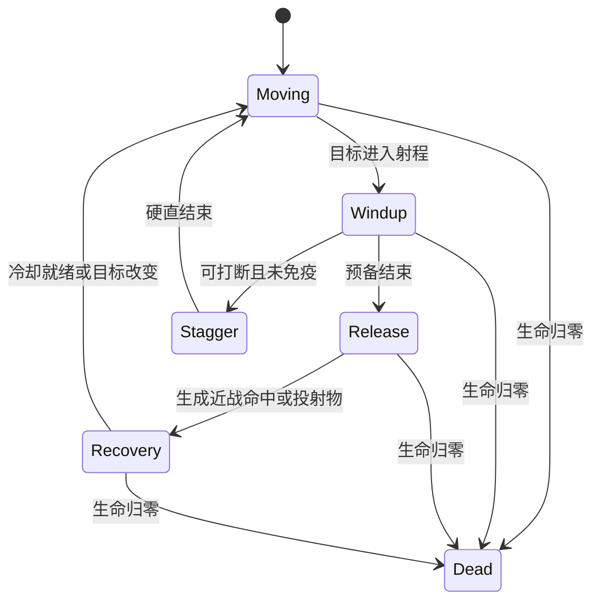

# 战斗打击与数值

## 规则层与表现层

战斗按30Hz固定逻辑步长执行。动画、镜头、粒子和声音消费同一命中事件，但不决定伤害；30/60/120Hz显示设备得到同样的交战结果。动作必须分预备、出手、命中、恢复，不能只扣血后播放无关闪光。



## 属性与时代

时代HP/攻击倍率：A1=1、A2=1.45、A3=2.05、A4=2.90、A5=4.10。普通兵使用出生时代倍率；旧兵不会在进化后自动获得新倍率。英雄使用当前时代倍率并保留生命比例；炮塔使用购买时代。队伍HP加成改变最大生命时同样保持比例。

普通兵价格倍率1/1.15/1.30/1.45/1.60，基础军资收入倍率1/1.20/1.45/1.75/2.10。最大生命计算后向下取整，攻击与技能原始威力保留固定点精度直到最终伤害取整。护甲、射程、速度和训练时长不再次乘时代倍率，避免同时放大六个维度造成不可逆碾压。

## 伤害公式

```text
raw = damageBase × eraMultiplier × (1 + attackBonus或skillPowerBonus)
armorEffective = max(0, armor × (1 - strongestArmorBreak) × (1 - armorIgnore))
mitigation = 100 / (100 + armorEffective)                  # 物理、穿刺、爆炸
mitigation = 1 - energyResistance                         # 能量
resolved = floor(raw × typeCounter × mitigation
                 × (1 + cappedConditionalBonus)
                 × (1 - cappedReceivedReduction)
                 × baseSkillMultiplierIfApplicable)
```

穿刺忽略35%剩余护甲；其他物理类没有该忽略。类型克制表在 `rules.json`：穿刺对重型1.35、对轻兵0.85；爆炸对轻兵1.25、对重型0.85；物理对重型0.9；能量对轻兵0.95、对重型1.1。基地类型系数均1，主动技能对基地另乘0.35。

攻击/技能加成、条件加成、受伤减免各进入一个加法池并应用上限；标记、换代首击和“破甲后爆炸”不逐项连乘。普通武器若正伤害算出低于1则取1；护盾、治疗、标记等零伤害技能不因此造成1点假伤害。无随机暴击或闪避作为基础规则，强命中由条件与准备达成。

护盾先吸收最终伤害，剩余扣HP。记录原始值、类型、吸收值、实际HP损失和条件来源，供调试与复盘。治疗按目标最大生命计算但不超过缺失量，不影响最大生命，也不能治疗已dead实体。

## 动作时序与投射

| 武器表现 | 预备参考 | 命中形态 | 表现重点 |
| --- | --- | --- | --- |
| 石槌/短剑/长矛 | 0.18–0.28秒 | 出手tick检测接触范围 | 身体前倾、武器过线、受击后退 |
| 石块/箭/弩 | 0.30–0.40秒 | 逻辑投射物，沿路径检测 | 拉弓/抡索、可辨识弧线、木石撞击 |
| 火枪/磁轨弹 | 0.25–0.35秒 | 高速投射物，分段检测 | 枪口、后坐、短烟；避免无限长激光 |
| 炮车 | 0.35–0.50秒 | 慢弹与有限范围爆炸 | 炮管回缩、车身压低、地面尘浪 |
| 冲锋 | 有明确起步与至少规定行进距离 | 首次接触，最多三目标 | 旗帜拉直、短尘尾、接触时停顿 |
| 电弧 | 0.30–0.40秒 | 主目标与有限支链 | 充能、短闪、目标间清楚连线 |

攻击周期包含预备与恢复，最终按逻辑tick向上取整。攻速调整总周期，不把预备降到0，预备最低0.08秒。目标在预备期间离开攻击范围时重新移动；已经释放的物理弹沿路径继续，与最近合法碰撞目标交互。能量锁定目标死亡后只可在原目标附近80内重选一次，不穿越全场追新目标。

同tick先收集全部到期命中，再统一应用伤害、状态、死亡与奖励，以避免遍历顺序让同时攻击变成先手优势。破甲等新状态在本次命中伤害之后施加，仅影响后续事件。基地同tick双杀按平局处理。

## 打击反馈分级

| 等级 | 动作与粒子 | 声音 | 镜头 |
| --- | --- | --- | --- |
| 普通命中 | 受击对象短色块闪、1–3碎屑 | 轻木/石/金属，同类限并发 | 无全局震屏 |
| 破甲/盾破 | 护甲裂纹或盾边碎裂、明确状态图标 | 短金属脆响/低脆盾声 | 最多1像素、80ms |
| 重炮/冲锋 | 攻击者后坐、受击方位移、6–10尘粒 | 低频主体+中频冲击 | 2–4像素、120ms |
| 进化/基地摧毁 | 地标变化、战旗、分阶段崩落 | 时代动机/终结音 | 4–6像素、200ms，降低动态可关 |

强命中可对攻击者与受击对象的渲染姿势短冻结40–60ms，模拟照常；同屏多个命中合并，不能每次都停整张战场。特效只在真实命中/吸收时触发，挥空不播放命中尘浪。伤害数字默认仅显示技能与重大命中，可开启完整数字。

## 控制、重量与可读性

轻兵被击退明显，重型位移只有20%；体型大小也通过速度、预备和后坐体现。普通死亡退场不超过0.8秒，受击残影不挡住新兵。己敌可由旗形、盾形和轮廓判断，不只依靠红蓝颜色。

视野中军团密集时优先保留单位轮廓、弹道与血量反馈，削减环境粒子。降低动态效果关闭屏闪和大震屏但保留攻击预备、命中轮廓与技能区域，使可访问模式仍能读懂规则。

## 必测场景

近战同tick互杀、射手目标提前死亡、炮弹多杀只领奖一次、DOT施法者倒下、英雄进化不回血、盾过期批次、2秒控制免疫、重型抗聚拢、超六目标连锁、基地双杀、30/60Hz相同动作记录重放一致。

[返回目录](README.md) · [演算](17-数值演算与构筑样例.md)
