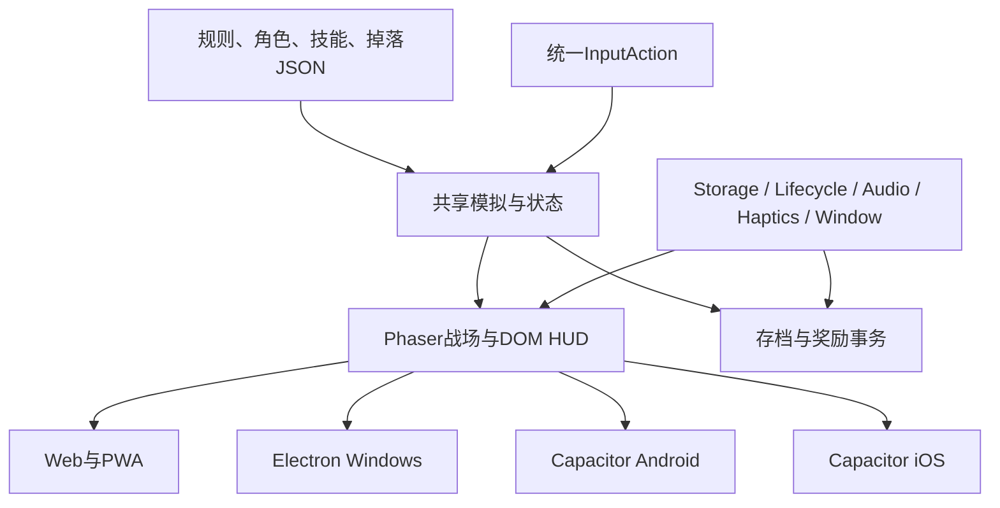

# 技术架构与跨端交付

## 共享核心与平台壳

建议TypeScript + Phaser 3 + Vite，DOM负责中文文本、菜单和HUD。战斗与数据独立于渲染；PC安装版使用Electron，Android/iOS使用Capacitor，Web/PWA直接加载同一前端构建。依赖在实现时锁定具体版本与lockfile，不把latest当作可重现交付。

Electron官方支持通过同一JavaScript代码库构建Windows、macOS和Linux桌面应用；本项目PC首要目标为Windows安装版。[Electron官方介绍](https://www.electronjs.org/docs/latest/)。Capacitor提供Android/iOS/Web运行时，本项目选择其稳定v8线，具体补丁版本在建包时确认。[Capacitor官方文档](https://capacitorjs.com/docs)。

## 模块边界

| 模块 | 负责 | 不依赖 |
| --- | --- | --- |
| core | 时钟、实体、目标、伤害、状态、队列、经济、进化、AI、胜负 | DOM、Phaser对象、平台插件 |
| content | JSON加载、字段验证、ID解析、构筑合法性、版本 | 平台文件路径 |
| presentation | sprite、rig、镜头、粒子、命中表现 | 改写HP与军资 |
| ui | 页面流程、状态展示、输入映射、触屏瞄准 | 直接修改模拟实体 |
| services | 档案、对局快照、奖励日志、资源缓存 | 原生API具体实现 |
| adapters | Web/PC/Android/iOS的储存、音频、触觉、生命周期 | 游戏伤害公式 |

预期目录：`src/core/`、`src/content/`、`src/presentation/`、`src/ui/`、`src/services/`、`src/adapters/`，`public/assets/`放生产素材；`desktop/`、`android/`、`ios/`放平台项目。此为计划结构，当前不是已存在的运行源码。

## 固定步长与重放

每tick为1/30秒；位置/资源以定点整数存储，单位位置精度1/100、军资与学识精度1/1000，伤害在最终向下取整。逐tick整数除法的余数须保存并进位，不让8军资/秒因每tick截断而变成7.98。所有逻辑时长转换为整数tick。RNG采用32位xorshift32-v1、明确非零种子与独立combat/loot流；种子为0时替换为固定0x9E3779B9，区间抽样用拒绝采样避免取模偏差。visual随机不进入存档或改变战斗结果。

渲染帧使用累加器推进逻辑，最多追赶5个tick；超出时按慢速模拟处理并记录性能，不把几秒后台时间一次追完。场景重新加载或设备30Hz/60Hz不会按帧数多产金币。动作日志包含tick、sequence、actor、类型和参数；相同内容版本、种子与动作序列重放产生相同状态哈希。

Phaser场景只做Boot/Preload、Shell、Battle、Overlay；状态来自core快照，渲染对象可销毁重建。单战线采用分区排序和线段投射检测，不引入全场刚体物理或多地图寻路。

## 三端目标与实际建包条件

| 平台 | 成品形态 | 建包/验证路线 | 状态 |
| --- | --- | --- | --- |
| PC | Windows x64安装包+Web/PWA | Windows本地Node/Vite/Electron；键鼠、窗口、离线存档测试 | 待实现与实测 |
| Android | APK测试包、AAB发布包 | Windows本地Android SDK/JDK/Gradle，实体Android设备 | 待实现与实测 |
| iOS | Xcode项目、签名测试与发布构建 | 实体Mac或授权远端macOS构建，Xcode，实体iPhone/iPad | 待实现与实测 |

已核对官方v8环境要求：Node22+；iOS构建需要macOS/Xcode，最低Xcode26；Android需要Android Studio与SDK。[官方环境说明](https://capacitorjs.com/docs/getting-started/environment-setup)。当前本机可确认Node22.14、Python3.13和JDK21；adb/gradle未在PATH发现，尚不能据此宣称Android工具链可用。Windows不能在本机直接产出最终签名iOS包。

Capacitorv8支持iOS15+与Android API24+；游戏测试目标先按iOS15+、Android10+及更新WebView设置，不把框架的最低系统支持等同于本游戏已实测覆盖所有老机器。[iOS支持](https://capacitorjs.com/docs/ios)；[Android支持](https://capacitorjs.com/docs/android)。发布时再核对目标SDK、Xcode与平台要求。

不启动Docker、WSL、Android虚拟机或任何其他本地虚拟化环境。手机验证用实体设备；iOS走Mac实机/远端构建，不在Windows虚拟macOS。当前设计阶段无需安装SDK或收集签名资料。

## 适配层契约

StoragePort提供`loadProfile/saveAtomic/export/import`；LifecyclePort提供`suspend/resume`；AudioPort提供用户手势初始化、音量与挂起恢复；HapticsPort按能力返回可用/不可用；WindowPort处理窗口、安全区和方向变化。平台能力不足时保留规则及图形反馈，不调用不存在的API。

Web用IndexedDB双槽与日志、PC用受控文件存储、移动端用原生文件/数据库适配。Electron页面关闭Node直接访问，只通过有限preload接口调用储存与窗口；平台壳中不得保存图像网关密钥或在游戏运行时请求素材生成。

v1跨端进度采用统一JSON导出/导入，记录内容版本与校验值。自动云同步是单独服务能力，当前不依赖账号或服务器；产品提示必须写清实际迁移方式。

## 离线与更新

生产素材随原生包发布；Web/PWA使用版本化缓存，核心、当前时代与菜单预加载，后续时代按组加载。失败保留旧可运行版本，重新下载只替换完整组。更新在对局结束或重启后生效，禁止中途换rules导致战斗不一致。

旧对局快照若contentVersion不兼容，不强行恢复；保留档案进度并给出重新开始提示。安卓/iOS进程被系统杀死后读取最后完整快照，不能承诺毫秒级无损；每5模拟秒及关键状态保存。

## 性能预算与设备矩阵

设计预算：60战斗实体总上限，临时炮台计入其中，逻辑投射物峰值目标80、120可见FX粒子、场景解码纹理目标不超过64MiB，当前场景短音缓存目标不超过12MiB。投射物是压力预算，超预算不能丢弃已成功释放的攻击；先降低表现并优化对象池。低画质降低粒子、帧图与DPR，不减规则tick。

PC正常画质目标60fps；目标移动设备正常60、低画质30fps。这些是待测预算。记录实际硬件、OS、WebView、构建版本、P95帧时与20分钟持续运行数据；至少覆盖Windows浏览器/安装版、4GB Android机与一台iPhone及iPad布局。峰值进化、20兵技能连锁和后台恢复是重点。

本地浏览器试玩用项目服务与可控标签页；结束关闭不用的测试标签页。原生包验证不能以桌面浏览器截图代替。

[返回目录](README.md)
