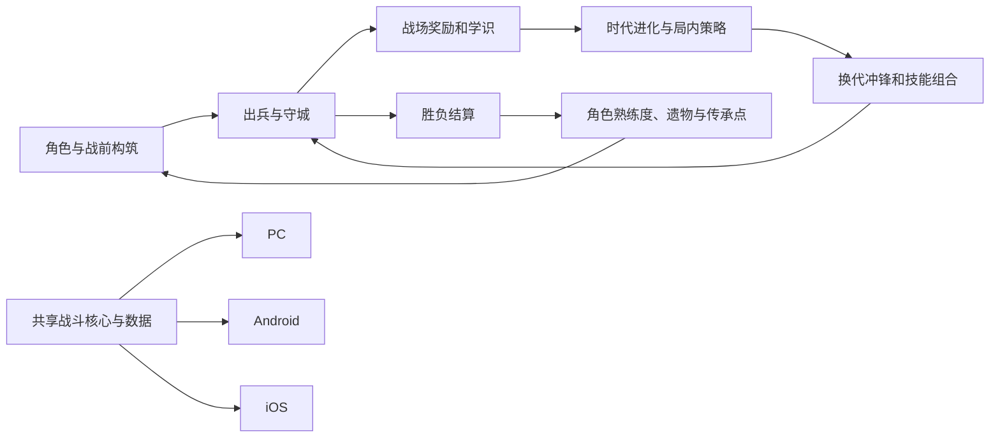

# 一线万年：文明冲锋 · Epoch Rush

设计版本：v0.1。日期：2026-10-04（Asia/Taipei）。项目方向：已选择方向 1。

这是面向 PC、Android、iOS 成品开发的设计基线：规则、内容、数据、素材规格与验收要求在此关联。当前交付阶段为系统设计；游戏代码、生产素材、安装包和实机验证分别由后续里程碑完成。所有数值是可用于实现的初始值，需要通过试玩校准。

## 游戏结构

横向单战线的文明进化战争。玩家选一名可操作战术指挥官，配置一种角色专精、两个通用技能、最多两件遗物和一套传承天赋。战斗中用军资生产部队与炮塔，用学识推进五个时代，管理指挥能量释放技能；每次进化选择一个局内策略，并利用换代冲锋发动推进。指挥官有实际战场实体，由玩家下达站位与技能指令，部队自动行进、索敌和攻击。

完整 v1 内容目标：6 名指挥官、18 个角色专精、5 个时代、20 种兵、10 种炮塔、12 个通用技能、6 个角色专属技能、18 项传承天赋、12 项局内时代策略、12 件遗物、15 个战役关卡、6 种敌方策略、3 档难度、完整教程、存档、图鉴、设置、结算和三端输入适配。

## 文档入口

| 文档 | 内容 |
| --- | --- |
| [00 产品愿景与范围](00-产品愿景与范围.md) | 游戏定位、完整版本边界、模式与设计原则 |
| [01 世界观与背景故事](01-世界观与背景故事.md) | 五时代、六名主角、阵营、故事与叙事语气 |
| [02 核心循环与对局规则](02-核心循环与对局规则.md) | 资源、出兵、进化、基地、胜负与节奏 |
| [03 可玩角色与军团体系](03-可玩角色与军团体系.md) | 六角色、18 专精、兵种、炮塔与克制 |
| [04 成长路线与构筑](04-成长路线与构筑.md) | 局内与局外成长、三条传承路线、负载与上限 |
| [05 掉落物与经济](05-掉落物与经济.md) | 战场掉落、结算、遗物、重复转换与保底 |
| [06 技能组合与状态系统](06-技能组合与状态系统.md) | 技能、状态、组合、六套构筑与限制 |
| [07 战斗打击与数值](07-战斗打击与数值.md) | 伤害公式、动作时序、命中反馈、击退与死亡 |
| [08 美术设定与素材制作](08-美术设定与素材制作.md) | 风格、尺寸、锚点、动画、图集与生成路线 |
| [09 交互体验与多端UI](09-交互体验与多端UI.md) | 完整流程、PC 与触屏控制、HUD、适配与可访问性 |
| [10 音频与触觉](10-音频与触觉.md) | 音乐、音效、混音、反馈与中断恢复 |
| [11 关卡敌人AI与叙事](11-关卡敌人AI与叙事.md) | 15 关、敌人策略、Boss、难度与教学 |
| [12 技术架构与跨端交付](12-技术架构与跨端交付.md) | 游戏核心、平台壳、生命周期、原生构建与性能 |
| [13 数据字典存档与配置](13-数据字典存档与配置.md) | 稳定 ID、JSON、存档、迁移、配置与事件契约 |
| [14 实施里程碑与验收](14-实施里程碑与验收.md) | 从代表性切片到完整成品的任务及验收 |
| [15 决策记录与实现风险](15-决策记录与实现风险.md) | 实际取舍、验证重点与版本变更规则 |
| [16 需求追踪与覆盖](16-需求追踪与覆盖.md) | 本次要求对应的文档、数据与验证证据 |
| [17 数值演算与构筑样例](17-数值演算与构筑样例.md) | 伤害、经济、技能预算与掉落演算 |
| [数据目录](data/README.md) | 可供开发读取的规则与内容目录 |
| [素材提示词目录](prompts/README.md) | 场景、英雄、兵种、UI 与动画生成规格 |
| [素材制作任务表](素材制作任务表.md) | 197项逻辑素材的阶段、状态与路径 |
| [内容目录附录](附录-内容目录.md) | 角色、兵种、技能、成长、关卡等完整表 |
| [校验报告](设计校验报告.md) | 内容数量、引用、数值及文档链接检查 |

## 系统关系

## 数据与更新约定

机器数据为数值与稳定 ID 的主来源；文档解释玩法意义与执行顺序。数值修改同步更新引用表、演算和数据版本。旧五方向归档是选择阶段快照；本套文档记录方向 1 的扩展，新增系统以本基线为准。

本地执行使用 Windows 进程，遵守不启动 Docker、WSL 或其他本地虚拟化环境的约束；后续浏览器测试结束时关闭不用的测试标签页。素材继续采用用户指定的 Sub2API 路线。

