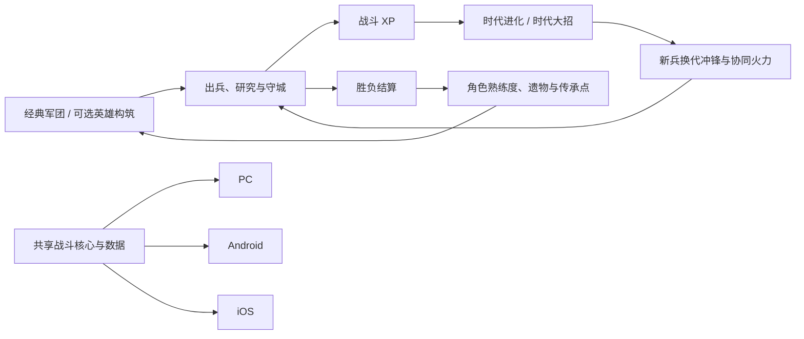
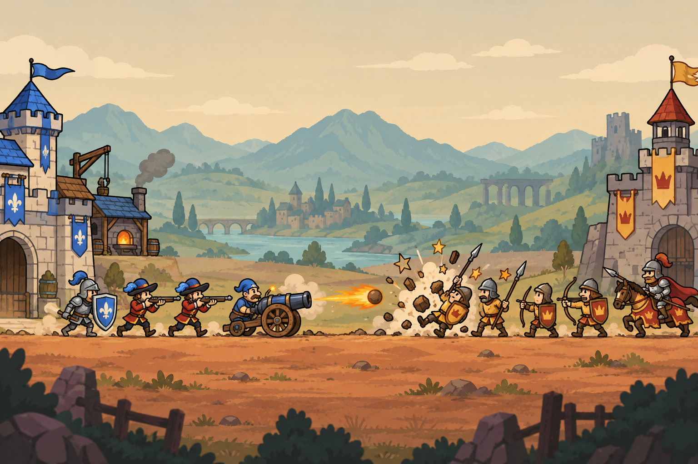

# 一线万年：文明冲锋 · Epoch Rush

Godot 原生线路的最新技术判断见 [全面重构专项评估](godot-system-rebuild-assessment.md)：说明动作、演出与方案 1 UI 的收益、制作边界和验收要求。

最新原生版本为 **Godot 0.7.0《纪元急袭 · 像素指挥台》**：十时代、50 兵种、60 套主将形态、20 关战役、30 张候选地图。Windows / Android 下载、九项需求的修复和实际验收证据见 [十时代交付报告](godot-v0.7-ten-eras-report.md)。声音沿用并适配十时代的系统来源见 [0.6.2 音频报告](godot-v0.6.2-audio-report.md)，历史修复见 [0.6.1 报告](godot-v0.6.1-repair-report.md)。

下一轮玩法构思见 [十时代玩法深化与对等博弈](godot-v0.7-gameplay-depth-and-fair-duels.md)：按 0.7.0 的十时代、五倍伤害代差和时代主将体系，提出有限集结、行为克制、公开进化投资、基础反制、路线构筑与同规则 AI；数值和新增规则待原型验证。[0.6.2 旧提案](godot-gameplay-depth-and-fair-duels.md) 保留为历史构思。

以下为 Web / Electron v0.3.0 最终交付基线和 v0.3.1 战斗扩展的历史设计入口（2026-10-06）；Godot 当前规则以 0.7.0 数据与交付报告为准。

这是面向 PC、Android、iOS 的设计基线：规则、内容、数据、素材规格与验收要求在此关联。v0.2.0 更新了营地与战斗界面、完整战线移动、26套角色动作和建筑反馈，实际实现与验证边界见 [本次改版](19-界面战场与动作改版.md)；首版交付记录见 [首版实现与验证](18-首版实现与验证.md)。所有数值仍需要通过试玩校准，归档中的原始设计快照保持不变。

2026-10-05质量复核发现：默认首关阻断进化、占位不完整、同代强化与参考作品的XP取舍缺失、动作和HUD未达体验目标。当前设计已按 [前两部复核与重做方案](20-Age-of-War前两部复核与重做方案.md) 落地；最终状态、剩余发布边界与实际证据见 [23-v0.3最终交付与验收](23-v0.3最终交付与验收.md)。

v0.3 已接入真实身体阵线、战斗 XP、金币研究、共享 XP 的时代大招、即时进化、图标圆角 HUD、本地字体和 26/26 Sub2 动作图集；v0.3.1 在此基础上加入放大基地、5 个时代特种单位、3 个主动道具、粒子化打击反馈、独立特种单位动作图集（31/31）和玻璃指挥甲板。自动流程与最终包验证见 [重建进度](21-v0.3重建进度与验收.md)、[候选交付记录](22-v0.3候选版交付与验收记录.md)、[最终交付与验收](23-v0.3最终交付与验收.md) 和 [v0.3.1 战斗扩展](24-v0.3.1战斗扩展与UI重构.md)。下列 00–19 文档保留历史设计背景，冲突时以当前数据与最新验收记录为准。

## 游戏结构

横向单战线的文明进化战争。默认经典模式从石器推进到轨道文明，用金币生产部队、研究与炮塔，用交战 XP 选择进化或时代大招。旧兵与旧训练订单保留出生时代，金币研究跨时代保留，进化立即更新基地和新兵；不再强制弹出时代策略选择。可选指挥官扩展保留一名英雄、一种专精、两个通用技能、遗物和传承天赋；英雄有真实战场实体，撤回后驻营休整，出口有空间才归队。

完整 v1 内容目标：6 名指挥官、18 个角色专精、5 个时代、20 种兵、10 种炮塔、12 个通用技能、6 个角色专属技能、18 项传承天赋、12 项局内时代策略、12 件遗物、15 个战役关卡、6 种敌方策略、3 档难度、完整教程、存档、图鉴、设置、结算和三端输入适配。

## 文档入口

| 文档 | 内容 |
| --- | --- |
| [00 产品愿景与范围](00-产品愿景与范围.md) | 游戏定位、完整版本边界、模式与设计原则 |
| [01 世界观与背景故事](01-世界观与背景故事.md) | 五时代、六名主角、阵营、故事与叙事语气 |
| [02 核心循环与对局规则](02-核心循环与对局规则.md) | 资源、出兵、进化、基地、胜负与节奏 |
| [03 可玩角色与军团体系](03-可玩角色与军团体系.md) | 六角色、18 专精、兵种、炮塔与克制 |
| [04 成长路线与构筑](04-成长路线与构筑.md) | 局内与局外成长、三条传承路线、负载与上限 |
| [05 掉落物与经济](05-掉落物与经济.md) | 战场掉落、结算、遗物、重复转换与保底 |
| [06 技能组合与状态系统](06-技能组合与状态系统.md) | 技能、状态、组合、六套构筑与限制 |
| [07 战斗打击与数值](07-战斗打击与数值.md) | 伤害公式、动作时序、命中反馈、击退与死亡 |
| [08 美术设定与素材制作](08-美术设定与素材制作.md) | 风格、尺寸、锚点、动画、图集与生成路线 |
| [09 交互体验与多端UI](09-交互体验与多端UI.md) | 完整流程、PC 与触屏控制、HUD、适配与可访问性 |
| [10 音频与触觉](10-音频与触觉.md) | 音乐、音效、混音、反馈与中断恢复 |
| [11 关卡敌人AI与叙事](11-关卡敌人AI与叙事.md) | 15 关、敌人策略、Boss、难度与教学 |
| [12 技术架构与跨端交付](12-技术架构与跨端交付.md) | 游戏核心、平台壳、生命周期、原生构建与性能 |
| [13 数据字典存档与配置](13-数据字典存档与配置.md) | 稳定 ID、JSON、存档、迁移、配置与事件契约 |
| [14 实施里程碑与验收](14-实施里程碑与验收.md) | 从代表性切片到完整成品的任务及验收 |
| [15 决策记录与实现风险](15-决策记录与实现风险.md) | 实际取舍、验证重点与版本变更规则 |
| [16 需求追踪与覆盖](16-需求追踪与覆盖.md) | 本次要求对应的文档、数据与验证证据 |
| [17 数值演算与构筑样例](17-数值演算与构筑样例.md) | 伤害、经济、技能预算与掉落演算 |
| [18 首版实现与验证](18-首版实现与验证.md) | 可运行版本、安装包、测试证据、素材来源与验证边界 |
| [19 界面战场与动作改版](19-界面战场与动作改版.md) | v0.2.0整体界面、地图移动、流程修复、角色与建筑反馈及复测证据 |
| [20 Age of War前两部复核与重做方案](20-Age-of-War前两部复核与重做方案.md) | 四项质量问题、官方规则来源、受控复现、完整重做方案与验收条件 |
| [21 v0.3重建进度与验收](21-v0.3重建进度与验收.md) | 重建过程、当前决策、26/26 动作门禁与历史通道记录 |
| [22 v0.3候选版交付与验收记录](22-v0.3候选版交付与验收记录.md) | 候选包历史、玩法与 UI 验证、自动对局样本与当时限制 |
| [23 v0.3最终交付与验收](23-v0.3最终交付与验收.md) | 26/26 动作门禁、四项问题落地、正式包、资源预算与最终验证 |
| [24 v0.3.1 战斗扩展与 UI 重构](24-v0.3.1战斗扩展与UI重构.md) | 大基地、时代特种单位、主动道具、粒子打击与图标优先 HUD 的实现和验收 |
| [数据目录](data/README.md) | 可供开发读取的规则与内容目录 |
| [素材提示词目录](prompts/README.md) | 场景、英雄、兵种、UI 与动画生成规格 |
| [素材制作任务表](素材制作任务表.md) | 197项逻辑素材的阶段、状态与路径 |
| [内容目录附录](附录-内容目录.md) | 角色、兵种、技能、成长、关卡等完整表 |
| [校验报告](设计校验报告.md) | 内容数量、引用、数值及文档链接检查 |

## 系统关系

## 数据与更新约定

机器数据为数值与稳定 ID 的主来源；文档解释玩法意义与执行顺序。数值修改同步更新引用表、演算和数据版本。旧五方向归档是选择阶段快照；本套文档记录方向 1 的扩展，新增系统以本基线为准。

本地执行使用 Windows 进程，遵守不启动 Docker、WSL 或其他本地虚拟化环境的约束；后续浏览器测试结束时关闭不用的测试标签页。素材继续采用用户指定的 Sub2API 路线。

