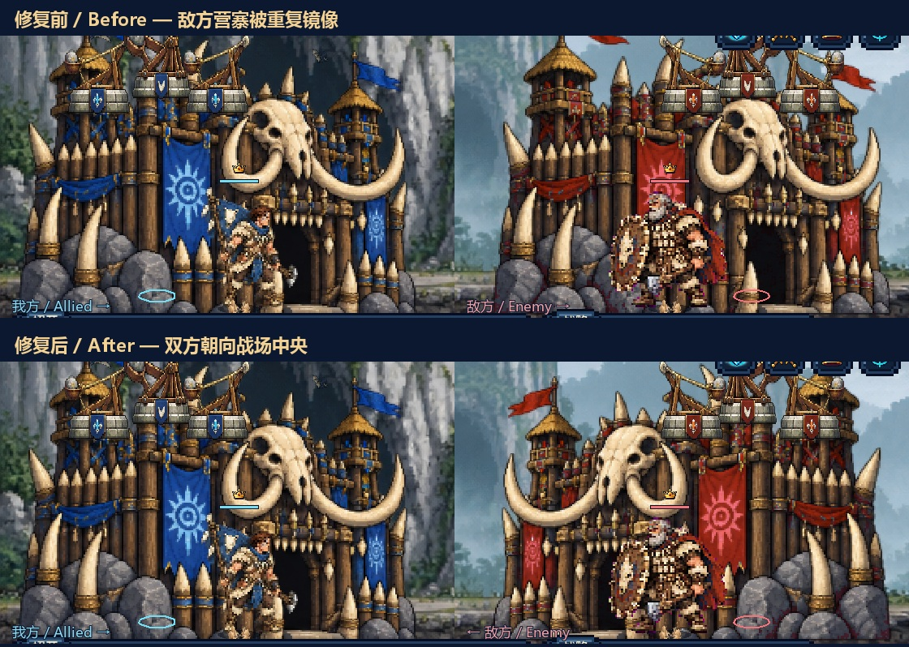

# 营寨相向修复 / Inward-facing camps

双方营寨现在朝向战场中央：左侧我方朝右，右侧敌方朝左。十时代完整、受损、濒毁和废墟状态，以及敌方 A1 → A10 的九次换代均已通过检查。本机 Windows EXE / ZIP 和 Android release / debug APK 已重新导出，游戏版本保留为 **0.7.0**。

Both camps now face the battlefield center: the allied camp on the left faces right, and the enemy camp on the right faces left. The corrective build covers all ten eras, four damage states and nine consecutive enemy evolution transitions. Local Windows and Android packages have been rebuilt; the application version remains **0.7.0**.



图中每一行分别拼接我方和敌方镜头的实机裁切，标注朝向。上排来自原 Windows 成品，下排来自新 Windows 成品的内嵌资源；均由匹配版本的 Godot 原生渲染。十时代采用相同时代、预设资源的检查场景；[完整朝向图](../media/base-facing/ten-era-base-pairs.jpg) 保留截图比例。

Each row joins native crops from the allied and enemy cameras. The upper row uses the original Windows build; the lower row uses the corrected Windows build's embedded resources, rendered by the matching Godot engine. The [ten-era comparison](../media/base-facing/ten-era-base-pairs.jpg) uses controlled same-era fixtures and preserves screenshot proportions.

## 原因与修正 / Cause and change

`BaseView` 原先对所有敌方营寨统一水平翻转。但 A1、A2、A4、A10 的敌方 PNG 已经烘焙了镜像，再翻转一次便与我方同向；其余六时代的敌方 PNG 只改配色，需要渲染时翻转。

`BaseView` previously flipped every enemy camp. The enemy PNGs for A1, A2, A4 and A10 were already mirrored, so the second flip made them face the allied direction. The other six eras use palette-only variants and require the renderer's flip.

时代数据现在明确记录 `enemyBaseMirrored`。渲染按素材实际方向决定是否翻转，素材复用和新素材处理工具同步维护此字段，四种损伤形态遵循同一约定。炮塔有自己的朝向处理，检查覆盖每侧三个炮位的轻型、重型炮塔。

Era data now declares `enemyBaseMirrored`. Rendering applies a flip according to the artwork's existing orientation, and both the reuse and generation tools maintain this field. All damage variants share the same convention. Turrets retain their own orientation handling; validation covers three mounts on each side with light and heavy turrets.

## 验证 / Verification

| 检查 / Check | 结果 / Result | 证据 / Evidence |
| --- | --- | --- |
| 原成品复现 / Original build regression | 508 / 527；19 项预期失败 / 19 expected failures | [before.json](../qa/base-facing/before.json) |
| 更新后源码 / Corrected source | **527 / 527**，40 状态组合、9 次换代 / 40 state pairs, 9 transitions | [source.json](../qa/base-facing/source.json) |
| 新 Windows 成品内嵌资源 / Corrected Windows embedded resources | **527 / 527** | [windows-embedded.json](../qa/base-facing/windows-embedded.json) |
| Windows 数据与图集 / Windows data and atlases | 19 JSON 与导出时源码逐字节匹配，252 图集加载 / byte matches and loaded atlases | [embedded-content.json](../qa/base-facing/embedded-content.json) |
| Android release / debug | 两包 CRC、各 19 JSON、营寨字节码与已测 Windows 相同 / CRC, data and identical tested base bytecode | [android-packages.json](../qa/base-facing/android-packages.json) |
| Android 签名与对齐 / Android signing and alignment | 签名校验、16 KB 页对齐、图标别名 / signatures, page alignment and icon alias | [android-finalization.json](../qa/base-facing/android-finalization.json) |
| Windows ZIP | 八个文件、CRC、内含 EXE 哈希 / eight files, CRC and bundled EXE hash | [delivery.json](../qa/base-facing/delivery.json) |

原成品的 19 项失败包含四个问题时代各四种损伤状态，以及连续换代到 A2、A4、A10 时的三个错误。检查还确认敌方连续换代时，我方时代仍保持 A1。朝向预期由原始透明轮廓推断，不直接复用时代字段作为预期结果。

The original build fails four affected eras in each of four damage states, plus transitions to A2, A4 and A10. The same regression also checks that allied evolution remains independent. Expected orientation is inferred from the original silhouette pixels independently of the new metadata.

源码重跑：在仓库根目录使用 Godot 4.7.2 Standard 执行以下命令，需要图形设备以输出原生截图。检查采用独立存档目录。

To repeat against source, run from the repository root with Godot 4.7.2 Standard and a graphics device. The script uses an isolated QA save directory.

```powershell
godot --path godot --script res://qa/base_facing.gd
```

本机可玩文件位于 `godot/build/windows/` 和 `godot/build/android/`，哈希见本次交付证据；它们由 Git 忽略，未作为 GitHub Release 上传。Android 完成包级校验，尚未进行实体设备游玩验证。首次发布成品和历史 `v0.7.0` 证据保留原哈希；本次修复记录单独存放。

Playable local files are in `godot/build/windows/` and `godot/build/android/`; their hashes are recorded in this repair's delivery evidence. They are ignored by Git and have not been uploaded as GitHub Releases. Android has package verification, without physical-device playtesting. The initial build and historical `v0.7.0` evidence retain their original hashes.
