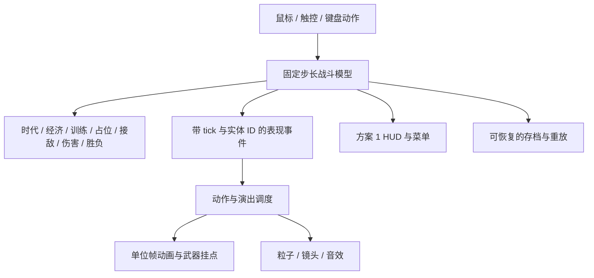

# Godot 全面重构：动作、演出与 UI 评估

评估日期：2026-10-07。对象是本项目原 Phaser + TypeScript + DOM 客户端，以及当前独立 Godot 实现。视觉方案采用已选定的方案 1「像素指挥卡组」。

## 结论

**如果 Windows/Android 原生发行是主目标，并且同时重做动作资源、战斗时序、技能演出与 UI，推荐 Godot 作为后续主线。最明确的收益是制作、预览与复用复杂演出的能力。最终画面、手感和性能仍需验收，不能承诺所有维度都会更好。**

这次评估针对系统性重建。相同图集、相同关键帧、相同时序和相同粒子参数，在 Phaser 与 Godot 中可以得到接近的画面。作品进步来自新的动作设计和完整表现管线；Godot 为这条管线提供较集中的工具。

## 针对本游戏的判断

| 维度 | 全面重构应得到的改变 | Godot 的帮助 | 验收条件 |
| --- | --- | --- | --- |
| 行走、待机、朝向 | 每类单位有独立步幅、脚底锚点、转向与停止姿态 | 精灵资源和节点组合便于预览、复用 | 双方所有兵种均朝移动/攻击方向，翻转不造成脚底跳位；停止时不滑步 |
| 攻击动作 | 按武器区分预备、释放、后坐和恢复 | AnimationPlayer 可同时编排多个属性轨道 | 斩击接触、枪口发射、弹道抵达、伤害与声音对应同一攻击 |
| 受击与死亡 | 区分轻击、重击、护盾和金属；控制硬直、闪白与退场 | 动画、Shader 与音效可共同组成表现资源 | 受击方向正确，死亡只结算一次；反馈不使兵线失去可读性 |
| 技能、道具 | 每种技能具备预警、释放、命中、残留和结束状态 | 技能场景与粒子资源便于组合、调参 | 各技能轮廓和节奏可辨；瞄准/取消/冷却/暂停正确 |
| 时代进化与基地摧毁 | 基地变化、镜头、光效、音效与 HUD 提示形成连续演出 | 时间线和场景资源特别适合这类多对象演出 | 升级只影响本方；演出期间规则持续正确；暂停和跳过不会重复事件 |
| 方案 1 UI | 像素卡组、九宫格边框、统一图标与字体；队列和状态清楚 | Control、Container、Theme 集中管理布局与控件状态 | 按设计稿检查战场占比、卡片层级与触控尺寸；图标按钮仍有明确状态反馈 |
| 性能、输入、包体 | 根据真实设备制定预算 | 原生运行和资源管理提供统一入口 | 同设备对照测试，分别记录帧耗时、输入延迟、加载和内存，不能预设更快 |

Godot 官方将 AnimationPlayer 用于具有复杂时序的动画，并提供轨道编辑；Tween 适合运行时目标值变化的插值。对本项目而言，固定技能、基地变化适合时间线，动态镜头和追踪目标适合运行时控制。[AnimationPlayer](https://docs.godotengine.org/en/stable/classes/class_animationplayer.html) · [Tween](https://docs.godotengine.org/en/stable/classes/class_tween.html)

Godot 同时提供 GPU 和 CPU 2D 粒子，两者性能取舍依赖设备与粒子数量。像素战斗还应限制透明叠加、同屏粒子与大范围闪光，保留低特效档。[2D 粒子官方说明](https://docs.godotengine.org/en/stable/tutorials/2d/particle_systems_2d.html)

Theme 可以统一字体、图标、颜色、StyleBox，并从父控件传递给子控件。方案 1 的美术外观仍由我们的卡片、图标与交互设计决定。[Godot GUI 主题](https://docs.godotengine.org/en/stable/tutorials/ui/gui_skinning.html)

## 当前代码已经实现和仍需完善的部分

原客户端的 `src/presentation/animation.ts`、`motion.ts` 与 `battle-scene.ts` 已有模型时序、精灵帧、武器挂点和战斗事件反馈。这些能力说明 Phaser 足以实现此类横向 2D 游戏。

仓库现已存在独立 Godot 项目，而不是仅有迁移提案。`GameModel` 和 `EpochCombat` 持有规则；`UnitView` 按模型阶段与位移推进图集，使用 AnimationPlayer 处理闪白；`BaseView` 提供基地时间线；`BattleEffects` 消费事件并复用粒子。HUD 采用方案 1 的图标与卡片。

当前 Godot UI 和单位节点仍有较多脚本组装。后续要进一步发挥编辑器收益，应把兵卡、指挥甲板、弹窗、单位和技能逐步整理为可独立预览的 `.tscn`/`.tres` 资源。仅把 TypeScript 翻译为 GDScript，仍不能获得这部分制作便利。

此轮复查还发现：敌方图集只是换色而没有转向；远程让位使用固定时长，导致慢速兵突然加速；部署炮台复制了英雄临时移动状态；触屏事件路由和拖拽/施放边界需要明确。这些实例说明，朝向、占位、出营、攻击排队和道具状态都需要独立规则与输入校验。

## 推荐架构

1. 伤害、双方时代、占位和训练订单由模型决定。动画负责表达事件；掉帧、暂停、降低动态和跳过演出不能改变伤害次数。
2. 保持单战线的身体间距和攻击排队规则。短兵接敌、长兵越肩、远程后排和出口等待需要显式实现；不交给通用物理碰撞自行决定。
3. 像素兵种优先使用经过验收的逐帧动画；重型机械可添加分部件运动。复杂动画状态混合仅在确有需求时引入，避免给每个小兵增加无用层级。
4. 素材继续使用指定 Sub2/gpt-image-2.5 流程。复用合格 PNG、背景、音效和字体；检查轮廓一致性、朝向、武器、透明边缘与脚底锚点，不能以增加帧数代替动作质量。
5. 用统一主题与可复用控件落实方案 1。按钮的普通、按下、选中、锁定、冷却、次数与持续时间都必须直接绑定实际状态。
6. 规则、交互、截图、完整对局、性能与发布包分别验证。当前测试不能代替 Android 真机试玩，也不能证明与 Phaser 的性能对比结果。

## 投入与交付取舍

PNG、图集、字体、音效和 JSON 配置可复用；TypeScript 规则、DOM UI、存档接口与浏览器测试需要建立 Godot 对等实现。投入重点依次是规则正确性、动作与命中同步、演出资源、UI 组件、输入与存档，再到完整对局和目标设备性能。

若浏览器即开即玩仍是主要目标，需要单独测量 Godot Web 的加载、触控和音频。Godot 4 Web 导出要求 WebAssembly/WebGL 2；多线程导出需要跨源隔离，当前 C# 项目不能导出 Web。原生与 Web 均需保留时，本项目宜使用 GDScript 并验证 Web 版本。[Web 导出官方说明](https://docs.godotengine.org/en/stable/tutorials/export/exporting_for_web.html)

**最终建议：沿 Godot 原生主线继续系统化制作，把更好的攻击节奏、受击重量、进化演出和方案 1 UI 作为验收目标。游戏效果是否优于旧版，依据同内容录像与试玩判断；帧率和输入性能依据同设备测量判断。**

早期平台取舍背景见 [原重平台评估](godot-replatform-evaluation.md)。当前修复与交付证据单独记录，避免把技术预期写成已完成效果。
