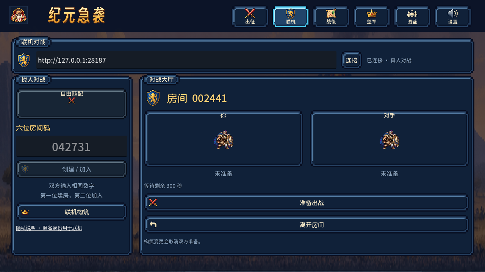
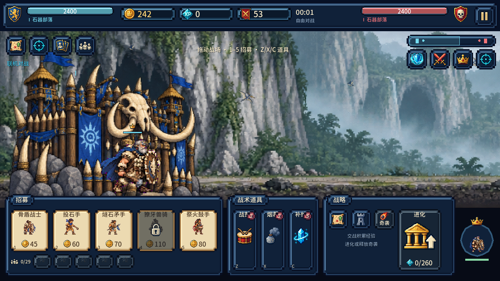
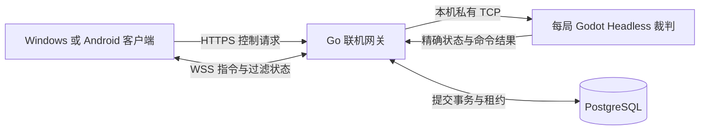

# v0.8.0 真人联机实现与交付

日期：2026-10-11。游戏版本 0.8.0，Android versionCode 13，协议 1.0，规则 `pvp-classic-v1`。原先的[体系设计](online-system-design.md)和[实施计划](online-implementation-and-acceptance.md)保留为设计基线；本报告描述已经写入代码并实际验证的版本。

## 已实现的游玩流程

主菜单新增第六个入口 **联机**，首页同时有联机对战按钮。联机页提供服务器地址、连接状态、自由匹配、六位数字房间码、双方席位/准备状态、联机构筑、原对局返回及隐私说明。页面沿用像素卡片、同一套像素图标、字体和安全区，不将网页控制台嵌入游戏。

1. 启动同版本服务端，两台客户端填写相同的服务端地址并连接。
2. 自由匹配寻找另一位真实玩家，双方在 15 秒内确认；无人匹配时可以等待或取消，没有 AI 冒充玩家。
3. 或双方输入同一个六位数字：第一位创建、第二位加入、第三位提示已满；`042731` 等前导零不会丢失。六位码全服唯一，关闭后短暂冷却，不能当成身份凭据。
4. 进入房间后可以调整联机构筑；构筑修改会取消双方准备，避免一方未看清就开战。双方准备后加载同一权威比赛。
5. 双方都把自己的军团、资源和基地显示在左侧；右席位的坐标、朝向、技能目标由统一视角适配转换。
6. 战斗按钮提交到服务器，确认后才播放对应执行反馈。设置、研究等本地弹窗不暂停在线战局；返回大厅仍可回到原比赛，投降需要显式确认。
7. 掉线后输入锁定，恢复连接会同步原军队、首都、时代与指令结果。重启客户端也能通过保存的受保护身份恢复原席位。结束后双方看到同一结果并可回大厅继续找人。






这些画面来自已导出 Windows EXE 的内嵌资源、原生 Godot 渲染和两个实际联网身份；不是图片生成的概念界面。构筑、准备和招募由真实 API/WSS 操作，服务器执行战斗。

## 公平规则和单机兼容

线上双方控制类型均为 `human`，各自 240 金币、相同被动资源增速。三档 AI 资源倍率继续用于单机 AI，不会套到真人右席位。双方时代升级完全独立；成功进化按兵种比例提升自己的首都最大生命并回满自己的首都。

联机构筑独立于单机养成，双方都可使用六位主将、两个通用技能、两件遗物和六点天赋，服务器验证实际条目与预算。本版采用现有战斗规则和兵种攻防，不增加充值优势、排位积分、聊天或好友系统。联机局不改写单机存档，不发放单机养成奖励。

## 实际架构



| 路径 | 已实现职责 |
| --- | --- |
| `services/online-gateway/` | 原生 Go 网关、匿名身份、活动互斥、匹配、房间、租约、持久提交、WSS、容量和清理 |
| `services/online-gateway/migrations/001_online.sql` | 玩家、令牌、房间、席位、比赛、指令账本、批次、结果与发件箱 |
| `godot/server/server_main.gd` | 纯战斗 Headless 入口，固定步进；不实例化菜单、音频或纹理 |
| `godot/server/command_router.gd` | 允许的动作、参数范围、时代合法性与服务器席位映射 |
| `godot/server/network_projection.gd` | 分别生成双方的公开/私有状态与事件 |
| `godot/scripts/net/net_client.gd` | HTTP 幂等请求、WSS、状态缓存/分片、重连、持久待确认序号和房间构筑合并 |
| `godot/scripts/net/online_battle_state.gd` | 只读显示状态、表现插值和命令转交，不执行战斗或发钱 |
| `godot/scripts/net/battle_perspective.gd` | 本方左视角、敌我、世界坐标、朝向和技能目标转换 |
| `godot/scripts/net/session_credentials.gd` | Windows DPAPI 与 Android Keystore 受保护身份 |
| `services/android-secure-store/` | 自有 Android Godot v2 插件源码，无第三方账号 SDK |
| `godot/scripts/ui/online_menu.gd` | 联机大厅、六位码、准备、匹配确认和恢复入口 |
| `tools/online/` | 原生工具链、模板、双客户端/故障/负载检查及服务端打包 |

客户端通过既有 BattleScreen 读取 OnlineBattleState 来复用画面和输入；没有按原方案另建一整套 BattleSession 类层级。服务端使用 **30Hz** 固定战斗步进、约 **100ms** 提交批次，保存完整压缩精确快照、两侧投影、命令结果和控制状态。客户端更新基于已确认基线的增量投影，缺基线主动请求完整同步；大消息分片并验证 SHA-256。

这一版不依赖 GDScript 浮点模拟的跨进程重放来证明一致性。恢复读取最近已提交的完整状态；在数据库事务提交前不会对外发布新 ACK 或战局。为了消除失败重试中的重复扣费，命令按 `比赛 / 玩家 / 序号` 唯一，结果可查询；双方各自的序号 1 不相互冲突。

## 断线和平台故障

| 情况 | 行为 |
| --- | --- |
| 客户端网络中断 | 探活、有限退避重连；完整同步前锁定输入 |
| 客户端重启 | 恢复受保护身份与保存的比赛，取回原席位和已提交游标 |
| 已执行但 ACK 丢失 | 服务器返回原执行结果，不能再次执行或扣费 |
| 尚未执行的旧点击 | 恢复时封存序号，不补发过时技能或招募 |
| 一方离线 | 每次最多 8 秒技术暂停、每人整局 15 秒；连续 120 秒或累计 180 秒离线判负 |
| 双方离线 | 冻结模拟；60 秒均未恢复则关闭，无获胜方 |
| Headless 裁判被强制终止 | 网关重建裁判，从数据库精确检查点恢复 |
| 网关/数据库暂时故障 | 识别平台恢复并暂停玩家离线预算，保留已提交状态与结果 |
| 旧裁判迟到提交 | 租约、世代与事务比较阻止写入与发布 |
| 平台长期无法恢复 | 关闭为服务器异常，不冒充玩家获胜，不发单机奖励 |

本地重连不会把离线点击积攒成恢复后的瞬间爆发。快照延迟超过 1.5 秒时即使仍收到心跳也锁定操作，避免在陈旧画面继续下单。窗口暂停/Android 生命周期通知进入网络恢复逻辑；**Android 的后台切换、系统杀进程、Wi-Fi/蜂窝切换仍待实体设备验证**。

## 运行服务端和双端下载

服务端下载包 `Epoch-Rush-Server-0.8.0-Windows-x64.zip` 包含原生网关、Godot 4.7.2、精简裁判工程、独立原生 PostgreSQL 和 PowerShell 启停脚本。无 Docker、WSL 或虚拟机。系统需要 Microsoft Visual C++ x64 运行库；脚本检测并在缺少时提供官方安装地址。

解压后执行：

```powershell
powershell -NoProfile -ExecutionPolicy Bypass -File .\Start-Server.ps1
```

客户端选择 **联机**，填写 `http://服务器局域网IPv4:28187`，再选择自由匹配或相同六位码。数据库仅在服务器本机监听 54329，裁判内部 TCP 仅本机可达；不要开放这两个内部接口。独立包无需另装 Go 或 Python。

默认限制十局并发，提高前应在目标机器复测。排空更新使用 `Stop-Server.ps1`，它在仍有比赛时只停止新准入；全部结束后再停止服务与替换包。`Resume-Admissions.ps1` 恢复准入。数据库、匿名身份与比赛记录留在独立用户数据目录中，不能提交进 Git。详细参数和英文操作见 [服务端 README](../../services/online-gateway/README.md)。

客户端 Windows EXE/ZIP、Android debug/release APK 与服务端 ZIP 同步放入 [v0.8.0 Release](https://github.com/wikigsroom/Evolutionary-history-of-war/releases/tag/v0.8.0)，校验文件包含五个二进制下载文件的 SHA-256。

## 已验证范围

精简证据见 [v0.8.0 验收目录](../qa/v0.8.0/README.md)。

| 检查 | 结果与范围 |
| --- | --- |
| 双真人核心契约 | 35/35，包括公平经济、独立升级、两侧视角和本地弹窗不暂停 |
| 实际 HTTP/WSS/数据库集成 | 23/23，包括前导零、满房、幂等请求、序号独立、状态隐私、重连和并发占位 |
| 已导出 Windows 资源双客户端 | 19/19，构筑合并、准备、真实招募、自动重连、重启恢复、结果；运行日志无脚本错误 |
| 原生强制崩溃 | 10/10，实际终止裁判/网关/隔离 PostgreSQL，已确认命令不回滚，旧点击不重发 |
| 独立服务端发布包 | 10/10，完整解压、初始化/启停、维护排空、已有战局结算、数据库重启后保留结果 |
| 本机负载 | 十局、二十订阅者、30 秒；最低 29.96Hz，平均 30.14Hz，指令 ACK P95 260ms；各局唯一共同结算 |
| 控制层 Go 单元检查 | 7/7，掉线预算、重复掉线、双离线、平台故障免罚等 |
| 单机交互 | 159/159 |
| 单机难度/首都进化 | 187/187 |

十局负载仅代表开发机原生 Windows 的这次测量；不是公网容量、多人在线峰值或地域网络质量承诺。先前长屏 92 项验证保留在 v0.7.3，新增大厅检查覆盖 1280×720 与两种长屏尺寸。APK 检查包含应用标识/版本、签名、页对齐、图标、INTERNET 权限和 Keystore 插件，不能替代真机试玩。

## 当前边界和下一步

交付支持本机与局域网实际可玩；**没有部署公共对战服务器**，用户需启动自己的服务端。`jyqx.sidcloud.cn` 已更新为联机版隐私说明，仍是静态政策网页，不能填写为对战地址。公网使用需要拥有的常驻主机、域名与 HTTPS/WSS 代理；随包有 Caddy 模板，没有把 Vercel 当裁判服务器。

当前 PostgreSQL 为单主实例。实测进程崩溃后的提交恢复，不等同于整机/磁盘损坏后的零数据丢失；全天候服务应补齐备份、同步副本、故障切换、告警与重启管理。本次没有实体 Android 设备、原生 C/C++ race detector、真实跨地域网络或商用峰值场景，不能写作已通过。

后续优先：实体双端长局/后台切换、目标公网部署与真实弱网、服务自启和监控、数据库备份恢复演练；最后再扩展排位、好友、观战和匹配分级。已有设计里的 50 局容量、跨区策略、5 秒检查点/浮点重放和 72 小时账本是原方案参数，不是本版运行默认。
