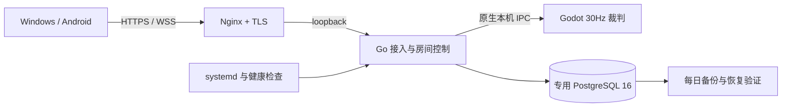

# v0.8.1 正式公网联机交付

2026-10-11。SIDcloud 官方联机服务已部署在 **https://jyqx-server.sidcloud.cn**；Windows 和 Android 0.8.1 默认使用该地址。下载与校验见 [v0.8.1 Release](https://github.com/wikigsroom/Evolutionary-history-of-war/releases/tag/v0.8.1)，精简证据见 [本版 QA](../qa/v0.8.1/README.md)。

## 玩家如何开始

1. 双方安装本版客户端。Windows 解压便携 ZIP 后运行 EXE；Android 使用 release APK。
2. 主菜单进入「联机」，阅读 SIDcloud、新加坡服务器及隐私提示，点击「同意并连接」。首次打开大厅不会创建新的线上身份；匹配和建房在明确连接后开放。已加入的原局可以在重启后自动恢复。
3. 自由匹配会等待另一名真实玩家，找到后双方在 15 秒内接受。当前没有机器人补位，也没有排位积分。
4. 与朋友对战时，双方输入同一个六位数字。第一位创建，第二位加入；前导零保留，第三人不能加入满房。选择构筑后双方准备开始。
5. 掉线时等待自动重连即可。保留原席位、时代、军队和已确认指令；未执行的旧点击不会在恢复后突然补发。对局设置菜单不暂停在线模拟。

同一个系统用户的普通 Windows 客户端共用匿名身份，不能用该身份的两个窗口占据双方。请使用两台设备、不同 Windows 用户或专门的隔离 QA 身份。六位码只是找房方式，不是身份密钥。

首次安装默认选择官方地址；升级时保留之前保存的自定义地址。已有私有服设置的用户如需进入官方服，请将地址改为 https://jyqx-server.sidcloud.cn 再连接。

## 服务端实现

目标主机为新加坡 Ubuntu 24.04 / amd64，2 vCPU、1 GB 内存，已有其他应用。复用其现有 Nginx 与 PostgreSQL 服务，只增加本游戏虚拟主机、独立数据库和受限角色；没有停止无关应用，没有使用 Docker、WSL 或虚拟机。

| 层 | 当前正式配置 |
| --- | --- |
| 公网接入 | 可信 HTTPS/WSS，HTTP 跳转 HTTPS；Let’s Encrypt，已启用续期定时器与本游戏 reload hook |
| 应用 | 非 root epochrush 用户；127.0.0.1:28187；systemd 开机自启与 3 秒崩溃重启 |
| 数据库 | 专用 epochrush_online 库、受限 epochrush_server 角色、最多 4 个连接；数据库仅 loopback |
| 容量 | 最多 2 局 / 4 玩家同时对战；超额明确拒绝，不把玩家无限塞进模拟进程 |
| 资源 | Go 96 MiB 目标；服务 MemoryHigh 192 MiB、MemoryMax 320 MiB；裁判导入 worker 限为 2 |
| 健康 | 每分钟检查；连续三次失败重启本游戏服务；磁盘不足 512 MB 排空新对局 |
| 备份 | 每日 04:20 主机时间，另加最多 10 分钟随机延迟；custom-format dump 与 SHA-256；超过七天定时清理，可能保留至八天 |
| 日志 | 本游戏 Nginx 访问/错误日志关闭，避免票据 URL 入日志；应用诊断日志每天或达到 2 MB 后轮换，保留七份归档 |
| 公网管理 | /healthz、/metrics、/admin 均 404；健康只供本机运维 |

TLS 证书本次核验有效至 2027-01-09。实际运行配置与逐文件哈希已核验；备份已恢复到全新隔离测试库并查到真实玩家和结算记录，随后移除测试库。操作路径、排空升级和恢复步骤见 [Linux 运维说明](../../services/online-gateway/deploy/linux/README.md)。

## 稳定性修正

公网长流程暴露了一个旧身份匹配错误：队列过期判断读取匿名玩家的 last_seen，而原实现只在身份认证时刷新它。完成较长比赛后再入队，或匹配等待超过一分钟，就可能被误清理。现在入队事务和活动轮询都刷新 last_seen；已用超过一分钟的旧身份、超过一分钟的真实等待、对手到达与双方接受开战完整验证。

进程崩溃复测还发现，反向代理在接入服务重启期间可能返回 HTML/空响应。客户端现在用不会刷引擎解析错误的 JSON 实例解析，将无效响应标记为临时网络故障，按原重连流程恢复。数据库故障验证要求双方收到故障后的新投影且模拟继续前进，再提交下一条指令，避免用屏幕上尚未刷新的一帧误判为已经恢复。

战斗继续使用服务端权威裁判、提交后 ACK、按玩家序号去重、持久检查点、租约世代隔离及唯一结算。双端同等经济与构筑预算，敌方私有资源/队列/冷却经订阅过滤。时代与首都升级遵循原有独立规则，不跟随对手自动升级。

Windows 默认 DPAPI 与 Android Keystore 保留随机身份。首次连接前增加明确动作和地区提示，离线养成不上传。所有联机中文已加入两款游戏字体子集，避免依赖设备系统字体。两款 APK 的网络客户端、连接菜单和导入字体与已经实际游玩的 Windows 资源逐项比对。

## 本次验收与边界

| 检查 | 范围 |
| --- | --- |
| 22 项导出资源客户端检查 | 官方默认地址、打开大厅不联网、明确连接、六位房间、构筑同步、宽屏、安全布局、真实招募、重连、客户端重启恢复、双方结算 |
| 23 项公网协议检查 | HTTPS/WSS、独立身份、重复指令不重复消费、原席位恢复、敌方隐私过滤、20 人同码争抢只有两人进入、真人匹配与拒绝释放 |
| 11 项公网原生故障检查 | 只杀本游戏接入主进程；systemd 自动重启后原局继续；仅中断本游戏数据库连接后恢复；原已确认状态不回退，后续指令与唯一结算有效 |
| 7 项长队列检查 | 65 秒旧身份、65 秒心跳等待、到达对手、双方接受、真实运行与共同结果 |
| 4 项目标主机并发检查 | 两局四名真实 WSS 订阅者，约 30 秒持续模拟、全部招募确认、每局唯一共同结算 |
| 12 项运维检查 | DNS/TLS、私有管理、原生进程/自启、容量、数据库权限、根目录私密配置、最终部署 manifest、真实备份恢复、证书续期配置、loopback、日志与保护 |
| Windows 私有服检查 | 最终 ZIP 逐文件哈希、初始化/启动、23 项协议、排空、继续旧比赛、停止/重启后的结果保存，共 10 项管理检查 |
| APK 与品牌 | 双包版本/code14、权限、Keystore、资源一致性、16 KB native 对齐及无私密配置；Windows 与 Android 实际图标资源核验 |
| 隐私发布 | Vercel 正式域名、别名路由与下载文件一致性；最新 DOCX 的 15 页逐页渲染复核 |

公网并发样本最低估算模拟速率约 **30.10 tick/s**，本次工作站到服务器的招募确认 p95 **409 ms**、最大 **486 ms**。样本只有两局和 30 秒，速率包含投影采样/启动缓冲差异；不能推算长期稳定性、更多并发或所有网络下的延迟。服务器还有其他负载，因此维持两局硬上限。

**实际限制**：本版 APK 已完成内容、签名和对齐验证，但本机没有实体 Android 设备，不能宣称真机后台/前台切换、触控、声音或性能通过。备份仍在同一主机，未配置异地备份、数据库同步副本或跨机自动切换；已验证的进程恢复不等于整机/磁盘灾难零丢失。健康定时器是本机自检，尚未配置独立外部告警。没有用重启整台共享服务器冒充自启验证。

## 版本与发布物

客户端 0.8.1，Android versionCode **14**，协议 **1.0**，规则 **pvp-classic-v1**。模拟哈希仍为 `085a54fd2558352356ef9b46a001bb751db74c5638e50f4a31d96e633071395c`；本版修复接入、部署与字体，未改战斗数值。更新不同模拟版本之前必须排空旧比赛；同版本故障恢复保留数据库。

发布提供 Windows EXE、便携 ZIP、Android debug/release APK、完整原生 Windows 私有服 ZIP、原生 Linux 权威服务 TAR，共六个二进制包及 SHA256SUMS。Linux 包不包含数据库、引擎或任何服务器凭据；凭据、私有导出预设、签名密钥及本机数据始终留在被忽略的私密路径中。

## English

v0.8.1 connects both clients by default to **https://jyqx-server.sidcloud.cn**, the SIDcloud public service hosted in Singapore. Enter Online, read the region/operator notice, explicitly agree and connect, then choose real-player matchmaking or use the same six-digit code. Both players ready/accept; disconnects resume the original match and seat without replaying stale clicks. Opening the hall alone does not create a new identity.

The native deployment reuses existing Nginx and PostgreSQL 16 with an isolated game database and restricted role. A non-root systemd gateway supervises headless Godot authorities. TLS renewal, minute health/disk checks, daily database backups and isolated restore validation are configured. The shared 1 GB host is capped at **two matches / four players**.

An actual queue defect was corrected: old authenticated identities and long-polling queues no longer expire while actively waiting. Both APKs are compared with the verified Windows client's compiled network/menu/font resources. Native Windows public play, client restart, game-process kill, interrupted dedicated SQL connections, six-digit room contention and long-queue acceptance were exercised. Compact reports and exact artifact hashes are committed under this version's QA directory.

The public two-match sample sustained approximately 30 ticks per second for 30 seconds; observed recruitment confirmation reached 486 ms on the test workstation's route. This is not a long-duration or high-capacity certification. Physical Android validation, off-site backups, disk/host loss recovery and multi-host failover remain unverified or unimplemented. The existing offline game remains available.
