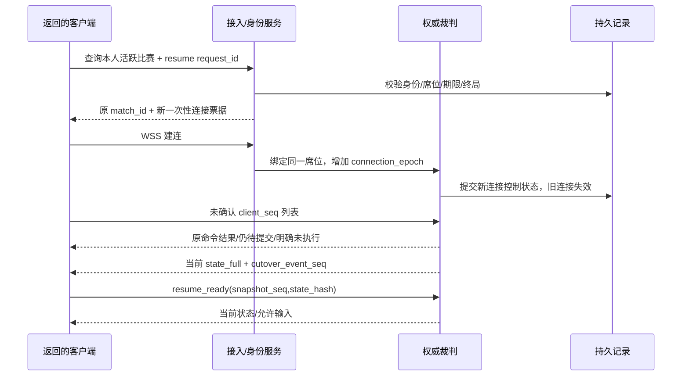

# 联机通信协议与数据契约草案

> 原始设计基线保留。v0.8.0 已有实现，实际模块、运行参数、交付范围与测试结果以 [实现报告](godot-v0.8-online-report.md) 为准；下文计划和验收目标不等同于已通过。

日期：2026-10-11。适用：[联机体系设计](online-system-design.md) 的首发 1v1。协议候选版本 `1.0`，规则候选 `pvp-classic-v1`。本文定义接口边界与故障行为，不是已经上线的 API。

## 1. 身份、版本与序号的不同职责

| 字段 | 含义 | 来源与规则 |
| --- | --- | --- |
| `player_id` | 持久游客/账号身份 | 服务端随机生成；不使用昵称、MAC、IP 或 Android 广告 ID |
| `room_id` | 一间房的内部 UUID | 服务端生成，房间码复用后仍是新 UUID |
| `room_code` | 六位数字入口 | 字符串，允许 `042731`；不能充当认证凭证 |
| `room_revision` | 准备阶段的状态版本 | 每次构筑、成员或规则变化增加；ready 必须匹配当前 revision |
| `match_id` | 一场比赛的 UUID | 准备结束后创建；再战重新创建，不复用旧指令键 |
| `seat` | 服务器世界 side 0 或 side 1 | 服务端绑定身份，客户端只读 |
| `connection_epoch` | 某席位连接代际 | 新连接成功接管原席位时增加；旧连接立即失效 |
| `owner_epoch` | 对局裁判进程代际 | 持久控制器接管比赛时增加；旧裁判提交被数据库拒绝 |
| `client_seq` | 本玩家、本场局的业务指令序号 | 从 1 递增，重连不归零；双玩家相互独立 |
| `snapshot_seq` | 当前订阅者的权威状态序号 | 每次发布新投影递增，重同步需要新全量基线 |
| `event_seq` | 当前订阅者收到的事件序号 | 服务器在隐私过滤后编号，不混用内部完整事件流水 |
| `committed_tick` | 已持久提交的最高模拟 tick | 服务器计算，30Hz；玩家不能指定执行到哪一 tick |
| `protocol_version` | 消息结构版本 | 不兼容主版本直接阻止入房；小版本只允许约定的兼容变更 |
| `simulation_hash` | 核心代码/数据/引擎构建的身份 | 服务器发布与客户端清单核对；不能用单机 contentVersion 代替 |
| `ruleset_hash` | 本局公平配置的规范化哈希 | 开始前锁定，对局过程中禁止替换 |

数字 JSON 字段必须有限、类型正确、范围正确。NaN、Infinity、字符串冒充数字或非法枚举均拒绝。网络坐标可量化用于绘制，模拟使用原精度。

**生命值不能按有符号 int32 编码**：当前第十时代首都基础生命为 `2400 × 5^9 = 4,687,500,000`，已经超过其上限，叠加生命增益还会增加。生命/资源网络值用 float64 或经验证的 int64/decimal 表示，禁止 32 位溢出；时间 tick 与单局实体 ID 同样明确范围。

## 2. HTTPS 接口

请求使用可信 TLS。建立游客身份时生成不含硬件标识的安装凭证，后续使用 access_token；高熵恢复凭证只在加密请求中传递，不进 URL、截图和普通日志。

所有会修改状态的请求带 `request_id`。服务端以身份、端点和 request_id 保存请求载荷哈希及结果；同 ID 同载荷重试返回同一结果，同 ID 不同载荷返回 IDEMPOTENCY_CONFLICT。校验记录、实际业务提交和 outbox 必须一致，不能先缓存“成功”再做可能失败的创建操作。

| 方法与路径 | 输入重点 | 返回重点 |
| --- | --- | --- |
| `POST /v1/auth/guest` | 首次安装凭证/幂等请求 ID | player_id、短期访问令牌、刷新凭证 |
| `POST /v1/auth/refresh` | 当前刷新凭证 | 新访问令牌；轮换采用幂等响应，防止丢响应导致唯一凭证丢失 |
| `GET /v1/bootstrap` | 客户端版本、平台 | 区域、兼容清单、规则、维护状态、公开参数 |
| `GET /v1/activities/me` | 访问令牌 | 无活动 / 匹配票据 / 等待房 / 活跃比赛 / 待确认结果 |
| `POST /v1/matchmaking/tickets` | request_id、构筑 ID、规则和区域候选 | ticket_id、等待状态；已有活动则返回其真实状态 |
| `DELETE /v1/matchmaking/tickets/{id}` | request_id | CANCELLED 或当前已经出现的 offer 状态 |
| `POST /v1/match-offers/{id}/decision` | request_id、accept、offer_revision | 当前预约状态；不直接开始模拟 |
| `POST /v1/rooms/by-code` | request_id、code、构筑选择 | CREATED / JOINED / ALREADY_MEMBER 与 room_id、revision、区域 |
| `PATCH /v1/rooms/{id}/loadout` | request_id、expected_revision、构筑 | 新 revision；双方准备失效 |
| `POST /v1/rooms/{id}/ready` | request_id、expected_revision、ready | 当前 roster / readiness；旧 revision 拒绝 |
| `POST /v1/rooms/{id}/leave` | request_id | 大厅离开结果；比赛已经开始则要求明确投降确认 |
| `POST /v1/ws-tickets` | 当前活动和访问令牌 | 30 秒内有效、一次使用的连接票据与 WSS 地址 |
| `POST /v1/matches/{id}/resume` | request_id、恢复凭证、已应用状态/未确认指令摘要 | 活跃路由与新连接票据，或 RECOVERING / FINISHED / EXPIRED |
| `GET /v1/matches/{id}/result` | 原成员身份 | 已提交终局、结果 ID；未提交时返回 PENDING，不猜测输赢 |
| `POST /v1/matches/{id}/surrender` | request_id、确认退出 | 服务端终局/正在提交；断链本身不调用此接口 |

候选访问令牌有效 15 分钟、刷新凭证 30 天；战斗恢复凭证绑定比赛和身份，到比赛终结后的短窗口失效。实际安全存储和撤销策略需在实施中验证。普通重连不依赖一个被服务端轮换但客户端没收到的新唯一秘密；每次连线使用新一次性 WSS 票据，稳定恢复凭证由认证 API 重新验证。

一次性票据的 30 秒只限制建连，不能让已认证长局每 30 秒被断开；持续会话由比赛状态和身份撤销控制。恢复握手重新验证凭证并增加连接代际，不能长期沿用已撤销身份。

401 只触发一次受控刷新；403/版本错误/TLS 验证失败不进入无限重试。429 遵守 `Retry-After`，5xx 和可重试网络错误保留原 request_id。服务恢复中的 202 返回当前状态和建议重试间隔，不自动新建一场比赛。

### 房间码请求示例

```json
{
  "request_id": "a60f88b7-6613-4cd5-9dde-5f8b15b60c12",
  "code": "042731",
  "protocol_version": "1.0",
  "simulation_hash": "<release-manifest-sha256>",
  "ruleset_id": "pvp-classic-v1",
  "loadout": {
    "heroId": "H03",
    "specializationId": "<legal-specialization-id>",
    "commonSkillIds": ["S04", "S05"],
    "relicIds": ["I01", "I03"],
    "talentIds": ["<legal-selection-within-budget>"]
  }
}
```

示例中的尖括号是文档占位，不是合法 API 值。服务器按 PvP 候选池及预算验证构筑，不接受本地 profile 中自称的等级或解锁作为证据。

## 3. WSS 会话与消息外壳

原生客户端连接 `wss://<configured-play-domain>/v1/socket`，在握手 Authorization 头传一次性票据，使用约定子协议 `epoch-rush.v1`。私有 Go–Godot 通道另外鉴权；不要在公网给裁判开放任意方法调用。

原型采用受约束 JSON 消息。二进制状态编码可在实测确有价值后加入并明确 codec，不能用任意 Godot 对象反序列化；协议既不是 Socket.IO，也不是 Godot 内部 RPC。客户端逐帧 poll，STATE_OPEN 后才发送；API 返回 OK 并不证明连接已成功。[Godot WebSocketPeer](https://docs.godotengine.org/en/stable/classes/class_websocketpeer.html)。

```json
{
  "v": "1.0",
  "type": "command",
  "match_id": "4d926dfc-42f3-4624-8b31-bf07e8852c38",
  "connection_epoch": 3,
  "payload": {
    "client_seq": 18,
    "last_seen_tick": 4212,
    "action": {"type": "train", "unitId": "U31"}
  }
}
```

`last_seen_tick` 用于测延迟与过时输入，不控制裁判的执行 tick。公网消息不传可修改的 seat；网关将认证身份注入内部消息，裁判再按 match 成员记录确定 side。

| 消息 | 方向 | 核心功能 |
| --- | --- | --- |
| `session_bound` | 服务端 → 客户端 | 确认身份、席位、连接代际、规则和活动阶段 |
| `room_state / match_offer` | 服务端 → 客户端 | 带 revision 的大厅状态与确认期限 |
| `client_loaded` | 客户端 → 服务端 | 客户端已校验本局素材和规则，可进入初始同步 |
| `match_start` | 服务端 → 客户端 | 初始全量、锁定清单、开始时点、tick=0 |
| `command` | 客户端 → 服务端 | 仅合法策略操作 |
| `command_received` | 服务端 → 客户端 | 可选的收件提示，不是成功扣费/施法凭证 |
| `command_result` | 服务端 → 客户端 | 已提交执行或拒绝，client_seq、commit_id、applied_tick、关联订单/实体 ID |
| `command_status` | 双向 | 查询指定未确认序号及原结果 |
| `command_abandon` | 客户端 → 服务端 | 在恢复协议内封存明确未提交的旧序号，不撤销已经执行的动作 |
| `state_full / state_delta` | 服务端 → 客户端 | 私有过滤后的权威投影，带 snapshot_seq、tick、哈希与基线 |
| `state_ack / state_resync` | 客户端 → 服务端 | 确认已应用状态或请求新全量 |
| `battle_events` | 服务端 → 客户端 | 已提交事件序号和 tick，驱动视觉/声音 |
| `heartbeat / heartbeat_reply` | 双向 | 探活、估计 RTT，带服务器时钟锚点与对局状态 |
| `presence / technical_pause` | 服务端 → 客户端 | 掉线、短暂停、恢复期限和暂停额度 |
| `resume_bound / resume_ready` | 双向 | 当前原局的连接接管、快照应用完成 |
| `server_recovering` | 服务端 → 客户端 | 平台故障恢复提示；禁用输入，不消耗玩家离线预算 |
| `match_result` | 服务端 → 客户端 | 一次提交的终局及对应玩家视角 |
| `protocol_error` | 服务端 → 客户端 | 可识别错误码、是否重试、当前阶段 |

## 4. 指令验证、顺序、过期与去重

候选动作清单：train、cancel、evolve、research、turret、sell、unlockSlot、stance、item、ageSpecial、cast。没有 setGold、setHp、spawn、setWinner、pause 或 restore。投降属于控制层事务，不是由客户端提交胜者。

每个动作有允许的字段、枚举、长度、合法 ID、射程和归属校验。对 `evolve` 先验证合法下一时代强化 ID，再调用模型，避免当前模型“无效强化被忽略但时代仍升级”成为线上载荷漏洞；目标实体和取消订单都只能指向本席位拥有的合法对象。

处理顺序：

1. 有界解码，验证身份、活动、connection_epoch、版本和比赛阶段。
2. 查本席位 client_seq 账本；同载荷重复返回原结果，异载荷同序号报错。
3. 对新序号校验连续性、速率和输入有效期；序号跳跃返回 SEQUENCE_GAP 与服务器期待值，只影响该席位，不阻塞对手的指令。
4. 在单局所有者里分配接收序号和执行 tick，写入待提交批次；新输入最早在接收 tick 后第 2 tick 执行。
5. 执行 tick 的动作按既定顺序检查当前资源/射程/冷却，再调用模型；同一客户端保持自身序号顺序。相同 tick 两方同时输入用服务器固定交错规则，并交替该 tick 的先手席位，规则与日志必须可回放；不能一直让 side 0 的 RPC 回调优先。
6. 持久提交批次及最终结果，然后发送 command_result 和权威状态。业务拒绝也写入终态账本，不能反复重发期待换成成功。

命令不是追溯改写过去战斗。候选有效期：cast / ageSpecial / targeted item 500ms、其余策略动作 2 秒；期限在裁判可信接收后计时，对已经明确过旧的客户端画面输入直接拒绝，不能相信客户端随意填的墙钟时间。只有到执行 tick 时仍合法才执行。

精准技能默认不做“向过去命中位置回滚”的补偿；客户端瞄准圈是预览，服务器确认落点/范围。记录操作延迟并通过预警、插值和邻近服务器改善体验，未来若加延迟补偿需独立规则与反滥用测试。

候选限额：每席位 20 条动作/秒，突发 40；至多 64 条未终态命令；单条动作载荷 2KiB。超过范围返回 RATE_LIMITED，不入业务序号账本；客户端按返回的 expected_seq 恢复，不能当作已消耗序号。格式与认证错误同样不消耗业务序号；已进入排队且随后业务失败则消耗并持久记录。

`payload_hash` 只规范化动作载荷及固定指令身份，不把变动的连接代际、重试时间或 last_seen_tick 包进去。合法恢复连接可以查询/重送同一序号，得到原结果，而不是因新 connection_epoch 被误认为不同动作。

### 成功/拒绝结果示例

```json
{
  "v": "1.0",
  "type": "command_result",
  "match_id": "4d926dfc-42f3-4624-8b31-bf07e8852c38",
  "connection_epoch": 3,
  "payload": {
    "client_seq": 18,
    "status": "APPLIED",
    "commit_id": 1410,
    "applied_tick": 4215,
    "effect": {"queue_id": 87}
  }
}
```

status 可以是 APPLIED、REJECTED、PENDING；REJECTED 带稳定 reason_code，如 INSUFFICIENT_GOLD。用户文案由客户端本地化，不用字符串比较判断失败类型。

## 5. 状态全量、增量、基线与隐私

玩家网络全量至少包含：比赛阶段、tick、committed_tick、双方公开基地/时代/构筑、实体/投射物/区域、未到期的攻击预警、当前环境画面、本方经济/订单/冷却/研究/道具/站位、服务器确认到哪个 client_seq、cutover_event_seq。只需要渲染的投影不携带对手精确经济、订单、未来环境 RNG 或内部命中排程。

每个实体必须有稳定 match 内 ID。base、unit、hero、summon、projectile、field、warning 分类型编码；更新含 position/previous position、phase、phase start tick、必要动画/朝向/生命与状态字段，删除显式发送 tombstone。进化后的新生单位与旧兵保留不同 era_id，不能只广播一个“双方时代”。

增量带 `base_snapshot_seq`。服务端依据订阅者已确认基线生成；客户端保留有界的最近基线缓存，把增量应用到指定基线，不能把相对 A 的 delta 直接套在已经变成 B 的字典上。新 snapshot_seq 必须前进，晚到 ACK 不能让基线倒退。缓存缺失、哈希不符或进程代际变化则请求 state_full。

慢客户端可丢弃尚未发送的旧状态并重新生成基于已确认基线的最新状态；控制确认、终局不能跟着丢弃。真正断链后清理旧连接缓存，先收到新全量才收增量；不能在新连接继续假设旧实体都存在。

网络 state_hash 针对各订阅者的规范化投影，用于传输与合并纠错；服务恢复哈希针对完整模拟，用于可信重放。两者用途不同，不把客户端 ACK 的哈希当作服务器战斗正确性的证据。

候选容量：客户端入站/出站缓冲显式设定，入站约 1MiB、消息队列上限 256。单个 JSON 控制消息 ≤8KiB，普通增量 ≤32KiB，网络全量 ≤256KiB；大全量用 ≤32KiB 片段，含 transfer_id、index/count、总长度与 SHA256，10 秒组装超时、内存硬限制。去掉视觉资源并不自动保证存档很小，发布前必须实测第十代召唤与全场效果。

原型先不协商消息压缩，避免解压体积无法约束；若启用，解压后仍受同等硬上限。单连接积压超过 256KiB 或状态落后超过 1 秒，减少低优先级状态，仍不能恢复就关闭并受控重同步。WebSocketPeer 默认缓冲有限，不能沿用默认值又宣称任何大小的恢复快照都可送达。

## 6. 原局恢复握手



若收到 state_full 时比赛仍继续推进，resume_ready 后按新基线补齐最新状态，不从下载开始时的旧状态重新开局。重同步限时，发送消息时始终附正确 match_id 和 epoch；来自旧 socket 的 delayed packet 不得改变新画面或重新绑定身份。

未确认动作查询支持多序号但有数目上限。结果缺失必须通过可信账本和 committed_tick 证明为 NOT_COMMITTED，不能仅因为内存缓存找不到就宣称未执行。

NOT_COMMITTED 的旧点击默认显示“未执行，请重新操作”，不自动重放技能落点。恢复控制器接着发送有界的 command_abandon，服务器确认该序号没有已提交/待提交执行，再写 CANCELLED_NOT_EXECUTED 终态和载荷哈希，将指令流连续推进；不能简单跳过旧序号再发下一号。旧连接已被 fencing，不能随后送来这个点击。已提交命令不能被 abandon 撤销。

若原序号仍有 pending 批次，先等待持久结果再处理；如果确有允许重试的策略命令，仍使用原序号且再次校验有效期，只能在明确的用户/协议策略下执行。恢复完成响应返回 next_client_seq；UI 从服务器确认的连续游标继续，而不是用本机最后一次点击数量猜测。绝不自动堆积重连期间的新命令。

仅仅 socket 打开不等于恢复成功。输入直到当前身份/代际、规则、状态、未确认命令和 ready 状态全部满足才开放。对局已结束直接返回既有结算，超时离线弃权直接返回弃权结果；不能请求 resume 时又创建同码房来代替。

## 7. 内部持久化与所有权

候选逻辑表如下，实际迁移另行编写和事务测试。

| 表 | 必需唯一约束/关键字段 | 职责 |
| --- | --- | --- |
| players / sessions | player_id、凭证哈希与到期/撤销 | 原席位认证；不存明文 token |
| player_activity | player_id 主键、activity_type、target_id、generation | 只能匹配/入房/战斗其中之一 |
| room_codes | code 主键、room_id、generation、reusable_after | 全局短码注册与回收冷却 |
| rooms / room_members | room_id、revision；唯一 room+seat / room+player | 两席位、准备和成员状态 |
| matchmaking_tickets / offers | ticket_id、player_id、状态与 revision | 取消、确认、预约的 CAS |
| matches | match_id、规则哈希、owner_epoch、lease、status、committed_tick | 单裁判与终局真值 |
| match_batches | 唯一 match+commit_id，start/end_tick、指令/结果/控制变化、state_hash | 提交轨迹和崩溃重放 |
| match_checkpoints | match_id+committed_tick、schema/hash、完整状态 | 恢复基线，至少保留两个可校验版本 |
| command_results | 唯一 match+player+client_seq、payload_hash、结果 | 有界缓存外的持久去重，结束后按保留期归档 |
| request_results | player+endpoint+request_id、payload_hash、原响应 | HTTP 幂等与响应丢失恢复 |
| match_results / reward_ledger / outbox | 每局结果唯一、每局每玩家奖励唯一 | 终局与通知/奖励最终可达 |

比赛处理采用“模拟产生未提交批次 → 接入持久层事务提交 → 返回 commit 确认 → 发布给客户端”。工作进程不能提前广播尚未持久的伤害、胜负或指令成功，否则数据库失败后就不得不推翻玩家已见到的状态。

每个批次提交校验 owner_epoch、租约以及前一 committed_tick；重复提交同 ID 返回原提交，载荷变化拒绝。原所有者恢复后即使持有旧 socket 也没有写权限。租约用数据库时间锚点，运行时用单调时间计算间隔；客户端时间不参与弃权和回收。

持久提交超时的状态是“不确定”，不是自动失败；查询同一 commit_id 再确定结果。内存推演上限建议 1 秒，未提交命令仍受每席位 64 条上限；超过则暂停和限流，不能在数据库断连时继续模拟半小时，回来再把所有效果补播。数据库高可用必须验证同步持久提交及故障切换，异步副本可能丢失已确认写入，不符合本协议的无回滚目标。

检查点压缩和存储不阻塞战斗主循环；复制一致的提交边界状态后后台保存。新检查点落盘与哈希验证完成前，不能删掉恢复所需的旧检查点/日志。禁止只备份每 5 秒而没有中间已确认操作的日志。

## 8. 错误码与用户可采取的动作

| 错误 | 系统处理 | 玩家提示 |
| --- | --- | --- |
| VERSION_MISMATCH / RULESET_MISMATCH | 不排队、不建房 | 版本不兼容，更新后再联机 |
| ROOM_FULL / ROOM_IN_GAME | 不占席位 | 房间已满 / 已开战 |
| CODE_COOLDOWN / ROOM_EXPIRED | 不重用旧 room_id | 该码暂不可用 / 房间已结束 |
| ACTIVITY_CONFLICT | 返回本人现有活动 | 先返回原对局或结束当前等待 |
| REVISION_CONFLICT | 刷新 roster 并清准备 | 房间内容已变化，请重新准备 |
| RATE_LIMITED | 有界退避 | 操作太快，稍后重试 |
| SEQUENCE_GAP / IDEMPOTENCY_CONFLICT | 查询账本/重同步；严重冲突断开 | 同步异常，正在恢复 |
| STALE_COMMAND / INVALID_TARGET | 不补发该动作 | 操作已过时 / 目标已失效 |
| SESSION_REPLACED | 废止旧连接 | 已在新连接恢复 |
| RECONNECT_EXPIRED | 返回既有弃权或终止 | 恢复时间已结束 |
| SERVER_RECOVERING | 进入恢复 UI、禁用输入 | 服务恢复中，对局已保留 |
| SERVER_ABORTED | 无玩家败局，无奖励 | 服务异常，本局不计结果 |
| MATCH_FINISHED | 读取一次终局 | 返回结算 |

用户界面不显示 token、owner_epoch、内部堆栈或数据库错误。日志用 match_id、player_id 的受控标识、序号和错误码定位；公网参数与调试 URL 都不包含恢复秘密。

## 9. 协议必须保持的六个不变量

1. 同一活跃比赛只有一个有效裁判；连接换代不能产生第二个裁判。
2. 同一业务指令最多一次改变状态；网络重复不等于多次购买。
3. 两玩家的指令空间独立；对方 seq 不能取消本方动作。
4. 已确认的提交不回滚；客户端本地状态不能覆盖服务端真值。
5. 私有投影在服务端过滤；恢复全量不能泄露对手订单和资源。
6. 对局结果和奖励只能结算一次；自然胜负、超时、投降与故障终止使用同一终局状态机。
