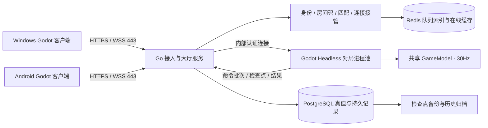
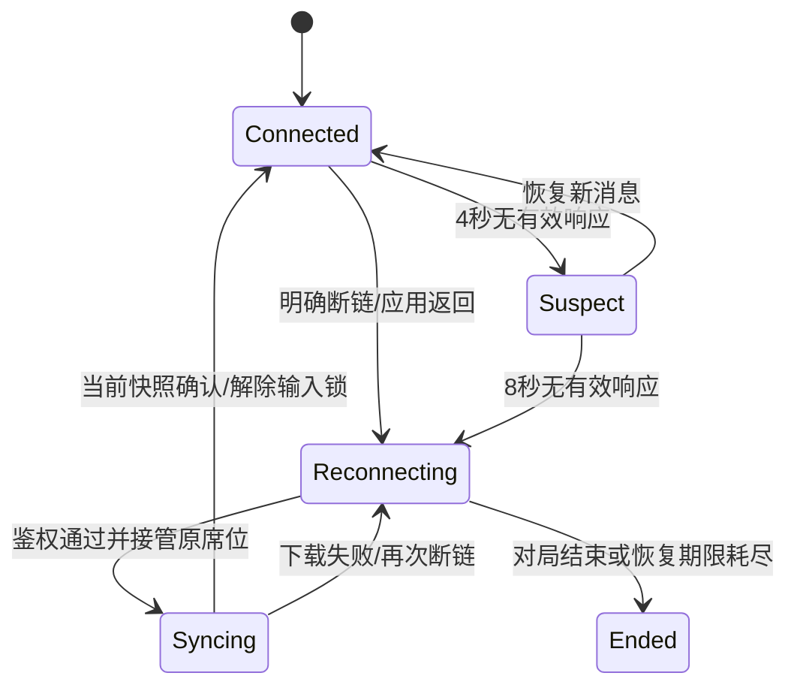

# 《纪元急袭》联机体系详细设计

> 原始设计基线保留。v0.8.0 已有实现，实际模块、运行参数、交付范围与测试结果以 [实现报告](godot-v0.8-online-report.md) 为准；下文计划和验收目标不等同于已通过。

日期：2026-10-11。依据：Godot 原生 v0.7.3，源码提交 `d886ab2`。状态：实施设计，本文所述联机模块尚未进入游戏；参数是首轮开发与验收的起点，不是已测出的线上容量或稳定性承诺。

建议构建 **Windows / Android 跨端 1v1、服务器权威结算、自由匹配与六位房间码共用同一对局服务、可恢复原对局** 的体系。第一阶段交付非排位真人对战；排位、观战、聊天、跨设备账号和战役合作另作后续功能。

配套文档：[通信协议与数据契约](online-protocol.md)、[实施路线与稳定性验收](online-implementation-and-acceptance.md)、[参数草案](online-defaults.example.json)。

## 1. 玩家最终使用方式

主菜单新增“联机”，进入后只有两个主要入口：“自由匹配”和“房间码”。已存在进行中对局时，优先显示“返回对局”，服务器确认结束后才能开始另一场。

| 路径 | 玩家操作 | 系统行为 |
| --- | --- | --- |
| 自由匹配 | 选择构筑、点匹配、接受找到的对手 | 按版本、区域、延迟与实力范围找真人，双方确认与资源加载完成后开战 |
| 六位房间码 | 两人分别输入同一个六位数字，例如 `042731` | 第一个输入者创建等待房，第二个加入；双方准备、显示构筑和规则后开战 |
| 返回原局 | 网络恢复，或重启 App 后点返回 | 凭原身份恢复原席位，下载当前状态，继续原来的军队、血量、资源和冷却 |

六位码按 **`000000`–`999999` 的字符串** 处理，前导零不丢失。输入相同码的行为是“创建或加入”，不要求两位玩家分辨建房按钮和加入按钮。

这里将用户所说的“创建开放”落实为：房间接受知道该码的第二名玩家，无需好友关系。默认不进入自由匹配池，也不公开列出房间，避免匹配到的陌生人占用朋友的席位。双方在准备页确认昵称及构筑；码是加入入口，不是重连凭证，也不是高强度密码。

## 2. 当前代码已有的基础和必须改的内容

| 已检查位置 | 当前情况 | 联机改造 |
| --- | --- | --- |
| [game_model.gd](../../godot/scripts/game_model.gd) `HZ / step_tick` | 固定 30Hz，战斗逻辑和渲染已有分离基础 | 原逻辑在专用服务器推进；客户端在线时停止调用本地 `advance` |
| `GameModel.act` | 招募、研究、进化、炮塔、站位、道具和技能统一入口 | 加服务器命令闸门、身份映射、每席位序号、业务去重和提交确认 |
| `reset_battle / step_tick` | 即便 `aiEnabled=false`，右侧仍乘 AI 初始金币/收入系数 | 引入控制类型 `human / ai` 和 PvP 规则配置；真人双方均 1.0×，不根据左右位置判断 AI |
| `last_action_sequence` | 两方共用一个序号，并在业务验证前消耗序号 | 改为双方独立的指令记录；重复请求返回原结果，不能重复扣费，也不能互相误判重复 |
| `snapshot / restore` | 保存完整模拟、RNG、环境、排程和命中；恢复会取消暂停并清掉待显示事件 | 可作为服务端检查点基础，另加对局控制状态、连接、指令结果、事件游标；不能直接当在线快照 |
| [battle_screen.gd](../../godot/scripts/battle_screen.gd) | `sides[0]`、`hero(0)`、胜负判断固定为本方在左；每帧推进模拟 | 抽象 `local_side` 和 BattleSession；输入转发给服务器，HUD 读取复制状态 |
| `BattleScreen._modal` | 研究等弹窗暂停整个模拟，部分经济动作在 paused 状态仍可执行 | 在线弹窗只覆盖本机界面；所有游戏动作受服务器对局状态统一限制 |
| [battle_world.gd](../../godot/scripts/battle_world.gd) | 摄像机、定位主将和前线依赖 side 0 | 统一视角映射和反向落点转换；地图尺寸、客户端屏幕比例不能改变模拟距离 |
| [game_store.gd](../../godot/scripts/game_store.gd) | 本机存档与奖励由本机判定 | 单机沿用；联机结果及联机奖励只能由服务器确认，分开存储 |
| [game_data.gd](../../godot/scripts/game_data.gd) `profile` | `animations.json` 的 bodyRadius / muzzle 等会参与战斗 | 服务端也保留这些规则元数据；模拟版本哈希包含它们，不能把所有动画数据当纯美术删掉 |
| [epoch_environment.gd](../../godot/scripts/epoch_environment.gd) | 环境事件、场景随机数分别保存，背景跟最高时代变化 | 环境只能由服务器采样；视觉换景仍不能替另一方升级时代 |

已验证的单机恢复和交互测试可以继续复用，但它们没有覆盖连接接管、双端顺序、并发入房、服务端崩溃和奖励事务。旧“玩法深化”提案不是已实现规则，尤其不能把其中保留基地血量比例的旧建议带入本次联机；当前进化回满血规则以 v0.7.3 为基线。

## 3. 总体架构和技术选择

| 层 | 首选方案 | 选择依据 |
| --- | --- | --- |
| 客户端 | 现有 Godot，`HTTPRequest` + `WebSocketPeer` | Windows / Android 同一套原生逻辑；有状态轮询、TLS 与二进制消息能力 |
| 公网接入 | Go 常驻服务，HTTPS / WSS 443 | 管理认证、限流、房间、队列和断线身份；消息结构可明确定义 |
| 战斗裁判 | Godot 专用服务器导出，同版 GDScript | 复用十时代规则和现有战斗逻辑，避免另用 Go 重写全部数值与占位系统 |
| 持久化真值 | PostgreSQL | 房间席位、单玩家唯一活动、命令去重、对局结果和检查点用事务约束 |
| 加速索引 | Redis，可在原型阶段不启用 | 缓存队列、在线状态、路由；丢失可从数据库重建，不负责最终胜负 |
| 客户端画面 | 权威状态复制 + 插值 | 服务器计算伤害与资源，客户端平滑绘制角色、弹道和特效 |

首选 WSS 是根据当前低频战略操作作出的工程判断，不代表它在所有弱网中优于 UDP。TCP 丢包时存在队头阻塞，必须设发送背压与过期状态丢弃，并做真实移动网络测试。若高丢包场景无法达标，再增加独立 ENet / UDP 战斗传输；大厅、身份、规则和重连状态机仍复用，不能只是换协议名来掩盖未实现的恢复机制。

使用自定义版本化消息，公网 Go 不直接解释 Godot 的内部 RPC 数据格式。初期保持一个 WSS 会话传送控制和展示数据，应用发送队列中控制消息优先；不能声称这能消除已经写进 TCP 的旧字节。

Godot 官方支持专用服务器导出和剥离视觉资源，WSS 需要持续 `poll`、验证状态并正确结束连接。[专用服务器文档](https://docs.godotengine.org/en/stable/tutorials/export/exporting_for_dedicated_servers.html)、[WebSocketPeer 文档](https://docs.godotengine.org/en/stable/classes/class_websocketpeer.html)。

## 4. 真人对战的规则边界

首发使用规则集 `pvp-classic-v1`，独立于单机难度。服务端固定规则，玩家提交的只是合法 ID 选择，不提交资源、攻击力或自定义倍率。

| 项目 | 首发建议 |
| --- | --- |
| 起始时代 | 双方 A1，最高 A10 |
| 经济 | 双方 240 金币、基础 2.5 金币/秒，时代与合法构筑倍率按同一规则叠加 |
| 主将与构筑 | 双方开放相同六位主将与合法构筑池，固定 6 点天赋预算、两项通用技能、最多两件遗物；不带入单机抽取等级或未验证的本地解锁 |
| 研究 / 军令 / 道具 | 同一价格、上限、冷却与初始次数；复用当前系统 |
| 进化 | 双方各自赚经验、各自升级；只回满本方首都，按当前兵种生命倍率增长；旧兵/订单保留出生时代 |
| 随机环境 | 首发标准 PvP 关闭伤害型随机事件，背景变体仍可由服务器统一选择；房间以后可显式选事件规则 |
| 结局 | 首都摧毁判负，同时摧毁平局；保留 30 分钟后的同等灼烧，建议 40 分钟模拟时长封顶判平局 |
| 暂停 | 只有服务器定义的短技术暂停；打开菜单、研究、进化选择不暂停对方 |
| 离开 | 在线确认退出即投降；网络关闭/后台挂起走重连机制，不自动等同投降 |
| 对手信息 | 双方公开主将、预选构筑、时代、前线、基地和实际战斗表现；精确军费、经验、军令、训练订单及私有冷却不下发给对手 |

上述公平规则必须通过 PvP 双席位测试后发布。现有“每代五倍 + 首都满血”可能让真人长期拉锯或出现抢代优势；先保留用户已经确认的规则并测对局时长，后续平衡修改使用新的规则 ID，不能借联机悄悄改变单机规则。首发不宣称已具备竞技平衡，不开放排位或付费强度差异。

## 5. 双方画面与输入坐标

服务器一直保存 side 0 在左、side 1 在右的固定世界。服务器为玩家绑定 `local_side`，客户端不可自行决定。

默认两位玩家均看到“我方在左、敌方在右”。side 1 客户端通过统一的 `BattlePerspective` 映射：`view_x = 1600 - server_x`，并反转朝向、镜头范围和弹道横向分量；点击落点用同一逆映射恢复为服务器世界 x。只在展示和输入边界映射，不能修改实体 ID、side、伤害或服务端占位顺序。

范围端点也要同时反向，因此 `[-80,1680]` 镜头边界保持一致；80 与 1520 两个基地交换展示位置。小地图、攻击预警、炮口、烟幕、冲锋方向、击退和音效声像共享这一转换。六位码房主不会因此获得某个经济或物理优势。

网络落点是世界坐标，不能是屏幕像素。现有 SafeUI 与长屏扩展继续在显示层工作；X30 的 20:9 与桌面 16:9 只改变可见面积和操作布局，不能放大技能范围。

## 6. 自由匹配完整流程

1. 客户端查询服务可用区域和兼容版本，测区域网关 RTT；选择构筑后获取匹配票据。
2. 数据库原子占用该玩家活动槽位；一个玩家不能同时排两队、占两个房间或开两场局。
3. 匹配器读取相同 `protocol_major / simulation_hash / ruleset_id` 的真人票据，按双方到同一候选区域的延迟、实力和等待时长配对。
4. 原子预约双方席位并生成 `match_offer`。双方在 15 秒内确认；成功后锁定规则与构筑，分配健康的对局进程。
5. 客户端收到清单、完成素材校验，并发送 `client_loaded`。双方都成功后由服务器公布开始时点与倒计时，随后模拟 tick 从 0 推进。
6. 任一人拒绝或加载超时，取消本次 offer；另一人可一键继续排队，退出者不会把对方留在已失效的房间。

候选参数：前 20 秒实力差 ±150，20–40 秒 ±300，40 秒以后 ±500；初始实力取默认值并记录不确定度。这些是范围参数，非已校准评级算法。首发隐藏内部评分，不把单机胜场当真人实力，不让新玩家在低可信评级阶段大幅改动别人评分。

同区域候选 RTT 优先 ≤120ms；等待后可放宽到 180ms。超过软阈值提示延迟，不自动把玩家送去超远区域。75 秒仍无人，显示继续等待、改区域或返回单机；不能无限显示“马上匹配”，也不把 AI 伪装成真人填充队列。

取消匹配与收到 offer 同时发生时，票据状态用 CAS/行锁单向变化。已取消票据不能再成局；已预约则返回 offer 的当前状态，接受与拒绝使用各自幂等请求 ID。票据过期或 Redis 重建时以数据库的活动记录为准。

## 7. 六位房间码的生命周期和并发

房间内部身份为随机 `room_id`，六位数字是短入口；两者不能混用。**活动码全局唯一**，不按地区各自分配，否则两个不同地区输入同一个码会进入两间房。跨地区第二人由房间注册表引导到原区域；延迟过高时在准备页提示双方。

| 房间状态 | 行为 |
| --- | --- |
| 不存在 / 已超过回收冷却 | 事务内创建 room_id 和第一个席位，响应 CREATED |
| 等待一个席位 | 第二个不同身份加入，响应 JOINED |
| 当前身份已在房内 | 响应 ALREADY_MEMBER，不重复占位；若已开战则走原局恢复 |
| 两席位已满 | 返回 ROOM_FULL，不创建同码新房，不挤掉旧玩家 |
| 正在加载或战斗 | 新身份返回 ROOM_IN_GAME；原成员仍可恢复 |
| 刚关闭，回收冷却中 | 返回 CODE_COOLDOWN，避免旧客户端加入下一间同码房 |

数据库约束至少包括 `room_codes.code` 唯一、`room_members(room_id,seat)` 唯一、`room_members(room_id,player_id)` 唯一和 `player_activity.player_id` 主键。房间码格式用 `^[0-9]{6}$`，不能先转整数再补零，也不接受空格、全角数字或任意长度。

创建/加入是单个事务：先处理该玩家已有活动；查或争取码记录，再锁定房间、核对代际和状态、占席位。不存在记录时依靠唯一约束竞争，不能“先查没有，再无保护插入”。一致的锁顺序、有限重试和 `request_id` 结果记录负责处理并发与响应丢失。[PostgreSQL 约束文档](https://www.postgresql.org/docs/current/ddl-constraints.html)。

两位玩家同时输入未使用的码，最终只能产生一个房间和两个席位；第三人只能收到满员。准备关联当前 `room_revision`，有人改构筑或离开就清掉双方准备标记，防止过时的准备消息触发开局。

候选时间：无人加入的等待房 5 分钟到期；准备房绝对寿命 10 分钟；大厅掉线席位保留 60 秒；结束后码冷却 90 秒。战斗房不使用普通大厅 TTL，不能在半小时对局中被清理。比赛结束释放双方活动槽位，码进入冷却；新局必须产生新 match_id，不能重用旧局幂等键。

房主只负责等待房的显示与关闭，不承担裁判或转发。大厅中房主超时退出后，可让仍在房内的成员成为新的房间管理员，清掉准备；战斗中原房主退出也不会终止服务器。

房间资源也要有边界：每身份最多一个活动房间，候选建房限制 5 次/分钟、码提交 10 次/分钟；IP 限制只做附加保护，必须允许同一家庭/校园 NAT 下的多人。后台房间清理校验状态与 generation，不能清理已开始比赛的旧大厅记录后误删整个比赛。

## 8. 游戏同步与打击反馈

模拟保持 30Hz；首轮权威状态下发 10Hz，关键业务结果随提交批次立即发送。客户端按 80–150ms 的插值缓冲平滑角色位置和弹道，连续无更新时最多做 100ms 受限外推，之后停在最后可靠画面并提示连接状态。

点击招募立刻出现“提交中”反馈，但先不在本机扣资源、生成士兵或宣布进化。服务器验证并提交后确认订单，HUD 才转为真实状态。点击动画、选中高亮可即时播放；伤害数字、受击、死亡、护盾破碎和胜负必须由权威事件驱动。

首发不要求 Windows 和 ARM Android 浮点模拟逐 tick 一致，也不让两个客户端用同种子互相裁判。战斗服务器可以复用当前固定步进与随机流；客户端只插值权威结果。技能落点、射程、冷却和占位由裁判检查。

不能每 100ms 把整个本机存档传给双方。需区分三种对象：

| 对象 | 使用者 | 必须包含 / 限制 |
| --- | --- | --- |
| 服务端检查点 | 服务器恢复与审计 | 完整模拟、随机流、排程、命中、双方私有经济、指令游标和控制状态 |
| 玩家网络全量快照 | 入局、断线恢复、纠错 | 公开战场 + 本方私有 HUD，完整当前可见投射物/预警/持续区域；不含对手私有队列和 RNG |
| 玩家网络增量 | 普通 10Hz 展示 | 已确认基线后的新增、修改、删除，带实体 ID 和版本，私有字段依身份过滤 |

生成私有投影必须在服务器完成；“客户端 UI 不显示”不等于信息没有泄露。`GameModel.restore` 要求完整双方字典，因此不能直接让它接收删了私有字段的网络快照；在线模式需要只读 `ReplicatedBattleState`，复用绘制接口，不执行本机伤害与经济。

所有战斗事件有唯一序号与 tick。重连后不重放一分钟的爆炸声、攻击特效或奖励动画，只恢复仍在生效的预警、持续技能和飞行弹道，后续事件继续按序消费。

## 9. 断线重连：玩家网络层

身份由服务器生成持久 player_id。原席位绑定 player_id、match_id 和随机高熵恢复凭证；房间码、昵称、IP 地址和连接临时 peer_id 都不能代替身份。手机从 Wi-Fi 切到移动网络后 IP 可以改变，仍回原席位。

恢复步骤必须完整执行：发现活跃对局 → 刷新认证或取得恢复连接票据 → 绑定新连接代际 → 废止旧连接 → 查询未确认指令结果 → 接收当前快照与事件游标 → 清空旧插值/瞄准 → 确认状态已应用 → 解锁输入。

心跳建议每 2 秒；4 秒无有效响应进入弱网状态，8 秒无有效响应或明确断链判定断线。所有正常认证消息也可更新存活时间。自动重连等待约 0、1、2、4 秒，之后上限 4 秒并加入 ±20% 抖动；系统通知网络变化或 App 回到前台时允许立即一次尝试，只重连一个活跃目标，不能每帧建立新 socket。

服务端在原席位保留最多 **120 秒单次恢复期限、180 秒每局累计离线预算**；这两个时间都是墙钟时间，不是暂停后的战斗 tick。恢复鉴权成功但状态还未同步完成时仍锁定输入，同步超时不能无限延长期限。后台短切换、锁屏和应用被系统终止都使用同一规则；强制关闭不是自动投降，重新启动 App 先查询活跃对局。

在线认证凭证使用操作系统保护存储，Android 对应 Keystore 支持的封装，Windows 对应系统凭证/DPAPI；实现时验证备份与迁移行为。单机 profile 和 match.json 不作为线上身份。游客身份可支持同一安装内重启恢复；卸载、清除数据或换设备不等于普通断线，首发不承诺游客跨设备找回。

## 10. 对手掉线时怎么办：公平与体验

仅仅“允许重新连接”还不够，必须规定掉线期间的战场行为。

| 情况 | 推荐首发规则 |
| --- | --- |
| 一方确认断线 | 服务器在下一个提交边界短暂停战斗，最多 8 秒；每方每局总技术暂停额度 15 秒 |
| 8 秒内回来 | 快照同步完成后恢复，所有战斗 tick 冷却和收入在暂停期间冻结 |
| 未回来 / 额度用尽 | 战斗继续；已存在军队自动交战、队列与收入继续，不生成 AI 代打 |
| 在期限内恢复 | 保留当时真实资源、兵力和状态；不补发离线操作、不额外发钱、不复活已毁基地 |
| 单方单次 120 秒 / 累计 180 秒耗尽 | 有仍在线的对手时，服务器判该方离线弃权；此前已自然结束则保留自然结局 |
| 双方都掉线 | 冻结比赛，不产生脱机战果；双方无人回来 60 秒则终止为 ABANDONED，不给胜者或战斗奖励 |
| 两人都离线时有人先到自身期限 | 仍按双方离线终止处理，不凭连接中断先后给另一离线者胜利 |
| 服务端整体故障 | 进入服务恢复状态，暂停并保留已提交状态；不按玩家掉线判负，故障期间不消耗其离线预算 |

双方离线冻结使用独立全局 60 秒期限，不增加某方的 120/180 秒额度；在 60 秒内有人回来就退出双方冻结，另一方原离线截止时间继续有效。不能两人交替断线无限延长房间寿命。

技术暂停由裁判控制，对双方禁止所有经济/技能动作，包括研究、进化、出售和取消；不能保留当前 `act` 只屏蔽部分动作的漏洞。UI 显示“对手连接中、剩余恢复时间、战场是否继续”，提供等待和明确结束选项。连接较好的一方不能因为打开本机暂停菜单冻结另一人。

## 11. 不确定指令、去重和旧连接接管

每个玩家在每场对局有独立递增 `client_seq`，服务端以 `(match_id, player_id, client_seq)` 去重并保存结果。两个玩家都发 seq=1 应分别执行；同一招募 seq 重发十次也只能扣一次金币。重复序号却更换载荷必须拒绝，不能覆盖旧操作。

连接代际 `connection_epoch` 和对局进程代际 `owner_epoch` 分开。恢复后新连接增加前者，服务迁移增加后者；旧连接和旧裁判都不能继续写入当前比赛。临时 WebSocket peer ID 改变不改变玩家席位或指令序号。

区分“网关收到”“裁判已排队”和“已持久提交”。只有最后一种可以向玩家宣告成功。掉线时招募没有收到确认，重连先查询该序号：已执行则返回原订单；已拒绝则显示原因；确定未进入提交历史则作废旧点击，玩家手动再点。不要把离线点击积累成几十个技能再补发。

序号缺口、晚到、重复、过期、对局已结束都有明确状态；不能把等待确认显示成已经购买，更不能相信客户端传入的 side、金币、tick、胜者或自带快照。

## 12. 断线重连：裁判进程恢复层

每个比赛同一时刻只有一个写入裁判。进程池由监管程序管理，工作进程内串行处理单局，不把同一 `GameModel` 放到多个线程共同修改；首轮一个进程可按测得容量承载少量房间，进程数量隔离 CPU 核心和崩溃范围。

PostgreSQL 保存比赛所有者、递增 `owner_epoch` 与租约；初值可取 6 秒租约、2 秒续约。检查点与指令批次提交必须比较 owner_epoch 和租约有效性，即使旧进程恢复联网，也不能造成两个裁判各判一套结果。缓存锁或 PID 文件不能承担这个保证。

每 5 秒写完整检查点；每 100ms 批次记录确定的 tick 范围、排序后的指令及结果、控制状态变化和最后状态哈希。服务端同一事务持久提交后，才把这一批次的成功确认、权威画面和结果发布给客户端。最多可以丢弃未提交的内存推演，不能回滚玩家已经看见的确认。

工作进程崩溃后：暂停对外状态 → 租约失效并换代 → 选择兼容的备用进程 → 读取完整检查点 → 重放已提交的批次到 committed_tick → 校验规范化状态哈希 → 发新快照 → 双方重同步 → 继续。

这里的重放只要求 **受控的服务端构建与部署架构** 可复现，不依赖客户端跨平台锁步。需要固定引擎、模拟代码、排序、随机流及输入 tick；回放检查必须覆盖真实部署的不同工作机。如果不能得到完全一致的恢复哈希，就不能发布“无回滚崩溃恢复”：改用每个提交批次持久化精确状态增量/完整状态的方案后重新测成本和容量，或者暂时终止异常比赛为无结果。

`snapshot()` 外还必须保存房间阶段、暂停原因、进程所有权、双方连接状态、累计离线时间、恢复期限、指令账本、事件游标、序列号与提交哈希。现有 `restore()` 最后 `paused=false` 并清事件，在线恢复必须由专用恢复入口显式恢复控制层，不能让比赛在只恢复半个状态时自动开跑。

若 30 秒内无法从可信状态恢复，申请终止为 SERVER_ABORTED，告知双方、不算玩家败局。终局仍需由可写的持久控制层确认；数据库整体不可达时 UI 显示故障/等待确认，恢复后再提交故障终止，不能由两个孤立进程各宣布一个终局。此时不假装已成功恢复，也不从某个客户端的存档选一个“正确结果”。

## 13. 结果、奖励和终局竞态

对局结果由服务器一次写入，终局枚举区分 CAPITAL_DESTROYED、SURRENDER、DISCONNECT_FORFEIT、DRAW、ABANDONED 和 SERVER_ABORTED。房间关闭、自然摧毁、投降、超时由同一个状态机裁决，持久提交后结果不可被后到请求覆写。

`matches.match_id` 唯一；联机奖励账本 `(match_id, player_id, reward_kind)` 唯一。结果与待发奖励/outbox 在同一事务里写入，响应丢失或应用重启可再查询，不能再次发放。

首发建议只记录独立的线上战绩，不向可编辑的单机存档发放可影响 PvP 的强度。以后若打通账号奖励，需要服务端钱包和兑换凭证；当前 `EpochStore.record_result` 的本地去重机制不具备服务器奖品防重复能力。

重连到已结束比赛，进入服务端结算页；只有用户明确开启下一场时才建立新 match_id。数据库暂时失败时保持“正在确认结果”，不能先显示获胜后又改判，或两边各加一次胜场。

## 14. 部署、稳定运行与容量边界

本地开发使用原生 Windows 进程：两个 Godot 客户端、Godot Headless、Go 服务和测试工具。遵守本项目禁止本地 Docker、WSL 和虚拟化的约束；数据库可用 Windows 原生安装或独立开发数据库服务，不启动虚拟化环境。

原型可以单台服务机。对外稳定版需要至少两个可替换的接入实例、两个不同机器上的对局进程池、具备持续日志与备份恢复的数据库；单机演示不能宣称高可用。生产服务用宿主原生进程监管启动、重启、日志轮转和优雅排空。连接路由、所有者和入房身份均可从持久记录重建，不能只在某台机器的内存里。

已确认操作不回滚还取决于数据库层：原型本机 WAL 持久提交可覆盖普通进程崩溃；稳定版若要覆盖主库机器/磁盘故障，必须配置经演练的同步备库或等效持久服务，指定同步副本并保持 `synchronous_commit=on`、fsync 等持久配置。异步备份/副本并不保证零数据损失。同步副本不可达时宁可暂停确认，也不能悄悄降成异步而继续承诺不回滚。[PostgreSQL 同步复制与持久性](https://www.postgresql.org/docs/current/warm-standby.html#SYNCHRONOUS-REPLICATION)。

现有 `jyqx.sidcloud.cn` 隐私网页可继续托管于 Vercel。联机服务部署独立常驻接入与裁判进程，未来申请单独 API / play 子域名。注意，Vercel 已于 2026-06-22 公布 Functions WebSocket Public Beta，不能再笼统说它完全不支持 WebSocket；选择独立服务的原因是本项目需要受控的 Godot 长驻裁判、进程监管与恢复边界。[Vercel 官方公告](https://vercel.com/changelog/websocket-support-is-now-in-public-beta)。此处不修改现有域名、不采购或发布新服务。

首轮参考下发预算为平均每玩家 40KiB/s；若实测满足，100 名同时对战玩家约需 3.9MiB/s 下行裸数据，另留 TLS、关键帧和波峰余量。这是算术预算，**不是当前程序的实测**。服务器 CPU、内存、恢复日志写入量和数据库费用由 Headless 最坏时代压测决定，先限制容量再逐步增加，不能从桌面 FPS 推导每机可开多少房。

排空升级：接入实例停止接新局但保留旧连接；对局进程完成旧规则比赛再退出；新客户端与新对局切入新版本。运行中不替换核心规则。无法连接旧房时尽可能引导兼容客户端恢复，正常比赛期间不能强制更新导致玩家被判负。

## 15. 版本和数据身份

单机存档 `contentVersion=0.7.0` 是迁移标识，不能作为联机一致性证明。为联机新增：`protocol_version`、`simulation_hash`、`ruleset_id`、`ruleset_hash`、`presentation_hash`。

模拟哈希覆盖 GameModel、Combat、Skills、Environment、Data 内参与规则的代码和 JSON 元数据、关键引擎版本/架构及步进配置。字体、音乐、纯纹理可单独版本化；`animations.json` 中影响 bodyRadius / muzzle 的部分仍必须进入模拟版本。

不兼容的玩家在匹配与入房前就被阻止并提示更新；不能开局后边玩边发现自己兵种价格不同。服务器生成并冻结种子、场景、构筑与双方经济，禁止客户端覆盖规则配置。

## 16. 第一项实际开发应当是什么

先做 `BattleSession` 接口与双真人离线夹具：同一 GameModel 接受双方独立输入、经济完全对称，side 1 的 UI 和输入正确，所有单机回归仍通过。随后用两个原生窗口连接一个 Headless 裁判，完成从按钮提交到服务器确认的十时代闭环。

这两个阶段通过后再做房间码和自由匹配；在对外测试前完成客户端重连、进程崩溃恢复、事务去重、X30 真机网络切换和故障注入。详细文件拆分、阶段入口/出口和测试矩阵见 [实施路线](online-implementation-and-acceptance.md)。不能用“双方能看见对方兵”作为稳定联机交付标准。

## 17. 尚需在实施时测定的参数

暂定恢复期限、匹配范围、插值、发送频率、房间寿命、进程房数都在 [参数草案](online-defaults.example.json) 明示。开发第一轮按这些值开始，但必须依照设备与网络数据调整。

第一版可以稳定完成本用户要求的 1v1、自由匹配、六位码创建/加入和原局重连。主要工程量在身份、状态机与故障恢复，并非增加一个联机按钮。本文完成详细设计，不代表后台已运行、云资源已确定或当前 APK 已经支持联机。
