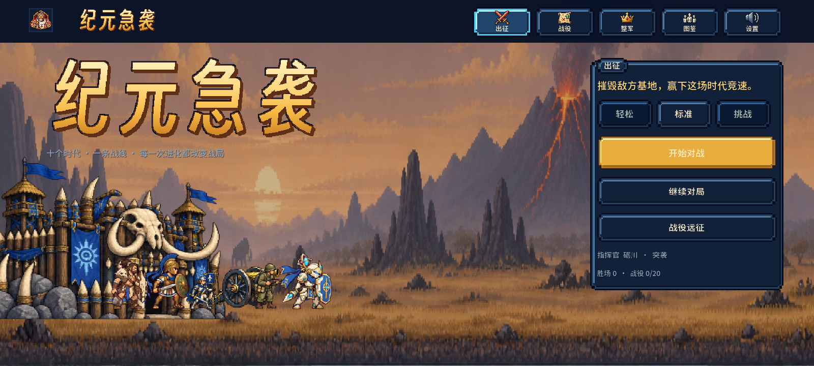
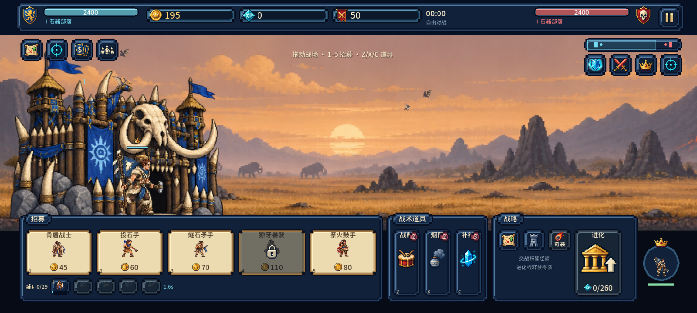
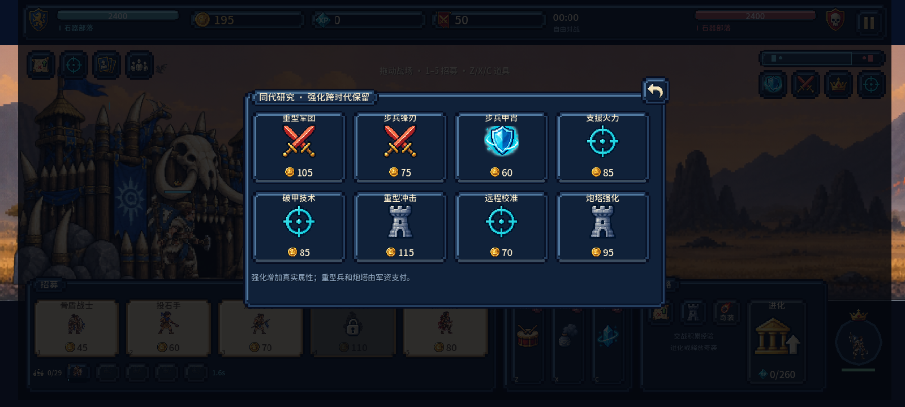

# v0.7.3 验收记录 / QA evidence

此次针对 Android 长屏留边修复，不改变 AI 经济与首都进化规则。布局截图来自 Windows 上原生 Godot OpenGL 渲染，不是 Android 截图。

- [多比例与模拟安全区检查](mobile-layout.json)：**92/92**，加载实际 Windows EXE 内嵌资源后运行；16:9、20:9、21:9、4:3，含 2400×1080 窗口；场景铺满、UI 安全区、弹窗、触控遮挡和坐标转换，以及安全区变换后的触屏招募和指挥官托盘。
- [交互回归](interaction-checks.json)：159 项，包含实际鼠标/触屏事件分发。
- [Android 屏幕参数与脚本](android-screen-checks.json)：两个 APK 的实际启动参数包含 `--fullscreen`、`--edge_to_edge`；包内视口为 expand，五个核心/UI 编译脚本与完成布局测试的 Windows 导出包一致。
- [Windows 导出资源](windows-embedded-content.json)：19 个 JSON、252 张图集与 0.7.3 版本核对。
- [Windows 独立启动](standalone-boot.json)：在空目录启动实际 EXE；强制退出时仍有既有资源释放警告，不宣称无泄漏。
- [既有难度与首都规则](difficulty-capital.json)：187/187 通过。
- [版本与启动图标](launcher-branding.json)、[素材及字体](package-asset-checks.json)、[Android 签名与 16KB 对齐](android-finalization.json)、[下载文件 SHA256](SHA256SUMS.txt)。

当前 ADB 设备列表为空。摩托罗拉 X30 的系统留边策略、挖孔安全区返回、前后台恢复与双向横屏真机效果仍待设备复测；不能从这些桌面截图推断已经实机通过。
